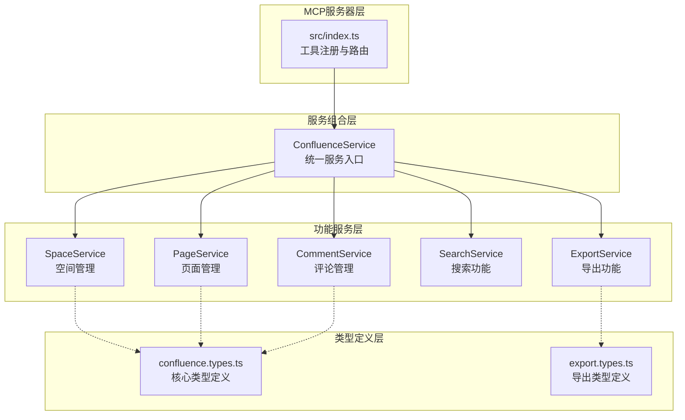
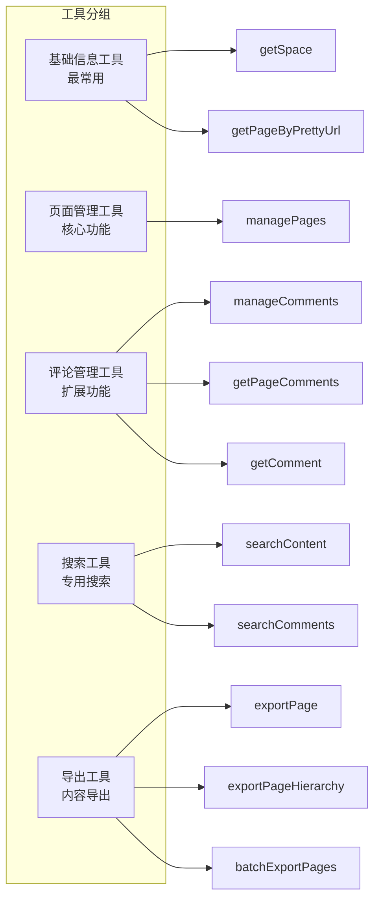
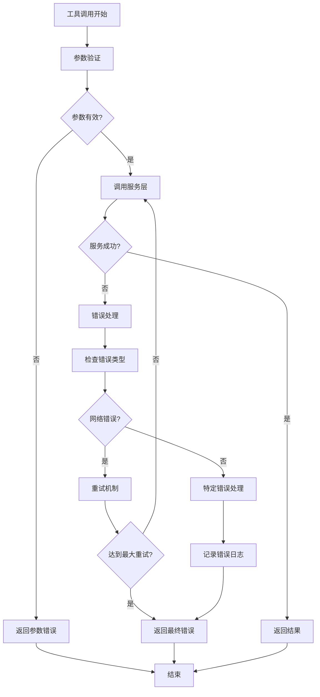
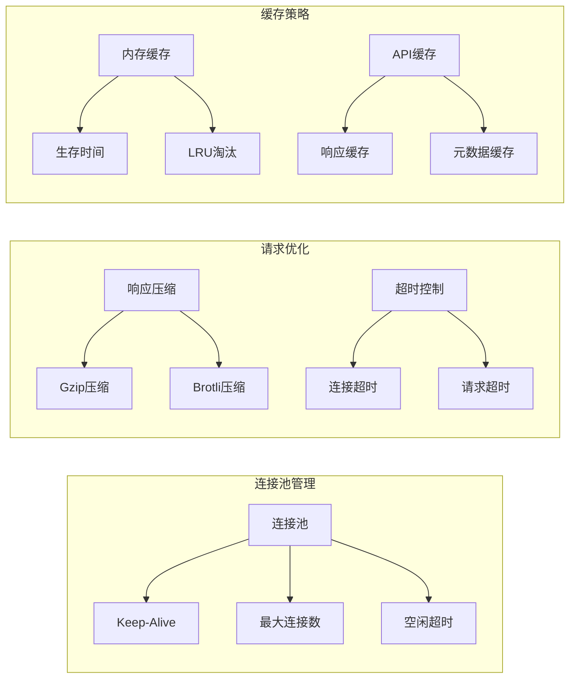

# MCP工具参考文档

<cite>
**本文档中引用的文件**
- [src/index.ts](file://src/index.ts)
- [src/services/confluence.service.ts](file://src/services/confluence.service.ts)
- [src/services/features/page.service.ts](file://src/services/features/page.service.ts)
- [src/services/features/comment-basic.service.ts](file://src/services/features/comment-basic.service.ts)
- [src/services/features/export.service.ts](file://src/services/features/export.service.ts)
- [src/types/confluence.types.ts](file://src/types/confluence.types.ts)
- [src/types/export.types.ts](file://src/types/export.types.ts)
- [README.md](file://README.md)
</cite>

## 目录
1. [简介](#简介)
2. [项目架构概览](#项目架构概览)
3. [工具分类与功能](#工具分类与功能)
4. [基础信息工具](#基础信息工具)
5. [页面管理工具](#页面管理工具)
6. [评论管理工具](#评论管理工具)
7. [搜索工具](#搜索工具)
8. [导出工具](#导出工具)
9. [错误处理机制](#错误处理机制)
10. [性能优化](#性能优化)
11. [最佳实践](#最佳实践)

## 简介

MCP (Model Context Protocol) Confluence 服务器是一个基于 TypeScript 的 Confluence API 服务实现，提供了完整的 MLC 工具集。该服务通过工具架构优化，将原本分散的12个工具精简为8个核心工具，实现了统一的API设计和智能参数验证。

### 核心特性

- **工具优化**: 从12个工具合并为8个，减少33%的复杂度
- **统一API**: 通过action参数区分不同操作类型
- **智能验证**: 根据操作类型自动验证必需参数
- **完整注释**: MCP Inspector中可查看详细参数说明
- **Markdown支持**: 全面支持Markdown格式的自动转换
- **性能优化**: HTTP连接复用、响应压缩、错误重试机制

## 项目架构概览



**图表来源**
- [src/index.ts](file://src/index.ts#L1-L827)
- [src/services/confluence.service.ts](file://src/services/confluence.service.ts#L1-L284)

**章节来源**
- [src/index.ts](file://src/index.ts#L1-L827)
- [README.md](file://README.md#L1-L100)

## 工具分类与功能

### 工具架构优化

经过架构优化，工具按使用频率和逻辑分组重新组织：



**图表来源**
- [src/index.ts](file://src/index.ts#L40-L827)

### 工具功能矩阵

| 工具类别 | 工具名称 | 主要功能 | 使用场景 |
|---------|---------|---------|---------|
| 基础信息 | `getSpace` | 获取空间详细信息 | 查询空间元数据 |
| 基础信息 | `getPageByPrettyUrl` | 通过标题精确获取页面 | 精确页面定位 |
| 页面管理 | `managePages` | 统一页面CRUD操作 | 页面生命周期管理 |
| 评论管理 | `manageComments` | 统一评论CRUD操作 | 评论内容管理 |
| 评论管理 | `getPageComments` | 获取页面评论列表 | 评论浏览 |
| 评论管理 | `getComment` | 获取单个评论详情 | 评论详情查看 |
| 搜索功能 | `searchContent` | 全文内容搜索 | 内容检索 |
| 搜索功能 | `searchComments` | 评论内容搜索 | 评论检索 |
| 导出功能 | `exportPage` | 单页面导出 | 个别页面导出 |
| 导出功能 | `exportPageHierarchy` | 层次结构导出 | 整体文档导出 |
| 导出功能 | `batchExportPages` | 批量页面导出 | 多页面批量处理 |

**章节来源**
- [src/index.ts](file://src/index.ts#L40-L827)

## 基础信息工具

### getSpace - 获取空间信息

**功能描述**: 获取指定空间的详细信息，包括空间ID、键值、名称和链接信息。

**参数定义**:
```typescript
{
  spaceKey: z.string().describe('空间Key（如：DEV, TECH, DOC 等）')
}
```

**使用示例**:
```json
{
  "name": "getSpace",
  "arguments": {
    "spaceKey": "DEV"
  }
}
```

**返回结构**:
```typescript
{
  "id": "string",
  "key": "string",
  "name": "string",
  "type": "string",
  "_links": {
    "webui": "string",
    "self": "string"
  }
}
```

**错误处理**:
- 空间不存在: 返回错误信息"空间未找到"
- 权限不足: 返回错误信息"权限被拒绝"
- 网络异常: 返回网络连接错误

### getPageByPrettyUrl - 通过标题精确获取页面

**功能描述**: 通过空间Key和页面标题精确匹配获取页面信息，支持中文标题搜索。

**参数定义**:
```typescript
{
  spaceKey: z.string().describe('空间Key（如：DEV, TECH 等）'),
  title: z.string().describe('页面标题（精确匹配）')
}
```

**使用示例**:
```json
{
  "name": "getPageByPrettyUrl",
  "arguments": {
    "spaceKey": "DEV",
    "title": "API开发指南"
  }
}
```

**返回结构**:
```typescript
{
  "id": "string",
  "type": "page",
  "status": "current",
  "title": "string",
  "space": {
    "id": "string",
    "key": "string",
    "name": "string"
  },
  "version": {
    "number": "number",
    "by": {
      "username": "string",
      "displayName": "string"
    }
  },
  "body": {
    "storage": {
      "value": "string",
      "representation": "storage"
    }
  }
}
```

**章节来源**
- [src/index.ts](file://src/index.ts#L40-L80)
- [src/services/features/page.service.ts](file://src/services/features/page.service.ts#L30-L60)

## 页面管理工具

### managePages - 统一页面管理工具

**功能描述**: 统一管理Confluence页面，包括创建、更新、删除和查询页面信息。通过action参数区分不同操作类型。

**参数定义**:
```typescript
{
  action: z.enum(['create', 'update', 'delete', 'get', 'getContent'])
    .describe('操作类型: create=创建页面, update=更新页面, delete=删除页面, get=获取页面基本信息, getContent=获取页面详细内容'),
  
  // 通用参数
  pageId: z.string().optional().describe('页面ID（用于update/delete/get/getContent操作）'),
  spaceKey: z.string().optional().describe('空间Key（用于create操作，必填）'),
  title: z.string().optional().describe('页面标题（用于create操作必填，update操作可选）'),
  content: z.string().optional().describe('页面内容（用于create操作必填，update操作可选）'),
  
  // 创建/更新页面参数
  parentId: z.string().optional().describe('父页面ID（可选，用于创建子页面）'),
  representation: z.enum(['storage', 'wiki', 'editor2', 'view', 'markdown'])
    .optional()
    .describe('内容格式: storage=HTML存储格式（推荐）, wiki=Wiki标记语法, editor2=编辑器格式, view=查看格式, markdown=Markdown格式'),
  version: z.number().optional().describe('页面版本号（用于update操作，建议填写以避免冲突）'),
  
  // 获取页面参数
  expand: z.string().optional().describe('扩展参数（可选，用于指定返回额外信息，如：body.storage,version,space）')
}
```

**操作类型详解**:

#### 1. 创建页面 (create)
```json
{
  "name": "managePages",
  "arguments": {
    "action": "create",
    "spaceKey": "DEV",
    "title": "新页面标题",
    "content": "<p>页面内容</p>",
    "parentId": "123456789",
    "representation": "storage"
  }
}
```

**支持的内容格式**:
- `storage`: HTML存储格式（推荐）
- `wiki`: Wiki标记语法
- `editor2`: 编辑器格式
- `view`: 查看格式
- `markdown`: Markdown格式（自动转换为HTML）

#### 2. 更新页面 (update)
```json
{
  "name": "managePages",
  "arguments": {
    "action": "update",
    "pageId": "123456789",
    "title": "更新的标题",
    "content": "<p>更新的内容</p>",
    "version": 2,
    "representation": "storage"
  }
}
```

**版本控制**: 建议提供版本号以避免并发更新冲突，系统会自动递增版本号。

#### 3. 删除页面 (delete)
```json
{
  "name": "managePages",
  "arguments": {
    "action": "delete",
    "pageId": "123456789"
  }
}
```

#### 4. 获取页面基本信息 (get)
```json
{
  "name": "managePages",
  "arguments": {
    "action": "get",
    "pageId": "123456789"
  }
}
```

#### 5. 获取页面详细内容 (getContent)
```json
{
  "name": "managePages",
  "arguments": {
    "action": "getContent",
    "pageId": "123456789",
    "expand": "body.storage,version,space"
  }
}
```

**返回结构**:
```typescript
{
  "content": [{
    "type": "text",
    "text": "JSON格式的页面信息"
  }]
}
```

**错误处理**:
- 参数验证失败: 返回具体缺少的参数信息
- 页面不存在: 返回"页面未找到"错误
- 权限不足: 返回"权限被拒绝"错误
- 内容格式错误: 返回格式验证错误

**章节来源**
- [src/index.ts](file://src/index.ts#L82-L200)
- [src/services/features/page.service.ts](file://src/services/features/page.service.ts#L1-L217)

## 评论管理工具

### manageComments - 统一评论管理工具

**功能描述**: 统一管理Confluence页面评论，支持普通评论和行内评论的增删改查操作。通过commentType参数区分评论类型。

**参数定义**:
```typescript
{
  action: z.enum(['create', 'update', 'delete', 'reply'])
    .describe('操作类型: create=创建评论, update=更新评论, delete=删除评论, reply=回复评论'),
  commentType: z.enum(['regular', 'inline'])
    .optional()
    .describe('评论类型: regular=普通评论（默认）, inline=行内评论'),
  
  // 通用参数
  pageId: z.string().optional().describe('页面ID（用于create/reply操作时必填）'),
  commentId: z.string().optional().describe('评论ID（用于update/delete操作必填，行内评论reply时必填）'),
  content: z.string().optional().describe('评论内容（用于create/update/reply操作必填）'),
  
  // 普通评论参数
  representation: z.enum(['storage', 'wiki', 'editor2', 'view', 'markdown'])
    .optional()
    .describe('内容格式: storage=HTML存储格式（推荐）, wiki=Wiki标记语法, editor2=编辑器格式, view=查看格式, markdown=Markdown格式'),
  parentCommentId: z.string().optional().describe('父评论ID（用于普通评论的reply操作必填，或创建子评论）'),
  version: z.number().optional().describe('评论版本号（用于update操作，建议填写以避免冲突）'),
  watch: z.boolean().optional().describe('是否监视评论（布尔值，默认false，用于reply操作）'),
  
  // 行内评论参数
  originalSelection: z.string().optional().describe('原始选中文本（用于创建行内评论时必填）'),
  matchIndex: z.number().optional().describe('匹配索引（当页面有多个相同文本时指定第几个，默认0）'),
  numMatches: z.number().optional().describe('匹配总数（页面中相同文本的总数，默认1）'),
  serializedHighlights: z.string().optional().describe('序列化高亮信息（JSON格式字符串，可选）')
}
```

### 普通评论操作

#### 创建普通评论
```json
{
  "name": "manageComments",
  "arguments": {
    "action": "create",
    "commentType": "regular",
    "pageId": "123456789",
    "content": "这是一条评论",
    "representation": "storage"
  }
}
```

#### 创建Markdown格式评论
```json
{
  "name": "manageComments",
  "arguments": {
    "action": "create",
    "commentType": "regular",
    "pageId": "123456789",
    "content": "## 代码审查意见\n\n这段代码需要优化：\n\n- **性能问题**: 数据库查询未优化\n- **安全问题**: 缺少输入验证\n\n建议修改：\n\n```javascript\n// 使用索引查询\nconst user = await User.findById(id).lean();\n```",
    "representation": "markdown"
  }
}
```

#### 更新普通评论
```json
{
  "name": "manageComments",
  "arguments": {
    "action": "update",
    "commentType": "regular",
    "commentId": "98765432",
    "content": "更新后的评论内容",
    "version": 2
  }
}
```

#### 删除普通评论
```json
{
  "name": "manageComments",
  "arguments": {
    "action": "delete",
    "commentType": "regular",
    "commentId": "98765432"
  }
}
```

#### 回复普通评论
```json
{
  "name": "manageComments",
  "arguments": {
    "action": "reply",
    "commentType": "regular",
    "pageId": "123456789",
    "parentCommentId": "98765432",
    "content": "这是一条回复",
    "watch": false
  }
}
```

### 行内评论操作

#### 创建行内评论
```json
{
  "name": "manageComments",
  "arguments": {
    "action": "create",
    "commentType": "inline",
    "pageId": "123456789",
    "content": "这里需要注意性能问题",
    "originalSelection": "QueryHoldingsService.setHoldingData()",
    "matchIndex": 0,
    "numMatches": 1
  }
}
```

#### 回复行内评论
```json
{
  "name": "manageComments",
  "arguments": {
    "action": "reply",
    "commentType": "inline",
    "commentId": "98765432",
    "pageId": "123456789",
    "content": "这是对行内评论的回复"
  }
}
```

### 评论类型对比

| 功能 | 普通评论 | 行内评论 |
|-----|---------|---------|
| 创建方式 | 通过页面评论区 | 选中文本后创建 |
| 显示位置 | 页面底部评论区 | 文档中对应位置 |
| 关联方式 | 通过pageId关联 | 通过文本匹配关联 |
| 回复机制 | 支持树形回复 | 支持树形回复 |
| 版本控制 | 支持 | 支持 |
| 监视功能 | 支持 | 支持 |

**返回结构**:
```typescript
{
  "content": [{
    "type": "text",
    "text": "JSON格式的评论信息"
  }]
}
```

**错误处理**:
- 评论不存在: 返回"评论未找到"错误
- 权限不足: 返回"权限被拒绝"错误
- 内容格式错误: 返回格式验证错误
- 行内评论参数缺失: 返回必需参数错误

### getPageComments - 获取页面评论列表

**功能描述**: 获取指定页面的所有评论列表，支持分页查询。

**参数定义**:
```typescript
{
  pageId: z.string().describe('页面ID'),
  start: z.number().optional().describe('起始位置（分页参数，默认0）'),
  limit: z.number().optional().describe('每页数量（分页参数，默认25）')
}
```

**使用示例**:
```json
{
  "name": "getPageComments",
  "arguments": {
    "pageId": "123456789",
    "start": 0,
    "limit": 25
  }
}
```

### getComment - 获取单个评论详情

**功能描述**: 获取指定ID的评论详细信息。

**参数定义**:
```typescript
{
  commentId: z.string().describe('评论ID')
}
```

**使用示例**:
```json
{
  "name": "getComment",
  "arguments": {
    "commentId": "98765432"
  }
}
```

**章节来源**
- [src/index.ts](file://src/index.ts#L202-L350)
- [src/services/features/comment-basic.service.ts](file://src/services/features/comment-basic.service.ts#L1-L579)

## 搜索工具

### searchContent - 搜索页面内容

**功能描述**: 在Confluence中搜索内容，支持使用Confluence Query Language (CQL)进行高级搜索。支持中文搜索，系统会自动转换为CQL格式。

**参数定义**:
```typescript
{
  query: z.string().describe('搜索关键词（支持中文和英文，将自动转换为CQL格式）')
}
```

**使用示例**:
```json
{
  "name": "searchContent",
  "arguments": {
    "query": "API 开发"
  }
}
```

**CQL转换规则**:
- 中文关键词自动转换为CQL格式
- 支持多种搜索条件组合
- 自动处理特殊字符转义

**返回结构**:
```typescript
{
  "results": [
    {
      "id": "string",
      "type": "page",
      "status": "current",
      "title": "string",
      "space": {
        "id": "string",
        "key": "string",
        "name": "string"
      },
      "version": {
        "number": "number",
        "by": {
          "username": "string",
          "displayName": "string"
        }
      }
    }
  ],
  "start": "number",
  "limit": "number",
  "size": "number",
  "totalSize": "number"
}
```

**错误处理**:
- 搜索参数无效: 返回CQL解析错误
- 权限不足: 返回"权限被拒绝"错误
- 网络异常: 返回网络连接错误

### searchComments - 搜索评论内容

**功能描述**: 在Confluence中搜索评论内容，支持限定空间范围和分页查询。

**参数定义**:
```typescript
{
  query: z.string().describe('搜索关键词（在评论内容中搜索）'),
  start: z.number().optional().describe('起始位置（分页参数，默认0）'),
  limit: z.number().optional().describe('每页数量（分页参数，默认25）'),
  spaceKey: z.string().optional().describe('限定搜索的空间Key（可选）')
}
```

**使用示例**:
```json
{
  "name": "searchComments",
  "arguments": {
    "query": "性能优化",
    "spaceKey": "DEV",
    "start": 0,
    "limit": 25
  }
}
```

**返回结构**:
```typescript
{
  "results": [
    {
      "id": "string",
      "type": "comment",
      "status": "current",
      "title": "string",
      "body": {
        "storage": {
          "value": "string",
          "representation": "storage"
        }
      },
      "version": {
        "number": "number",
        "by": {
          "username": "string",
          "displayName": "string"
        }
      }
    }
  ],
  "start": "number",
  "limit": "number",
  "size": "number",
  "totalSize": "number"
}
```

**章节来源**
- [src/index.ts](file://src/index.ts#L352-L400)

## 导出工具

### exportPage - 导出单个页面

**功能描述**: 导出Confluence页面为Markdown文件到当前工作空间，支持多种导出选项和章节拆分功能。

**参数定义**:
```typescript
{
  // 页面标识参数（二选一）
  pageId: z.string().optional().describe('页面ID'),
  spaceKey: z.string().optional().describe('空间Key（与title配合使用）'),
  title: z.string().optional().describe('页面标题（与spaceKey配合使用）'),
  
  // 导出选项
  outputDir: z.string().optional().describe('输出目录（相对于工作空间根目录，默认为"confluence-export"）'),
  overwrite: z.boolean().optional().describe('是否覆盖现有文件（默认false，会自动重命名）'),
  includeMetadata: z.boolean().optional().describe('是否包含页面元数据作为YAML frontmatter（默认true）'),
  preserveAttachments: z.boolean().optional().describe('是否保留附件信息（默认true）'),
  
  // 章节拆分选项
  splitByChapters: z.boolean().optional().describe('是否按章节拆分为多个文件（默认false）'),
  splitLevel: z.enum(['1', '2', '3']).optional().describe('拆分级别：1=H1标题，2=H2标题，3=H3标题（默认2）')
}
```

**使用示例**:
```json
{
  "name": "exportPage",
  "arguments": {
    "pageId": "123456789",
    "outputDir": "my-docs",
    "includeMetadata": true,
    "splitByChapters": true,
    "splitLevel": "2"
  }
}
```

**章节拆分功能**:
- 支持H1、H2、H3三个级别的标题拆分
- 自动生成章节导航和索引文件
- 保持章节间的内部链接引用

**返回结构**:
```typescript
{
  "content": [{
    "type": "text",
    "text": "# 导出完成\n\n## 导出摘要\n- 总页面数: 1\n- 成功导出: 1\n- 生成文件: 5\n- 总大小: 1024KB\n- 耗时: 1500ms\n\n## 导出的文件\n- **API文档**: `./my-docs/API文档.md` (200KB)\n- **章节1**: `./my-docs/API文档/01_介绍.md` (150KB)\n- **章节2**: `./my-docs/API文档/02_安装.md` (250KB)\n\n> 导出状态: ✅ 成功"
  }]
}
```

### exportPageHierarchy - 导出页面层次结构

**功能描述**: 导出Confluence页面层次结构为Markdown文件到当前工作空间，保持原有的目录层次结构。

**参数定义**:
```typescript
{
  // 页面标识参数
  pageId: z.string().describe('根页面ID'),
  
  // 导出选项
  outputDir: z.string().optional().describe('输出目录（相对于工作空间根目录，默认为"confluence-export"）'),
  overwrite: z.boolean().optional().describe('是否覆盖现有文件（默认false，会自动重命名）'),
  includeMetadata: z.boolean().optional().describe('是否包含页面元数据作为YAML frontmatter（默认true）'),
  preserveAttachments: z.boolean().optional().describe('是否保留附件信息（默认true）'),
  
  // 层次结构选项
  maxDepth: z.number().optional().describe('最大递归深度（默认5，防止无限递归）'),
  includeChildren: z.boolean().optional().describe('是否包含子页面（默认true）')
}
```

**使用示例**:
```json
{
  "name": "exportPageHierarchy",
  "arguments": {
    "pageId": "123456789",
    "maxDepth": 3,
    "includeChildren": true,
    "includeMetadata": true
  }
}
```

**层次结构导出示例**:
```
confluence-export/
├── User_Guide/                    # 页面层次结构
│   ├── User_Guide.md
│   ├── Getting_Started/
│   │   └── Installation.md
│   └── Advanced_Topics/
│       └── Configuration.md
└── API_Reference/
    ├── API_Reference.md
    └── Endpoints/
        └── Authentication.md
```

### batchExportPages - 批量导出页面

**功能描述**: 批量导出多个Confluence页面为Markdown文件到当前工作空间，支持并发控制和智能错误处理。

**参数定义**:
```typescript
{
  // 页面标识参数
  pageIds: z.array(z.string()).describe('页面ID数组'),
  
  // 导出选项
  outputDir: z.string().optional().describe('输出目录（相对于工作空间根目录，默认为"confluence-export"）'),
  overwrite: z.boolean().optional().describe('是否覆盖现有文件（默认false，会自动重命名）'),
  includeMetadata: z.boolean().optional().describe('是否包含页面元数据作为YAML frontmatter（默认true）'),
  preserveAttachments: z.boolean().optional().describe('是否保留附件信息（默认true）'),
  
  // 批量处理选项
  concurrency: z.number().optional().describe('并发处理数量（默认3，避免API限制）')
}
```

**使用示例**:
```json
{
  "name": "batchExportPages",
  "arguments": {
    "pageIds": ["123", "456", "789"],
    "concurrency": 3,
    "includeMetadata": true
  }
}
```

**批量导出特点**:
- 智能并发控制，避免API限制
- 自动重试失败的导出任务
- 详细的性能统计和错误报告
- 内存使用监控和优化

**返回结构**:
```typescript
{
  "content": [{
    "type": "text",
    "text": "# 批量导出完成\n\n## 导出摘要\n- 总页面数: 3\n- 成功导出: 2\n- 失败数量: 1\n- 生成文件: 6\n- 总大小: 3072KB\n- 耗时: 4500ms\n- 平均每页: 1500ms\n\n## 性能统计\n- 成功率: 67%\n- 并发数: 3\n- 平均文件大小: 512KB\n\n> 导出状态: ⚠️ 部分失败"
  }]
}
```

**章节来源**
- [src/index.ts](file://src/index.ts#L402-L827)
- [src/services/features/export.service.ts](file://src/services/features/export.service.ts#L1-L770)

## 错误处理机制

### 错误类型定义

系统定义了完整的错误类型体系，确保错误信息的准确性和一致性：

```typescript
enum ExportErrorType {
  PAGE_NOT_FOUND = 'PAGE_NOT_FOUND',
  PERMISSION_DENIED = 'PERMISSION_DENIED',
  CONVERSION_FAILED = 'CONVERSION_FAILED',
  FILE_WRITE_ERROR = 'FILE_WRITE_ERROR',
  NETWORK_ERROR = 'NETWORK_ERROR',
  INVALID_PARAMETERS = 'INVALID_PARAMETERS',
  MACRO_PROCESSING_FAILED = 'MACRO_PROCESSING_FAILED',
  MACRO_TIMEOUT = 'MACRO_TIMEOUT',
  MACRO_RECURSION_LIMIT = 'MACRO_RECURSION_LIMIT'
}
```

### 错误处理流程



**图表来源**
- [src/index.ts](file://src/index.ts#L50-L80)
- [src/services/features/export.service.ts](file://src/services/features/export.service.ts#L50-L100)

### 错误恢复策略

#### 1. 网络错误重试
- 默认重试2次，间隔1秒
- 支持指数退避策略
- 超时时间可配置

#### 2. 权限错误处理
- 区分读取权限和写入权限
- 提供具体的权限建议
- 记录详细的错误上下文

#### 3. 内容格式错误
- 自动格式验证和修复
- 支持多种内容格式转换
- 提供格式转换建议

**章节来源**
- [src/types/export.types.ts](file://src/types/export.types.ts#L60-L80)
- [src/services/features/export.service.ts](file://src/services/features/export.service.ts#L50-L150)

## 性能优化

### HTTP连接优化



**图表来源**
- [src/services/confluence.service.ts](file://src/services/confluence.service.ts#L20-L40)

### 并发控制

#### 批量导出并发优化
- 默认并发数: 3
- 最大并发数: 5
- 智能队列管理
- 内存使用监控

#### 评论API策略
- 支持三种策略: standard, tinymce, auto
- 自动回退机制
- 策略优先级: tinymce → standard → fallback

### 内存优化

#### 资源监控
```typescript
interface PerformanceStats {
  memoryUsage: {
    heapUsed: number;
    heapTotal: number;
    external: number;
  };
  memoryDelta: {
    heapUsed: number;
    heapTotal: number;
    external: number;
  };
  duration: number;
  startTime: number;
  endTime: number;
}
```

#### 内存清理策略
- 自动缓存清理
- 连接池管理
- 垃圾回收优化

**章节来源**
- [src/services/features/export.service.ts](file://src/services/features/export.service.ts#L600-L700)

## 最佳实践

### 工具使用建议

#### 1. 参数验证最佳实践
```typescript
// 推荐：使用工具提供的参数验证
{
  "name": "managePages",
  "arguments": {
    "action": "create",
    "spaceKey": "DEV",  // 必需参数
    "title": "新页面",   // 必需参数
    "content": "<p>内容</p>"  // 必需参数
  }
}

// 避免：遗漏必需参数
{
  "name": "managePages",
  "arguments": {
    "action": "create"
    // 缺少spaceKey, title, content
  }
}
```

#### 2. 错误处理最佳实践
```typescript
// 推荐：检查返回结果
try {
  const result = await mcpServer.callTool("getSpace", { spaceKey: "DEV" });
  if (result.isError) {
    console.error("获取空间失败:", result.content[0].text);
  } else {
    console.log("空间信息:", JSON.parse(result.content[0].text));
  }
} catch (error) {
  console.error("工具调用失败:", error);
}
```

#### 3. 性能优化最佳实践
```typescript
// 推荐：合理设置并发数
{
  "name": "batchExportPages",
  "arguments": {
    "pageIds": ["1", "2", "3", "4", "5"],
    "concurrency": 3  // 根据API限制调整
  }
}

// 推荐：使用适当的拆分级别
{
  "name": "exportPage",
  "arguments": {
    "pageId": "123456789",
    "splitByChapters": true,
    "splitLevel": "2"  // 适中的拆分级别
  }
}
```

### 配置优化建议

#### 1. 评论配置
```env
# 推荐配置
COMMENT_API_STRATEGY=standard
COMMENT_ENABLE_FALLBACK=true
COMMENT_TIMEOUT=15000
```

#### 2. 导出配置
```env
# 推荐配置
EXPORT_CONCURRENCY=3
EXPORT_TIMEOUT=30000
EXPORT_MAX_RETRIES=2
```

### 安全建议

#### 1. 认证配置
- 优先使用Access Token认证
- 定期轮换Access Token
- 使用环境变量存储敏感信息
- 确保`.env`文件已添加到`.gitignore`

#### 2. 权限控制
- 使用最小权限原则
- 定期审计用户权限
- 监控异常访问行为

### 监控和调试

#### 1. 日志配置
```typescript
// 结构化日志格式
{
  "jsonrpc": "2.0",
  "method": "log",
  "params": {
    "level": "info",
    "message": "请求信息",
    "timestamp": "2024-04-16T12:00:44.000Z"
  }
}
```

#### 2. 性能监控
- 监控API响应时间
- 跟踪内存使用情况
- 记录错误率和成功率
- 分析工具使用频率

**章节来源**
- [README.md](file://README.md#L200-L400)