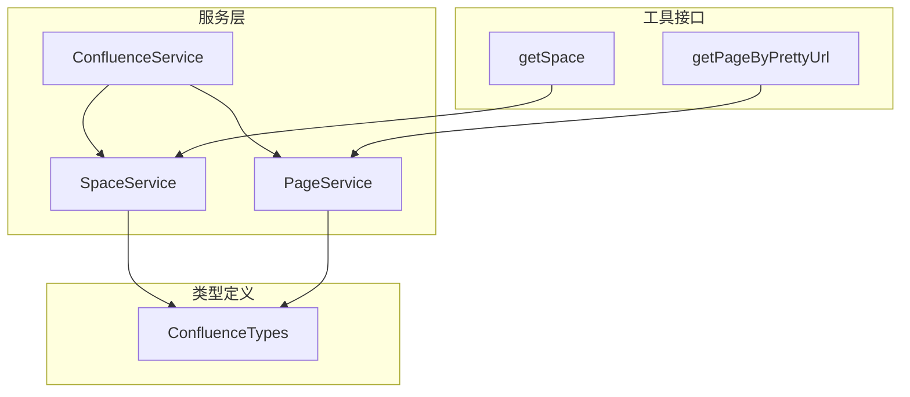
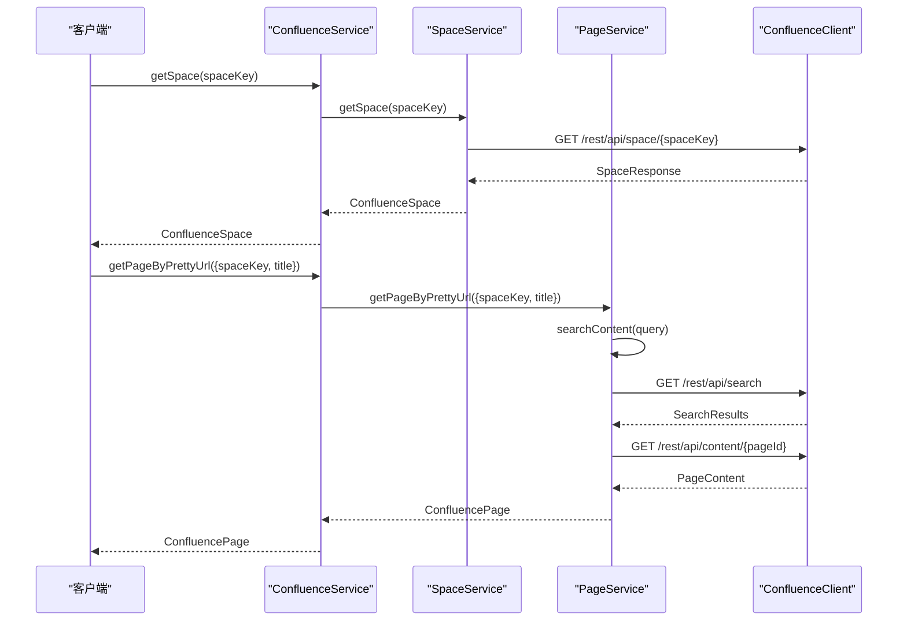
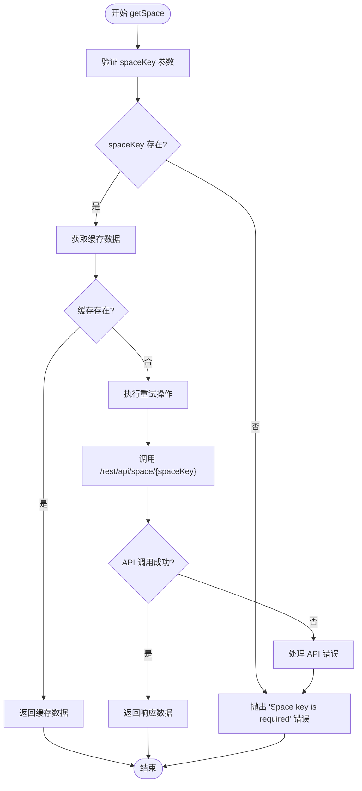
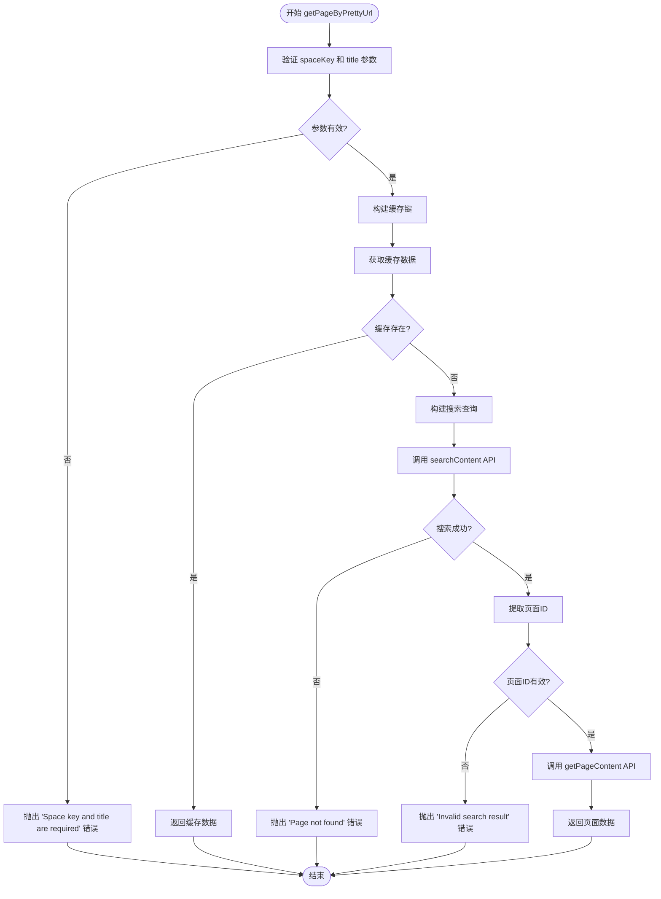
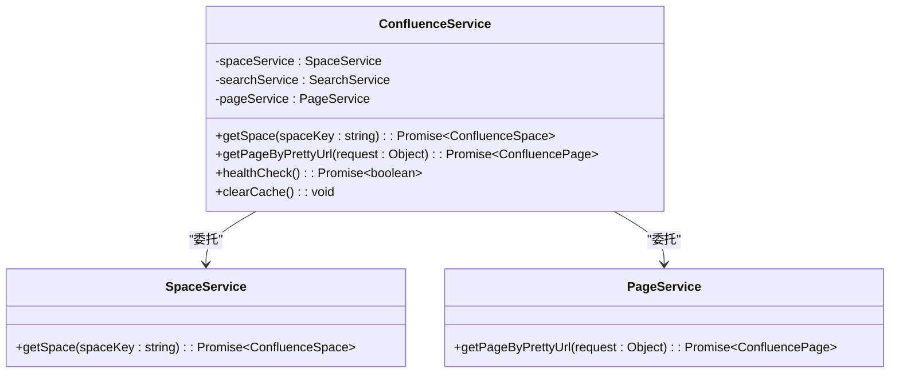
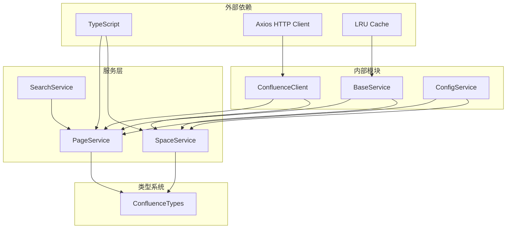

# 基础信息工具

<cite>
**本文档中引用的文件**
- [confluence.types.ts](file://src/types/confluence.types.ts)
- [space.service.ts](file://src/services/features/space.service.ts)
- [page.service.ts](file://src/services/features/page.service.ts)
- [confluence.service.ts](file://src/services/confluence.service.ts)
- [README.md](file://README.md)
</cite>

## 目录
1. [简介](#简介)
2. [项目结构](#项目结构)
3. [核心组件](#核心组件)
4. [架构概览](#架构概览)
5. [详细组件分析](#详细组件分析)
6. [依赖关系分析](#依赖关系分析)
7. [性能考虑](#性能考虑)
8. [故障排除指南](#故障排除指南)
9. [结论](#结论)

## 简介

基础信息工具是MCP Confluence服务的核心功能模块，主要负责提供Confluence空间和页面的基础信息查询能力。该模块包含两个关键的MCP工具：`getSpace`和`getPageByPrettyUrl`，它们分别用于获取空间元数据和通过页面标题URL定位页面信息。

这些工具通过Confluence REST API实现，提供了类型安全的接口和完善的错误处理机制，确保在各种网络环境下都能稳定运行。

## 项目结构

基础信息工具的实现遵循清晰的分层架构，主要文件组织如下：



**图表来源**
- [confluence.service.ts](file://src/services/confluence.service.ts#L1-L50)
- [space.service.ts](file://src/services/features/space.service.ts#L1-L27)
- [page.service.ts](file://src/services/features/page.service.ts#L1-L50)

**章节来源**
- [confluence.service.ts](file://src/services/confluence.service.ts#L1-L100)
- [space.service.ts](file://src/services/features/space.service.ts#L1-L27)
- [page.service.ts](file://src/services/features/page.service.ts#L1-L50)

## 核心组件

### ConfluenceSpace 类型定义

`ConfluenceSpace`接口定义了空间的基本属性，包括唯一标识符、键值、名称和类型等关键信息：

```typescript
export interface ConfluenceSpace {
  id: string;
  key: string;
  name: string;
  type: string;
  _links: {
    webui: string;
    self: string;
  };
}
```

### ConfluencePage 类型定义

`ConfluencePage`接口提供了完整的页面信息结构，包含页面内容、版本控制、空间关联等详细信息：

```typescript
export interface ConfluencePage {
  id: string;
  type: string;
  status: string;
  title: string;
  space: ConfluenceSpace;
  version?: {
    number: number;
    by: {
      username: string;
      displayName: string;
    };
    when: string;
    message?: string;
  };
  body?: {
    storage: {
      value: string;
      representation: string;
    };
  };
  _links: {
    webui: string;
    edit?: string;
    tinyui?: string;
    self: string;
  };
}
```

**章节来源**
- [confluence.types.ts](file://src/types/confluence.types.ts#L10-L50)

## 架构概览

基础信息工具采用分层服务架构，通过ConfluenceService统一管理各个功能模块：



**图表来源**
- [confluence.service.ts](file://src/services/confluence.service.ts#L67-L116)
- [space.service.ts](file://src/services/features/space.service.ts#L12-L25)
- [page.service.ts](file://src/services/features/page.service.ts#L47-L72)

## 详细组件分析

### getSpace 方法实现

`getSpace`方法是空间信息服务的核心功能，负责通过Confluence REST API获取指定空间的元数据信息：



**图表来源**
- [space.service.ts](file://src/services/features/space.service.ts#L12-L25)

#### 关键实现细节

1. **参数验证**: 方法首先验证`spaceKey`参数是否存在，确保必要的输入条件
2. **缓存机制**: 使用`getCachedData`方法实现智能缓存，避免重复API调用
3. **重试机制**: 通过`retryOperation`方法提供自动重试功能，提高API调用的可靠性
4. **日志记录**: 在调试模式下记录详细的API调用信息

**章节来源**
- [space.service.ts](file://src/services/features/space.service.ts#L12-L25)

### getPageByPrettyUrl 方法实现

`getPageByPrettyUrl`方法实现了通过页面标题URL精确查找页面的功能：



**图表来源**
- [page.service.ts](file://src/services/features/page.service.ts#L47-L72)

#### 实现特点

1. **复合查询**: 使用CQL查询语言进行精确匹配
2. **多层缓存**: 实现两级缓存机制，提高性能
3. **错误处理**: 提供详细的错误信息，帮助用户理解问题原因
4. **搜索优化**: 通过精确的CQL查询减少不必要的API调用

**章节来源**
- [page.service.ts](file://src/services/features/page.service.ts#L47-L72)

### ConfluenceService 统一接口

ConfluenceService作为统一的服务入口，为客户端提供简洁的API接口：



**图表来源**
- [confluence.service.ts](file://src/services/confluence.service.ts#L25-L116)

**章节来源**
- [confluence.service.ts](file://src/services/confluence.service.ts#L25-L116)

## 依赖关系分析

基础信息工具的依赖关系体现了清晰的分层架构设计：



**图表来源**
- [space.service.ts](file://src/services/features/space.service.ts#L1-L10)
- [page.service.ts](file://src/services/features/page.service.ts#L1-L20)

**章节来源**
- [space.service.ts](file://src/services/features/space.service.ts#L1-L27)
- [page.service.ts](file://src/services/features/page.service.ts#L1-L50)

## 性能考虑

### 缓存策略

基础信息工具实现了多层次的缓存机制：

1. **内存缓存**: 使用LRU缓存策略，自动清理过期数据
2. **智能失效**: 基于页面内容变更自动失效相关缓存
3. **缓存键优化**: 使用有意义的缓存键，避免冲突

### 网络优化

1. **连接复用**: HTTP客户端支持Keep-Alive连接
2. **请求压缩**: 自动启用gzip压缩
3. **超时控制**: 可配置的请求超时时间
4. **重试机制**: 智能的指数退避重试策略

### 并发控制

1. **请求去重**: 避免重复的相同请求
2. **队列管理**: 合理的请求队列控制
3. **资源限制**: 防止过度消耗系统资源

## 故障排除指南

### 常见错误场景

#### 1. 空间不存在错误

当指定的`spaceKey`不存在时，系统会返回：
```
Error: Space key is required
```

**解决方案**:
- 检查空间键是否正确
- 确认用户具有访问该空间的权限
- 验证Confluence URL配置

#### 2. 页面未找到错误

当页面标题对应的页面不存在时：
```
Error: Page not found: /display/{spaceKey}/{title}
```

**解决方案**:
- 验证页面标题拼写
- 检查页面是否存在于指定空间
- 确认页面状态为"当前"而非"已删除"

#### 3. API访问权限错误

当用户没有足够的权限时：
```
Error: Unauthorized access to space {spaceKey}
```

**解决方案**:
- 检查认证凭据配置
- 验证用户权限设置
- 确认API端点可用性

**章节来源**
- [space.service.ts](file://src/services/features/space.service.ts#L14-L16)
- [page.service.ts](file://src/services/features/page.service.ts#L50-L55)

## 结论

基础信息工具通过精心设计的架构和完善的错误处理机制，为Confluence集成提供了可靠的基础信息服务。其主要优势包括：

1. **类型安全**: 完整的TypeScript类型定义确保编译时错误检查
2. **性能优化**: 多级缓存和智能重试机制提升系统性能
3. **错误处理**: 详细的错误信息和回退机制提高系统稳定性
4. **易于使用**: 简洁的API接口降低使用门槛
5. **扩展性强**: 分层架构便于功能扩展和维护

这些特性使得基础信息工具成为构建高效Confluence应用程序的理想选择，为开发者提供了强大而可靠的基础设施支持。