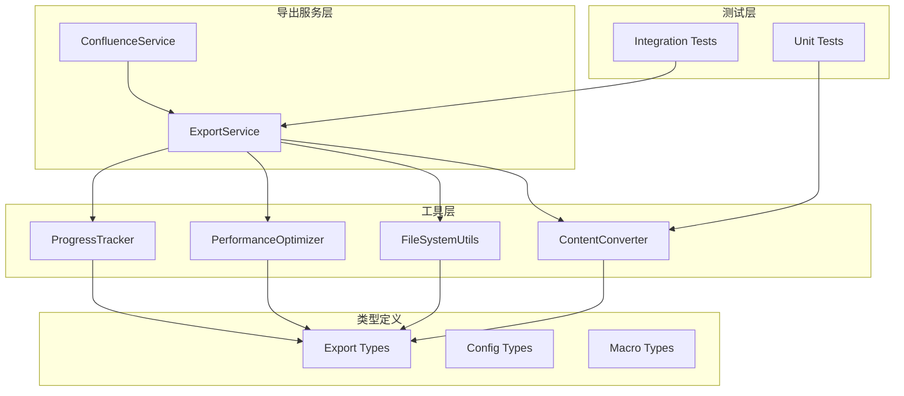
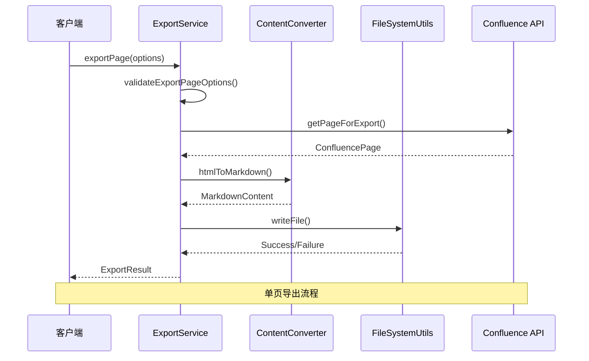
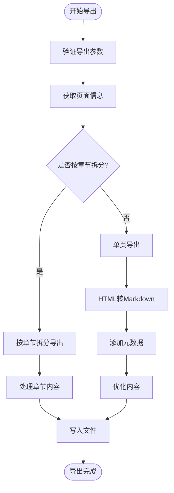
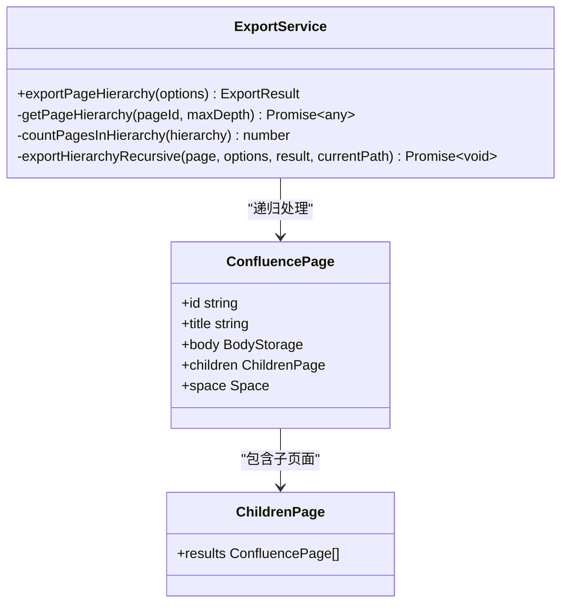
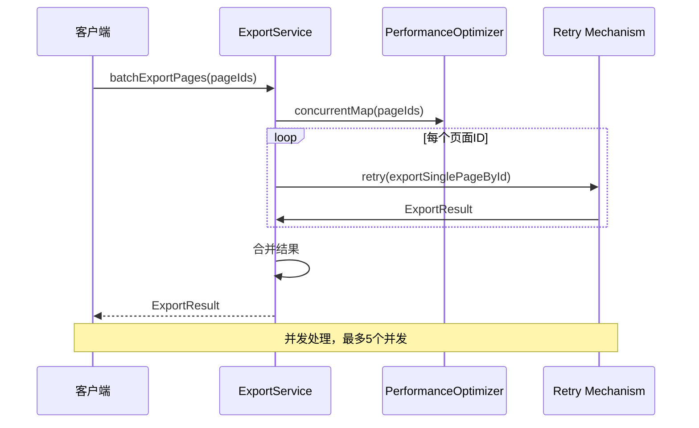
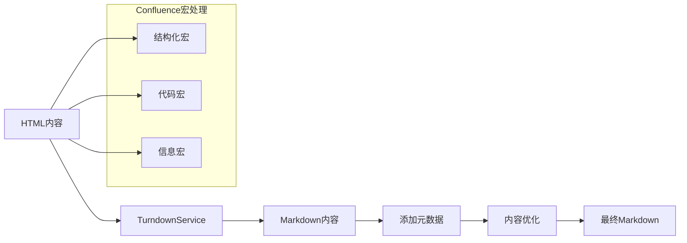
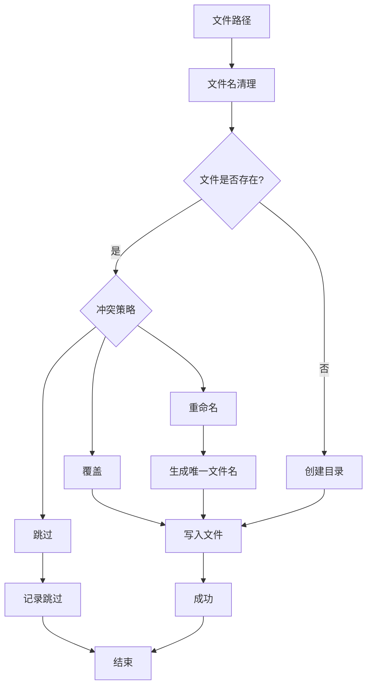
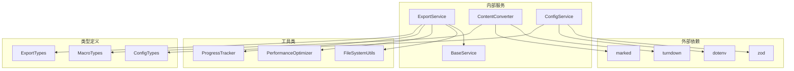
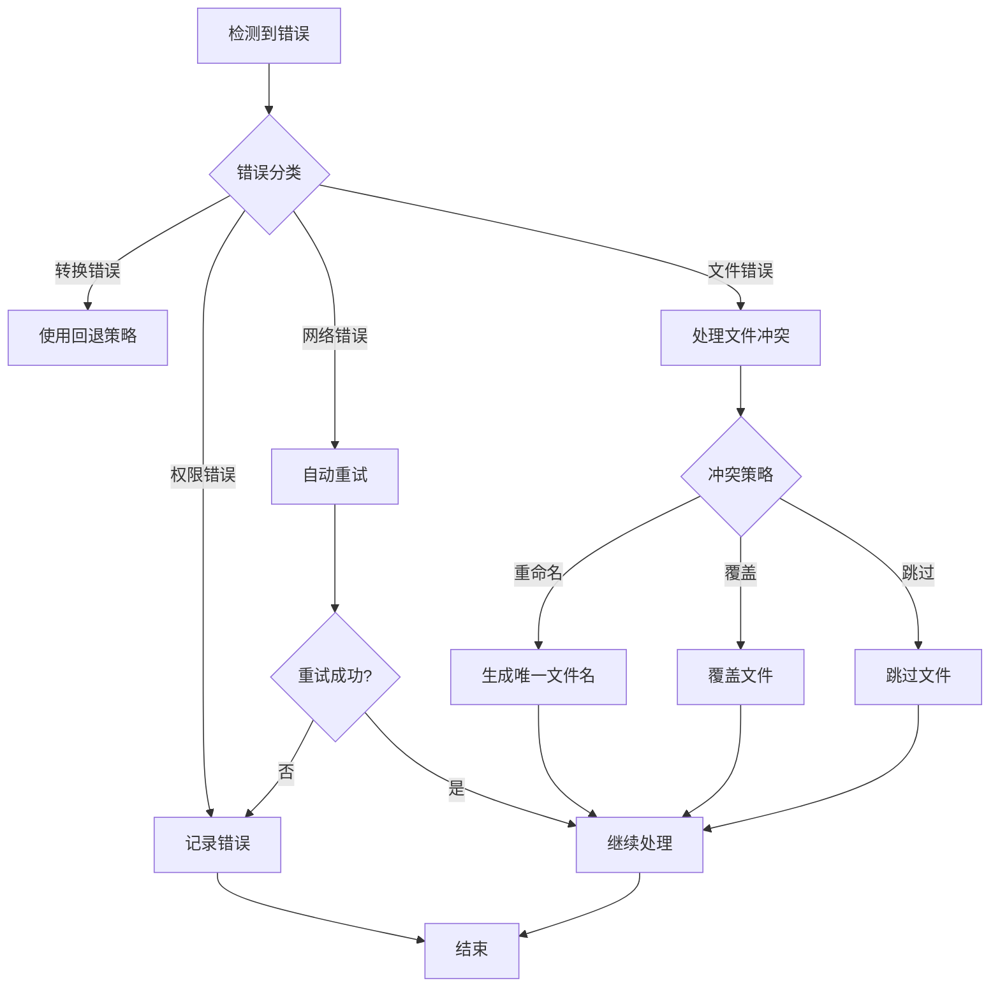

# 导出工具

<cite>
**本文档中引用的文件**
- [export.service.ts](file://src/services/features/export.service.ts)
- [export.types.ts](file://src/types/export.types.ts)
- [content-converter.ts](file://src/utils/content-converter.ts)
- [file-system.ts](file://src/utils/file-system.ts)
- [数据防篡改签名方案.md](file://export/数据防篡改签名方案.md)
- [real-page-104762256.test.ts](file://test/integration/real-page-104762256.test.ts)
- [config.service.ts](file://src/services/config.service.ts)
</cite>

## 目录
1. [简介](#简介)
2. [项目结构](#项目结构)
3. [核心组件](#核心组件)
4. [架构概览](#架构概览)
5. [详细组件分析](#详细组件分析)
6. [依赖关系分析](#依赖关系分析)
7. [性能考虑](#性能考虑)
8. [故障排除指南](#故障排除指南)
9. [结论](#结论)

## 简介

导出工具是一个功能强大的Confluence页面导出系统，提供了三种核心导出功能：单页导出（`exportPage`）、页面层次结构导出（`exportPageHierarchy`）和批量页面导出（`batchExportPages`）。该系统采用现代化的设计模式，支持Markdown格式转换、章节拆分、文件冲突处理、性能优化和错误恢复机制。

系统的核心优势包括：
- **多格式支持**：从HTML到Markdown的高质量转换
- **智能拆分**：支持按章节级别拆分大型页面
- **层次结构导出**：递归导出整个页面树结构
- **并发处理**：高效的批量导出支持
- **完整性保护**：基于哈希签名的数据完整性验证
- **容错机制**：完善的错误处理和重试策略

## 项目结构

导出功能的项目结构围绕核心服务和工具类组织，形成了清晰的分层架构：

**图表来源**
- [export.service.ts](file://src/services/features/export.service.ts#L23-L769)
- [content-converter.ts](file://src/utils/content-converter.ts#L1-L50)
- [file-system.ts](file://src/utils/file-system.ts#L1-L50)

**章节来源**
- [export.service.ts](file://src/services/features/export.service.ts#L1-L50)
- [export.types.ts](file://src/types/export.types.ts#L1-L50)

## 核心组件

### ExportService 类

`ExportService` 是整个导出系统的核心类，继承自 `BaseService`，提供了完整的导出功能实现。该类封装了复杂的导出逻辑，包括页面获取、内容转换、文件写入和错误处理。

主要特性：
- **统一接口**：提供三个核心导出方法
- **进度跟踪**：实时监控导出进度
- **错误恢复**：自动重试和错误分类
- **性能监控**：内置性能统计和资源监控

### ContentConverter 工具类

`ContentConverter` 负责将Confluence的HTML内容转换为Markdown格式。该类集成了Turndown服务，并针对Confluence特有的宏元素进行了专门处理。

核心功能：
- **HTML到Markdown转换**：使用Turndown进行高质量转换
- **Confluence宏处理**：特殊处理结构化宏、代码宏等
- **章节拆分**：智能识别和拆分页面章节
- **内容优化**：优化Markdown格式和结构

### FileSystemUtils 工具类

`FileSystemUtils` 提供了完整的文件系统操作功能，包括文件名清理、目录创建、冲突处理和文件写入。

关键特性：
- **文件名清理**：移除不安全字符，处理Windows保留名称
- **冲突解决**：支持覆盖、重命名和跳过策略
- **路径验证**：确保路径在工作空间范围内
- **批量操作**：支持批量目录创建和文件操作

**章节来源**
- [export.service.ts](file://src/services/features/export.service.ts#L23-L100)
- [content-converter.ts](file://src/utils/content-converter.ts#L1-L100)
- [file-system.ts](file://src/utils/file-system.ts#L1-L100)

## 架构概览

导出系统采用分层架构设计，确保了代码的可维护性和扩展性：

**图表来源**
- [export.service.ts](file://src/services/features/export.service.ts#L23-L150)
- [content-converter.ts](file://src/utils/content-converter.ts#L1-L50)
- [file-system.ts](file://src/utils/file-system.ts#L1-L50)

系统的核心架构特点：

1. **服务导向设计**：每个导出功能都是独立的服务方法
2. **工具类分离**：将具体功能分解到专门的工具类中
3. **类型安全**：使用TypeScript类型确保参数和返回值的正确性
4. **错误处理**：统一的错误分类和处理机制
5. **性能监控**：内置的性能统计和资源监控

## 详细组件分析

### 单页导出功能（exportPage）

单页导出是最基础的导出功能，支持完整的页面内容转换和文件生成：

**图表来源**
- [export.service.ts](file://src/services/features/export.service.ts#L23-L150)
- [export.service.ts](file://src/services/features/export.service.ts#L150-L300)

#### 核心实现细节

1. **参数验证**：确保提供有效的页面标识（pageId或spaceKey+title）
2. **页面获取**：通过Confluence API获取页面的完整信息
3. **内容转换**：使用Turndown服务将HTML转换为Markdown
4. **元数据处理**：可选添加YAML frontmatter
5. **文件写入**：处理文件冲突并写入目标目录

#### 章节拆分功能

当启用 `splitByChapters` 选项时，系统会：
- 分析HTML内容的标题结构
- 按指定级别（H1-H3）拆分页面
- 生成章节导航和索引文件
- 处理章节间的内部链接引用

**章节来源**
- [export.service.ts](file://src/services/features/export.service.ts#L23-L300)

### 页面层次结构导出（exportPageHierarchy）

层次结构导出功能递归导出整个页面树，维护层级关系：

**图表来源**
- [export.service.ts](file://src/services/features/export.service.ts#L300-L450)
- [export.types.ts](file://src/types/export.types.ts#L1-L50)

#### 递归导出机制

1. **层次结构获取**：通过Confluence API递归获取页面及其子页面
2. **深度控制**：支持最大递归深度限制
3. **路径构建**：为每个层级创建对应的输出目录
4. **错误容错**：即使某些子页面获取失败，仍继续处理其他页面

**章节来源**
- [export.service.ts](file://src/services/features/export.service.ts#L300-L500)

### 批量导出功能（batchExportPages）

批量导出功能支持并发处理多个页面ID，显著提升效率：

**图表来源**
- [export.service.ts](file://src/services/features/export.service.ts#L500-L650)

#### 并发控制和重试机制

1. **并发限制**：最多5个并发任务，避免过度消耗系统资源
2. **自动重试**：对网络错误自动重试2次，每次间隔1秒
3. **性能监控**：实时监控内存使用和处理时间
4. **结果聚合**：合并所有页面的导出结果

**章节来源**
- [export.service.ts](file://src/services/features/export.service.ts#L500-L700)

### 内容转换和Markdown处理

ContentConverter 类是内容转换的核心，专门处理Confluence特有的HTML结构：

**图表来源**
- [content-converter.ts](file://src/utils/content-converter.ts#L1-L100)

#### Confluence宏特殊处理

1. **结构化宏**：识别并处理AC:STRUCTURED-MACRO元素
2. **Markdown宏**：特别处理Markdown宏的CDATA内容
3. **代码宏**：保留语言信息并格式化代码块
4. **信息宏**：转换为引用块格式

**章节来源**
- [content-converter.ts](file://src/utils/content-converter.ts#L1-L200)

### 文件系统和冲突处理

FileSystemUtils 提供了完整的文件操作功能：

**图表来源**
- [file-system.ts](file://src/utils/file-system.ts#L1-L100)

#### 冲突处理策略

1. **覆盖策略**：直接覆盖现有文件
2. **重命名策略**：生成带序号的唯一文件名
3. **跳过策略**：跳过已存在的文件
4. **路径验证**：确保文件路径在工作空间范围内

**章节来源**
- [file-system.ts](file://src/utils/file-system.ts#L1-L200)

## 依赖关系分析

导出系统的依赖关系体现了清晰的分层架构：

**图表来源**
- [export.service.ts](file://src/services/features/export.service.ts#L1-L20)
- [content-converter.ts](file://src/utils/content-converter.ts#L1-L20)
- [config.service.ts](file://src/services/config.service.ts#L1-L20)

**章节来源**
- [export.service.ts](file://src/services/features/export.service.ts#L1-L30)
- [content-converter.ts](file://src/utils/content-converter.ts#L1-L30)
- [config.service.ts](file://src/services/config.service.ts#L1-L30)

## 性能考虑

导出系统在设计时充分考虑了性能优化：

### 并发处理

- **批量导出**：最多5个并发任务，避免系统过载
- **内存监控**：实时监控内存使用，防止内存泄漏
- **资源池**：使用性能优化器管理并发资源

### 内存优化

- **流式处理**：大文件采用流式写入
- **垃圾回收**：及时释放不需要的对象
- **缓存策略**：合理使用缓存减少重复计算

### 网络优化

- **连接复用**：Confluence API连接复用
- **超时控制**：合理的超时设置避免长时间等待
- **重试机制**：自动重试网络错误

## 故障排除指南

### 常见错误类型

系统定义了详细的错误类型枚举：

1. **PAGE_NOT_FOUND**：页面未找到
2. **PERMISSION_DENIED**：权限不足
3. **CONVERSION_FAILED**：内容转换失败
4. **FILE_WRITE_ERROR**：文件写入错误
5. **NETWORK_ERROR**：网络连接错误
6. **INVALID_PARAMETERS**：参数无效

### 错误恢复机制

**图表来源**
- [export.types.ts](file://src/types/export.types.ts#L80-L120)

### 调试和监控

- **日志记录**：详细的调试日志
- **性能统计**：处理时间和内存使用统计
- **进度跟踪**：实时导出进度显示
- **错误报告**：完整的错误堆栈信息

**章节来源**
- [export.types.ts](file://src/types/export.types.ts#L80-L150)

## 结论

导出工具是一个功能完善、设计精良的Confluence页面导出系统。它通过以下特点实现了高效、可靠的导出功能：

### 主要优势

1. **功能全面**：支持单页、层次结构和批量导出
2. **质量保证**：高质量的HTML到Markdown转换
3. **性能优化**：并发处理和智能缓存
4. **错误处理**：完善的错误分类和恢复机制
5. **扩展性强**：模块化设计便于功能扩展

### 技术特色

- **现代化架构**：基于TypeScript和面向对象设计
- **类型安全**：完整的类型定义确保代码质量
- **测试覆盖**：全面的单元测试和集成测试
- **文档完善**：详细的API文档和使用示例

### 应用场景

该导出工具适用于各种Confluence内容迁移、备份和归档场景，能够满足从个人笔记到企业知识库的各种需求。通过其强大的功能和稳定的性能，可以确保Confluence内容的安全、完整和可访问性。