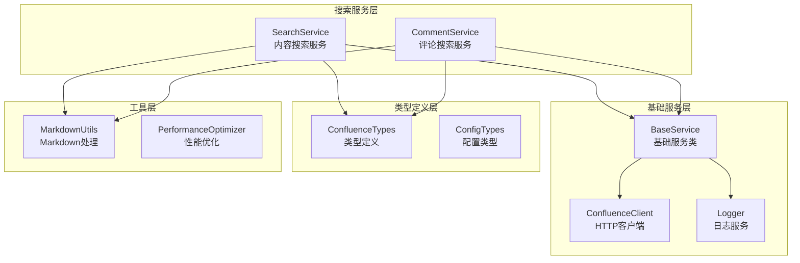
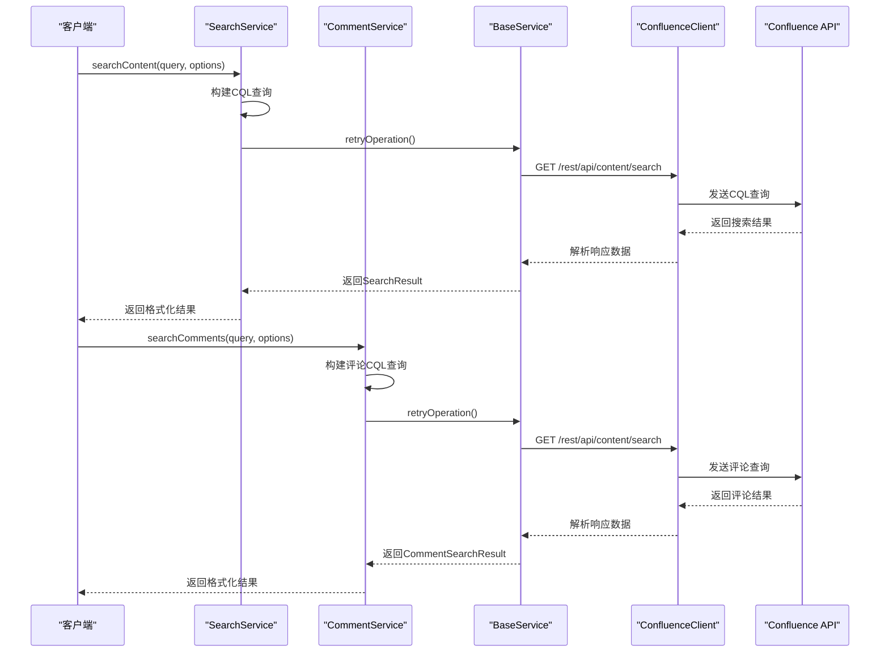
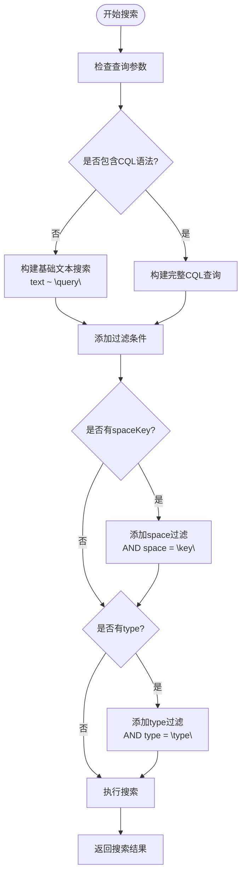
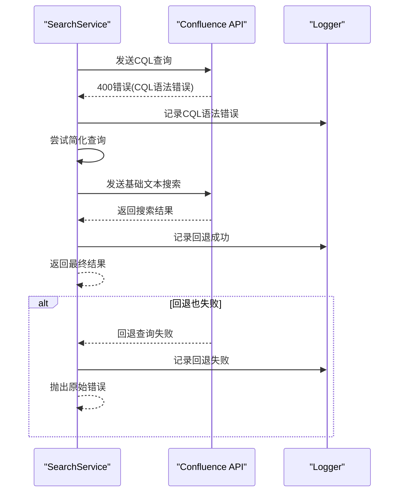
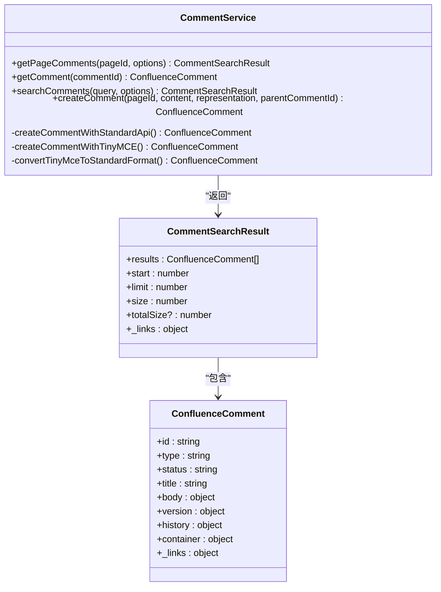
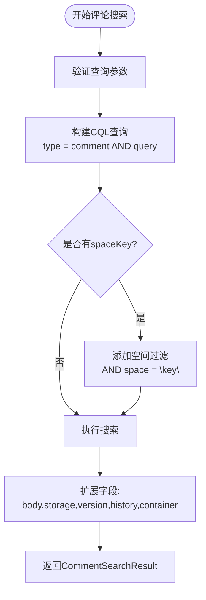
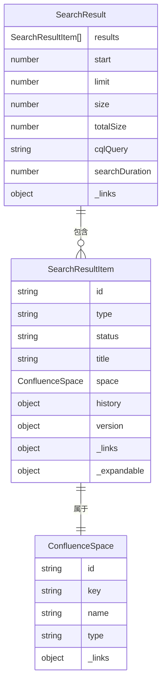
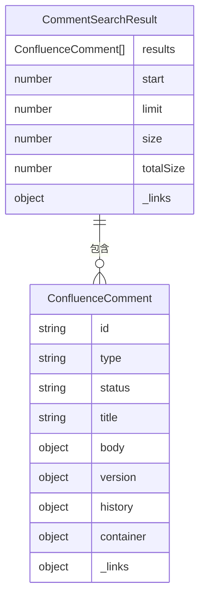
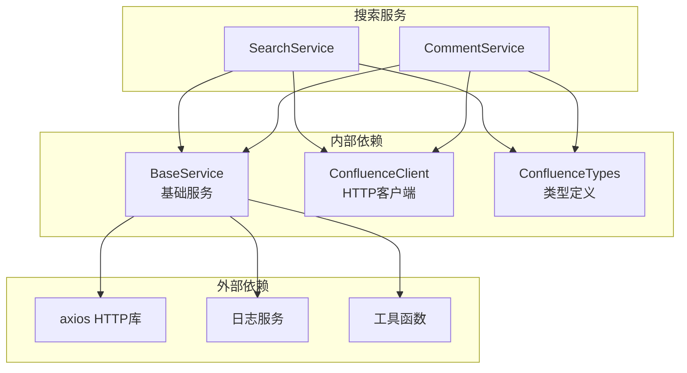

# 搜索工具

<cite>
**本文档中引用的文件**
- [search.service.ts](file://src/services/features/search.service.ts)
- [comment-basic.service.ts](file://src/services/features/comment-basic.service.ts)
- [confluence.types.ts](file://src/types/confluence.types.ts)
- [base.service.ts](file://src/services/base.service.ts)
- [page.service.ts](file://src/services/page.service.ts)
- [markdown-macro-real-page.test.ts](file://test/integration/markdown-macro-real-page.test.ts)
</cite>

## 目录
1. [简介](#简介)
2. [项目结构](#项目结构)
3. [核心组件](#核心组件)
4. [架构概览](#架构概览)
5. [详细组件分析](#详细组件分析)
6. [依赖关系分析](#依赖关系分析)
7. [性能考虑](#性能考虑)
8. [故障排除指南](#故障排除指南)
9. [结论](#结论)

## 简介

搜索工具是 Confluence TypeScript 服务器的核心功能模块，提供了强大的全文检索能力。该系统主要由两个核心搜索服务组成：`SearchService` 和 `CommentService`，它们分别负责内容搜索和评论搜索功能。

SearchService 类实现了基于 Confluence Query Language (CQL) 的全文检索功能，支持多种搜索参数配置，包括空间过滤、类型限制、日期范围等高级特性。CommentService 则专门处理评论内容的搜索和管理，提供了灵活的评论查询机制。

这些搜索工具不仅支持基础的文本匹配，还具备智能的错误处理、重试机制和性能优化策略，确保在各种网络环境和数据规模下都能提供稳定可靠的搜索服务。

## 项目结构

搜索工具的实现分布在多个模块中，形成了清晰的分层架构：



**图表来源**
- [search.service.ts](file://src/services/features/search.service.ts#L1-L104)
- [comment-basic.service.ts](file://src/services/features/comment-basic.service.ts#L1-L50)
- [base.service.ts](file://src/services/base.service.ts#L1-L184)

**章节来源**
- [search.service.ts](file://src/services/features/search.service.ts#L1-L104)
- [comment-basic.service.ts](file://src/services/features/comment-basic.service.ts#L1-L200)
- [base.service.ts](file://src/services/base.service.ts#L1-L184)

## 核心组件

### SearchService - 内容搜索服务

SearchService 是整个搜索系统的核心，继承自 BaseService，提供了完整的 CQL 查询构建和执行功能。

**主要特性：**
- 自动 CQL 查询构建
- 智能错误处理和回退机制
- 分页和排序支持
- 空间和类型过滤
- 性能监控和日志记录

### CommentService - 评论搜索服务

CommentService 专门处理评论相关的搜索功能，提供了灵活的评论查询和管理能力。

**主要特性：**
- 评论内容搜索
- 页面评论获取
- 评论详细信息查询
- 多种评论策略支持
- Markdown 格式处理

**章节来源**
- [search.service.ts](file://src/services/features/search.service.ts#L8-L104)
- [comment-basic.service.ts](file://src/services/features/comment-basic.service.ts#L13-L200)

## 架构概览

搜索工具采用分层架构设计，确保了代码的可维护性和扩展性：



**图表来源**
- [search.service.ts](file://src/services/features/search.service.ts#L15-L85)
- [comment-basic.service.ts](file://src/services/features/comment-basic.service.ts#L50-L75)

## 详细组件分析

### SearchService 详细分析

SearchService 提供了强大的内容搜索功能，其核心实现包括以下几个关键部分：

#### CQL 查询构建机制



**图表来源**
- [search.service.ts](file://src/services/features/search.service.ts#L25-L45)

#### 智能错误处理和回退机制

SearchService 实现了完善的错误处理机制，当遇到 CQL 语法错误时会自动回退到基础文本搜索：



**图表来源**
- [search.service.ts](file://src/services/features/search.service.ts#L60-L85)

#### 搜索选项配置

SearchService 支持丰富的搜索选项配置：

```typescript
interface SearchOptions {
  limit?: number;      // 每页结果数量（默认100）
  start?: number;      // 起始位置（默认0）
  spaceKey?: string;   // 空间键过滤
  type?: string;       // 内容类型过滤
}
```

**章节来源**
- [search.service.ts](file://src/services/features/search.service.ts#L15-L104)
- [base.service.ts](file://src/services/base.service.ts#L25-L35)

### CommentService 详细分析

CommentService 专注于评论内容的搜索和管理，提供了专门的评论查询功能：

#### 评论搜索查询构建



**图表来源**
- [comment-basic.service.ts](file://src/services/features/comment-basic.service.ts#L50-L75)
- [confluence.types.ts](file://src/types/confluence.types.ts#L150-L180)

#### 评论搜索选项配置

```typescript
interface CommentSearchOptions {
  start?: number;      // 起始位置（默认0）
  limit?: number;      // 每页结果数量（默认25）
  spaceKey?: string;   // 空间键过滤
}
```

#### 评论搜索查询构建过程



**图表来源**
- [comment-basic.service.ts](file://src/services/features/comment-basic.service.ts#L50-L75)

**章节来源**
- [comment-basic.service.ts](file://src/services/features/comment-basic.service.ts#L50-L75)
- [confluence.types.ts](file://src/types/confluence.types.ts#L150-L180)

### 搜索结果类型定义

搜索工具使用了详细的类型定义来确保数据的一致性和可预测性：

#### SearchResult 类型结构



**图表来源**
- [confluence.types.ts](file://src/types/confluence.types.ts#L60-L90)

#### CommentSearchResult 类型结构



**图表来源**
- [confluence.types.ts](file://src/types/confluence.types.ts#L150-L180)

**章节来源**
- [confluence.types.ts](file://src/types/confluence.types.ts#L60-L180)

## 依赖关系分析

搜索工具的依赖关系体现了清晰的分层架构设计：



**图表来源**
- [search.service.ts](file://src/services/features/search.service.ts#L1-L5)
- [comment-basic.service.ts](file://src/services/features/comment-basic.service.ts#L1-L10)
- [base.service.ts](file://src/services/base.service.ts#L1-L10)

**章节来源**
- [search.service.ts](file://src/services/features/search.service.ts#L1-L104)
- [comment-basic.service.ts](file://src/services/features/comment-basic.service.ts#L1-L200)
- [base.service.ts](file://src/services/base.service.ts#L1-L184)

## 性能考虑

搜索工具在设计时充分考虑了性能优化，采用了多种策略来提升搜索效率和用户体验：

### 缓存机制

BaseService 实现了智能缓存机制，可以显著减少重复请求：

- **缓存 TTL**: 默认 5 分钟缓存时间
- **缓存键**: 基于操作类型和参数生成唯一键
- **缓存失效**: 支持手动清除缓存

### 重试机制

完善的重试策略确保了搜索服务的可靠性：

- **最大重试次数**: 默认 3 次
- **重试延迟**: 1 秒间隔
- **可重试错误**: 5xx 错误、连接重置、超时

### 分页和限制

搜索结果支持分页和数量限制，避免一次性加载过多数据：

- **默认限制**: searchContent 100 条，searchComments 25 条
- **起始位置**: 支持任意起始位置
- **动态调整**: 根据实际需求调整限制数量

### 字段展开优化

搜索请求中只展开必要的字段，减少数据传输量：

- **searchContent**: 展开 `space,history,version`
- **searchComments**: 展开 `body.storage,version,history,container`

## 故障排除指南

### 常见问题和解决方案

#### CQL 语法错误

**问题**: 搜索时出现 CQL 语法错误
**解决方案**: 
1. 检查查询字符串是否包含有效的 CQL 语法
2. 系统会自动回退到基础文本搜索
3. 如需精确控制，建议使用完整的 CQL 查询

#### 权限不足

**问题**: 无法访问某些空间或页面
**解决方案**:
1. 检查 Confluence 用户权限
2. 确认空间键和页面 ID 正确
3. 使用管理员账户进行调试

#### 网络连接问题

**问题**: 搜索请求超时或连接失败
**解决方案**:
1. 检查网络连接状态
2. 调整超时设置
3. 使用重试机制处理临时故障

#### 性能问题

**问题**: 搜索响应缓慢
**解决方案**:
1. 减少搜索范围（使用 spaceKey 过滤）
2. 限制返回结果数量
3. 使用更精确的查询条件
4. 启用缓存机制

**章节来源**
- [search.service.ts](file://src/services/features/search.service.ts#L60-L85)
- [base.service.ts](file://src/services/base.service.ts#L80-L120)

## 典型使用场景

### 场景一：查找最近更新的技术文档

```typescript
// 使用 searchContent 查找最近更新的技术文档
const recentDocs = await searchService.searchContent(
  'space = "TECH" AND type = "page"',
  {
    limit: 20,
    start: 0,
    sort: '-lastmodified' // 按最后修改时间降序排列
  }
);
```

### 场景二：检索某用户的所有评论

```typescript
// 使用 searchComments 检索某用户的所有评论
const userComments = await commentService.searchComments(
  'creator = "username"',
  {
    limit: 50,
    spaceKey: 'PROJECT' // 限定在特定空间
  }
);
```

### 场景三：高级内容搜索

```typescript
// 组合多种搜索条件的高级查询
const advancedSearch = await searchService.searchContent(
  '(title ~ "API" OR body ~ "API") AND space = "DOCS" AND type = "page"',
  {
    limit: 10,
    start: 0,
    expand: 'space,history,version,metadata.labels'
  }
);
```

### 场景四：评论搜索和管理

```typescript
// 搜索特定页面的评论
const pageComments = await commentService.getPageComments(
  '123456789',
  {
    limit: 10,
    start: 0
  }
);

// 搜索包含特定关键词的评论
const keywordComments = await commentService.searchComments(
  '"important feedback"',
  {
    limit: 25,
    spaceKey: 'TEAM'
  }
);
```

## 结论

搜索工具是 Confluence TypeScript 服务器的核心功能模块，通过精心设计的架构和完善的错误处理机制，为用户提供了强大而可靠的搜索能力。

### 主要优势

1. **智能查询构建**: 自动处理 CQL 查询构建，支持多种查询模式
2. **完善的错误处理**: 智能回退机制确保搜索成功率
3. **高性能设计**: 缓存、重试、分页等多重优化策略
4. **灵活的配置选项**: 支持空间过滤、类型限制、排序等功能
5. **类型安全**: 完整的 TypeScript 类型定义确保开发体验

### 最佳实践建议

1. **合理使用过滤条件**: 通过 spaceKey 和 type 限制搜索范围
2. **适当设置分页参数**: 避免一次性加载过多数据
3. **利用缓存机制**: 对频繁查询的结果启用缓存
4. **监控搜索性能**: 关注搜索响应时间和错误率
5. **定期清理缓存**: 在数据发生重大变化时清除缓存

搜索工具的设计充分体现了现代软件工程的最佳实践，为 Confluence 平台提供了高质量的搜索服务，满足了各种复杂的业务需求。