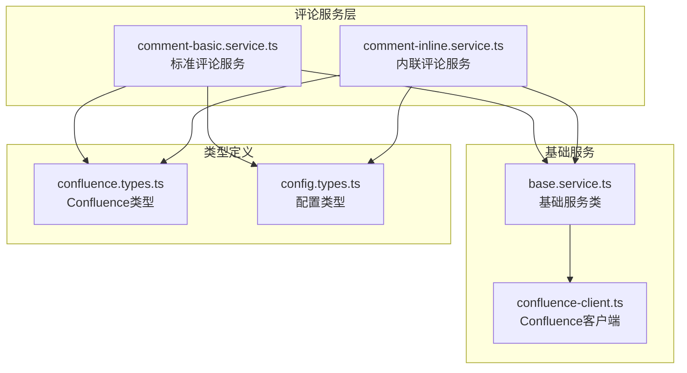
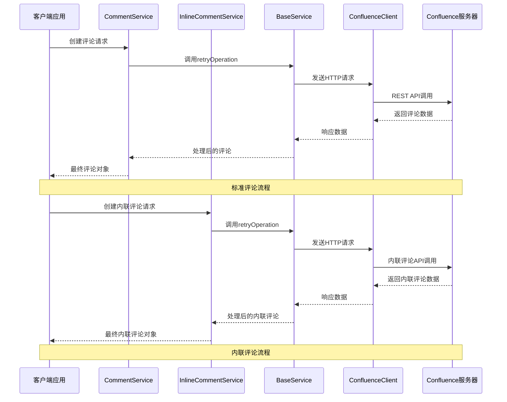
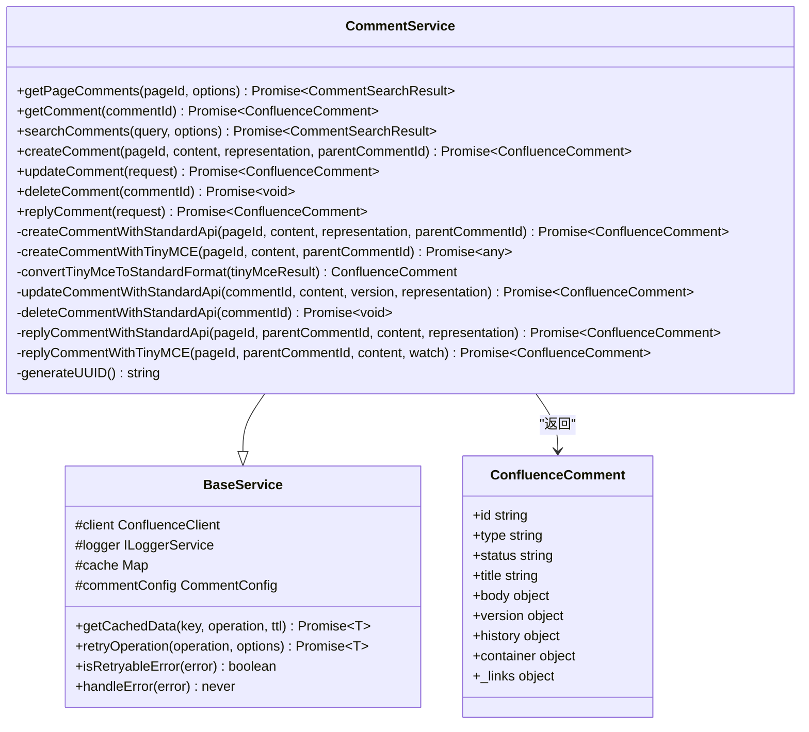
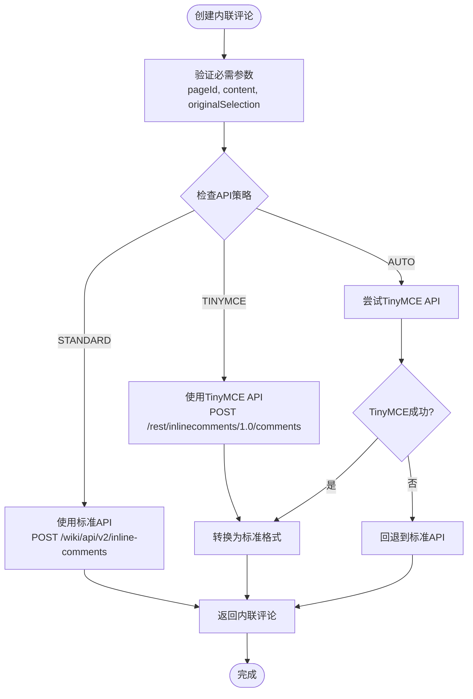
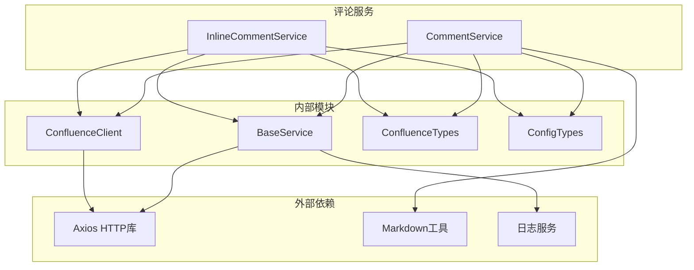

# 评论管理工具

<cite>
**本文档引用的文件**
- [comment-basic.service.ts](file://src/services/features/comment-basic.service.ts)
- [comment-inline.service.ts](file://src/services/features/comment-inline.service.ts)
- [confluence.types.ts](file://src/types/confluence.types.ts)
- [config.types.ts](file://src/types/config.types.ts)
- [base.service.ts](file://src/services/base.service.ts)
- [confluence-client.ts](file://src/services/confluence-client.ts)
</cite>

## 目录
1. [简介](#简介)
2. [项目结构](#项目结构)
3. [核心组件](#核心组件)
4. [架构概览](#架构概览)
5. [详细组件分析](#详细组件分析)
6. [依赖关系分析](#依赖关系分析)
7. [性能考虑](#性能考虑)
8. [故障排除指南](#故障排除指南)
9. [结论](#结论)

## 简介

评论管理工具是一个专门设计用于与Atlassian Confluence集成的评论管理系统。该系统提供了两个主要的服务类：`CommentService`（标准评论服务）和`InlineCommentService`（内联评论服务），分别处理不同类型的评论操作。系统支持评论的创建、读取、更新、删除（CRUD）以及回复功能，并且具备智能的API策略选择和回退机制。

## 项目结构

评论管理工具位于`src/services/features/`目录下，包含以下核心文件：



**图表来源**
- [comment-basic.service.ts](file://src/services/features/comment-basic.service.ts#L1-L20)
- [comment-inline.service.ts](file://src/services/features/comment-inline.service.ts#L1-L20)
- [base.service.ts](file://src/services/base.service.ts#L1-L30)

**章节来源**
- [comment-basic.service.ts](file://src/services/features/comment-basic.service.ts#L1-L579)
- [comment-inline.service.ts](file://src/services/features/comment-inline.service.ts#L1-L481)

## 核心组件

### 评论服务架构

评论管理工具采用双服务架构，针对不同的评论类型提供专门的处理逻辑：

1. **标准评论服务（CommentService）**
   - 处理传统的页面评论
   - 支持Markdown和存储格式的内容
   - 提供完整的CRUD操作
   - 支持嵌套回复和分页查询

2. **内联评论服务（InlineCommentService）**
   - 处理页面内的行内注释
   - 专注于文本选择区域的评论
   - 提供精确的坐标定位
   - 支持高亮显示和匹配索引

### API策略支持

系统支持三种API策略，确保最佳的兼容性和可靠性：

- **STANDARD（标准API）**：使用Confluence的标准REST API，兼容性好
- **TINYMCE（TinyMCE端点）**：使用富文本编辑器端点，功能更丰富
- **AUTO（自动选择）**：优先使用TinyMCE，失败时回退到标准API

**章节来源**
- [comment-basic.service.ts](file://src/services/features/comment-basic.service.ts#L15-L30)
- [comment-inline.service.ts](file://src/services/features/comment-inline.service.ts#L15-L30)
- [config.types.ts](file://src/types/config.types.ts#L4-L15)

## 架构概览



**图表来源**
- [comment-basic.service.ts](file://src/services/features/comment-basic.service.ts#L25-L50)
- [comment-inline.service.ts](file://src/services/features/comment-inline.service.ts#L25-L50)
- [base.service.ts](file://src/services/base.service.ts#L80-L120)

## 详细组件分析

### CommentService - 标准评论服务

`CommentService`继承自`BaseService`，提供了完整的标准评论管理功能。

#### 主要功能模块



**图表来源**
- [comment-basic.service.ts](file://src/services/features/comment-basic.service.ts#L15-L50)
- [base.service.ts](file://src/services/base.service.ts#L40-L80)
- [confluence.types.ts](file://src/types/confluence.types.ts#L120-L160)

#### 分页获取页面评论

`getPageComments`方法实现了高效的分页评论获取功能：

```typescript
public async getPageComments(
  pageId: string,
  options: { start?: number; limit?: number } = {}
): Promise<CommentSearchResult>
```

**参数说明：**
- `pageId`: 必需参数，标识目标页面
- `options.start`: 分页起始位置，默认为0
- `options.limit`: 每页数量，默认为25

**API调用路径：**
```
GET /rest/api/content/{pageId}/child/comment
```

**请求体结构：**
```json
{
  "start": 0,
  "limit": 25,
  "expand": "body.storage,version,history,container"
}
```

**响应格式：**
```json
{
  "results": [...],
  "start": 0,
  "limit": 25,
  "size": 10,
  "totalSize": 100,
  "_links": {...}
}
```

#### 精确查询单条评论

`getComment`方法提供了单条评论的精确查询功能：

```typescript
public async getComment(commentId: string): Promise<ConfluenceComment>
```

**特点：**
- 使用缓存机制提高性能
- 自动展开必要的扩展字段
- 支持评论历史和版本信息

**章节来源**
- [comment-basic.service.ts](file://src/services/features/comment-basic.service.ts#L25-L50)
- [comment-basic.service.ts](file://src/services/features/comment-basic.service.ts#L52-L75)

### InlineCommentService - 内联评论服务

`InlineCommentService`专门处理页面内的行内注释，提供了精确的文本定位功能。

#### 内联评论特性



**图表来源**
- [comment-inline.service.ts](file://src/services/features/comment-inline.service.ts#L25-L80)
- [comment-inline.service.ts](file://src/services/features/comment-inline.service.ts#L150-L200)

#### 内联评论数据结构

内联评论具有独特的数据结构，包含文本选择和高亮信息：

```typescript
interface InlineComment {
  id: string;
  originalSelection: string;           // 原始文本选择
  body: string;                        // 评论内容
  matchIndex: number;                  // 匹配索引
  numMatches: number;                 // 匹配总数
  serializedHighlights: string;       // 序列化的高亮信息
  authorDisplayName: string;          // 作者显示名称
  authorUserName: string;             // 作者用户名
  authorAvatarUrl: string;            // 作者头像URL
  containerId: string;                // 容器ID（页面ID）
  parentCommentId: string;            // 父评论ID
  lastFetchTime: string;              // 最后获取时间
  hasDeletePermission: boolean;       // 删除权限
  hasEditPermission: boolean;         // 编辑权限
  hasResolvePermission: boolean;      // 解决权限
  resolveProperties: object;          // 解决属性
  deleted: boolean;                   // 是否已删除
  created?: string;                   // 创建时间
  updated?: string;                   // 更新时间
}
```

**章节来源**
- [comment-inline.service.ts](file://src/services/features/comment-inline.service.ts#L15-L50)
- [confluence.types.ts](file://src/types/confluence.types.ts#L165-L195)

### manageComments 功能详解

`manageComments`功能通过`CommentService`和`InlineCommentService`的组合实现，支持以下核心操作：

#### 创建评论

**标准评论创建：**
```typescript
await commentService.createComment(
  pageId, 
  content, 
  representation, 
  parentCommentId
);
```

**内联评论创建：**
```typescript
await inlineCommentService.createInlineComment(
  pageId,
  content,
  originalSelection,
  matchIndex,
  numMatches,
  serializedHighlights,
  parentCommentId
);
```

#### 更新评论

**自动版本管理：**
```typescript
await commentService.updateComment({
  id: commentId,
  content: newContent,
  version: autoVersion // 可选，系统自动获取并递增
});
```

#### 删除评论

```typescript
await commentService.deleteComment(commentId);
await inlineCommentService.deleteInlineComment(commentId);
```

#### 回复评论

**标准评论回复：**
```typescript
await commentService.replyComment({
  pageId,
  parentCommentId,
  content,
  watch: false,
  representation: 'storage'
});
```

**内联评论回复：**
```typescript
await inlineCommentService.replyInlineComment({
  commentId,
  pageId,
  content
});
```

**章节来源**
- [comment-basic.service.ts](file://src/services/features/comment-basic.service.ts#L80-L150)
- [comment-inline.service.ts](file://src/services/features/comment-inline.service.ts#L80-L150)

## 依赖关系分析



**图表来源**
- [comment-basic.service.ts](file://src/services/features/comment-basic.service.ts#L1-L15)
- [comment-inline.service.ts](file://src/services/features/comment-inline.service.ts#L1-L15)
- [base.service.ts](file://src/services/base.service.ts#L1-L20)

**章节来源**
- [comment-basic.service.ts](file://src/services/features/comment-basic.service.ts#L1-L20)
- [comment-inline.service.ts](file://src/services/features/comment-inline.service.ts#L1-L20)
- [base.service.ts](file://src/services/base.service.ts#L1-L50)

## 性能考虑

### 缓存策略

系统实现了智能缓存机制来提升性能：

- **缓存键格式**：`comment:{commentId}` 或 `inline-comment:{commentId}`
- **缓存过期时间**：默认5分钟（300秒）
- **缓存清除**：在更新和删除操作后自动清除相关缓存

### 重试机制

```typescript
protected async retryOperation<T>(
  operation: () => Promise<T>,
  options?: RetryOptions | number
): Promise<T>
```

**重试策略：**
- 默认最大重试次数：3次
- 默认重试延迟：1000毫秒
- 可重试的错误类型：5xx状态码、连接重置、超时

### 并发控制

- **HTTP连接池**：支持最多100个并发连接
- **Keep-Alive**：启用连接保持以减少握手开销
- **请求超时**：默认15秒，可根据配置调整

## 故障排除指南

### 常见错误场景

#### 评论不存在错误

```typescript
try {
  const comment = await commentService.getComment('non-existent-id');
} catch (error) {
  if (error.statusCode === 404) {
    console.log('评论不存在');
  }
}
```

#### 权限不足错误

```typescript
try {
  await commentService.createComment(pageId, content);
} catch (error) {
  if (error.statusCode === 403) {
    console.log('无权限创建评论');
  }
}
```

#### API策略配置

```typescript
const config = {
  comment: {
    apiStrategy: CommentApiStrategy.STANDARD, // 强制使用标准API
    enableFallback: false,                    // 禁用回退机制
    timeout: 10000                           // 设置超时时间
  }
};
```

### 错误处理最佳实践

1. **捕获具体异常类型**
2. **记录详细错误信息**
3. **提供有意义的错误消息**
4. **实现适当的重试逻辑**

**章节来源**
- [comment-basic.service.ts](file://src/services/features/comment-basic.service.ts#L150-L200)
- [base.service.ts](file://src/services/base.service.ts#L120-L160)

## 结论

评论管理工具提供了一个全面而灵活的解决方案，用于处理Confluence平台上的各种评论需求。通过双服务架构、智能API策略选择和完善的错误处理机制，该系统能够适应不同的使用场景和技术要求。

### 主要优势

1. **双重支持**：同时支持标准评论和内联评论
2. **智能策略**：自动选择最优API端点
3. **容错能力**：强大的回退机制和重试逻辑
4. **性能优化**：智能缓存和并发控制
5. **类型安全**：完整的TypeScript类型定义

### 未来发展方向

- 支持更多评论格式和表示方式
- 增强实时协作功能
- 优化大规模评论处理性能
- 扩展移动端适配能力

该工具为开发者提供了强大而可靠的评论管理能力，是构建Confluence集成应用的理想选择。