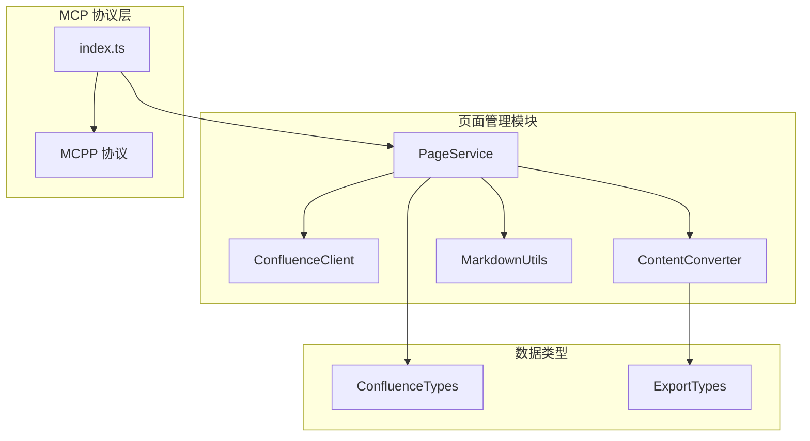
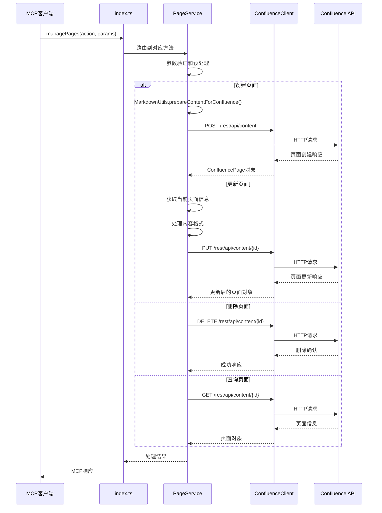
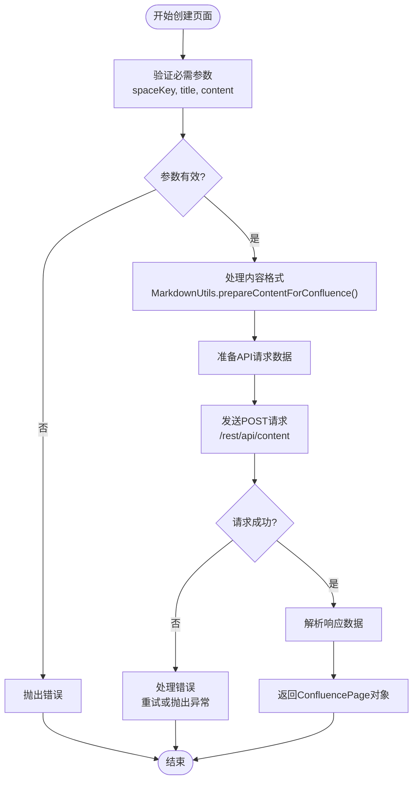
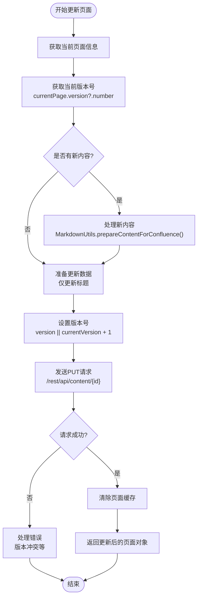
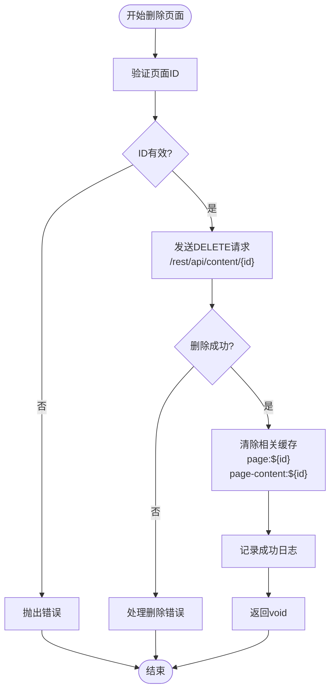
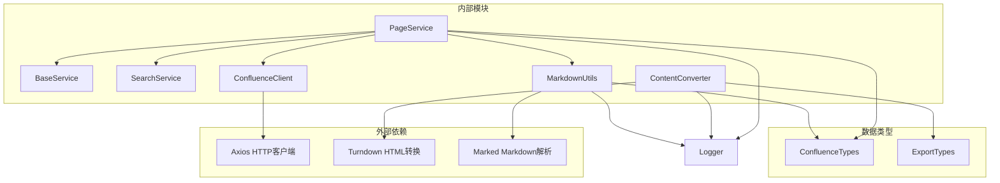

# 页面管理工具

<cite>
**本文档中引用的文件**
- [page.service.ts](file://src/services/features/page.service.ts)
- [confluence.types.ts](file://src/types/confluence.types.ts)
- [content-converter.ts](file://src/utils/content-converter.ts)
- [markdown.ts](file://src/utils/markdown.ts)
- [confluence-client.ts](file://src/services/confluence-client.ts)
- [index.ts](file://src/index.ts)
- [README.md](file://README.md)
</cite>

## 目录
1. [简介](#简介)
2. [项目结构](#项目结构)
3. [核心组件](#核心组件)
4. [架构概览](#架构概览)
5. [详细组件分析](#详细组件分析)
6. [依赖关系分析](#依赖关系分析)
7. [性能考虑](#性能考虑)
8. [故障排除指南](#故障排除指南)
9. [结论](#结论)

## 简介

managePages 工具是 Confluence MCP 服务器的核心功能模块，负责管理 Confluence 页面的完整生命周期。该工具提供了完整的 CRUD（创建、读取、更新、删除）操作能力，支持多种内容格式转换，并通过统一的 MCPP 协议接口对外提供服务。

该工具的主要功能包括：
- **页面创建**：支持多种内容格式（HTML、Markdown、Wiki）的页面创建
- **页面查询**：提供基本页面信息和详细内容获取
- **页面更新**：支持增量更新和版本控制
- **页面删除**：安全删除页面及其相关资源
- **内容转换**：自动处理 HTML 和 Markdown 格式转换
- **错误处理**：完善的异常处理和重试机制

## 项目结构



**图表来源**
- [page.service.ts](file://src/services/features/page.service.ts#L1-L217)
- [confluence-client.ts](file://src/services/confluence-client.ts#L1-L147)
- [index.ts](file://src/index.ts#L118-L170)

**章节来源**
- [page.service.ts](file://src/services/features/page.service.ts#L1-L217)
- [confluence.types.ts](file://src/types/confluence.types.ts#L1-L274)

## 核心组件

### PageService 类

PageService 是页面管理功能的核心服务类，继承自 BaseService，提供了完整的页面 CRUD 操作：

```typescript
export class PageService extends BaseService {
  private searchService: SearchService;

  constructor(config: any, searchService?: SearchService) {
    super(config);
    this.searchService = searchService || new SearchService(config);
  }
}
```

### 主要方法概览

| 方法名 | 功能描述 | 参数要求 |
|--------|----------|----------|
| `getPage` | 获取页面基本信息 | `pageId: string` |
| `getPageByPrettyUrl` | 通过 Pretty URL 获取页面 | `spaceKey, title` |
| `getPages` | 批量获取页面信息 | `pageIds: string[]` |
| `getPageContent` | 获取页面详细内容 | `pageId: string` |
| `createPage` | 创建新页面 | `CreatePageRequest` |
| `updatePage` | 更新现有页面 | `UpdatePageRequest` |
| `deletePage` | 删除页面 | `pageId: string` |

**章节来源**
- [page.service.ts](file://src/services/features/page.service.ts#L15-L217)

## 架构概览



**图表来源**
- [page.service.ts](file://src/services/features/page.service.ts#L25-L217)
- [confluence-client.ts](file://src/services/confluence-client.ts#L95-L146)
- [index.ts](file://src/index.ts#L133-L170)

## 详细组件分析

### 页面创建功能

#### CreatePageRequest 接口

```typescript
export interface CreatePageRequest {
  spaceKey: string;           // 必填：空间Key
  title: string;              // 必填：页面标题
  content: string;            // 必填：页面内容
  parentId?: string;          // 可选：父页面ID
  representation?: 'storage' | 'wiki' | 'editor2' | 'view' | 'markdown'; // 内容格式
}
```

#### 创建页面流程



**图表来源**
- [page.service.ts](file://src/services/features/page.service.ts#L95-L120)
- [markdown.ts](file://src/utils/markdown.ts#L180-L222)

#### 内容格式处理

系统支持多种内容格式的自动转换：

1. **Markdown 格式**：自动转换为 HTML 存储格式
2. **HTML 格式**：直接使用 storage 格式
3. **Wiki 格式**：保持原样传递给 Confluence API
4. **Editor2 格式**：适用于富文本编辑器输出

```typescript
// 内容准备示例
const processedContent = MarkdownUtils.prepareContentForConfluence(content, representation);
const finalContent = processedContent.content;
const finalRepresentation = processedContent.representation;
```

**章节来源**
- [page.service.ts](file://src/services/features/page.service.ts#L95-L120)
- [markdown.ts](file://src/utils/markdown.ts#L180-L222)

### 页面更新功能

#### UpdatePageRequest 接口

```typescript
export interface UpdatePageRequest {
  id: string;                 // 必填：页面ID
  title?: string;             // 可选：新标题
  content?: string;           // 可选：新内容
  version?: number;           // 可选：版本号
  representation?: 'storage' | 'wiki' | 'editor2' | 'view' | 'markdown'; // 内容格式
}
```

#### 更新页面流程



**图表来源**
- [page.service.ts](file://src/services/features/page.service.ts#L122-L160)

#### 版本控制机制

系统实现了智能的版本控制：

- **自动版本递增**：如果没有指定版本号，自动使用当前版本 + 1
- **版本冲突处理**：捕获 Confluence API 的版本冲突错误
- **缓存失效**：更新成功后立即清除相关缓存

**章节来源**
- [page.service.ts](file://src/services/features/page.service.ts#L122-L160)

### 页面删除功能

#### 删除页面流程



**图表来源**
- [page.service.ts](file://src/services/features/page.service.ts#L162-L175)

#### 缓存清理策略

删除操作会自动清理相关缓存，确保数据一致性：

```typescript
// 清除相关缓存
this.cache.delete(`page:${pageId}`);
this.cache.delete(`page-content:${pageId}`);
```

**章节来源**
- [page.service.ts](file://src/services/features/page.service.ts#L162-L175)

### 页面查询功能

#### 查询方法对比

| 方法 | 功能 | 适用场景 |
|------|------|----------|
| `getPage` | 获取基本页面信息 | 快速获取页面元数据 |
| `getPageContent` | 获取详细页面内容 | 需要完整页面内容时 |
| `getPageByPrettyUrl` | 通过标题精确查找 | 根据空间和标题定位页面 |

#### 查询缓存机制

系统实现了智能缓存机制：

```typescript
return this.getCachedData(
  `page:${pageId}`,
  () => this.retryOperation(async () => {
    // 实际的API调用逻辑
  })
);
```

**章节来源**
- [page.service.ts](file://src/services/features/page.service.ts#L25-L93)

### ConfluenceClient HTTP 客户端

#### 配置和认证

```typescript
export interface ConfluenceClientConfig {
  baseUrl: string;           // Confluence服务器地址
  username?: string;         // 用户名（Basic认证）
  password?: string;         // 密码（Basic认证）
  accessToken?: string;      // 访问令牌（Bearer认证）
  timeout?: number;          // 请求超时时间
  rejectUnauthorized?: boolean; // 是否验证SSL证书
}
```

#### 请求拦截器

```typescript
// 请求拦截器：记录请求信息和开始时间
this.axios.interceptors.request.use(
  (config) => {
    const startTime = Date.now();
    config.metadata = { startTime };
    this.logger.debug(`Request[${this.instanceId}]:`, {
      method: config.method,
      url: config.url,
      params: config.params,
      startTime: new Date(startTime).toISOString()
    });
    return config;
  }
);
```

#### 响应拦截器

```typescript
// 响应拦截器：记录响应时间和状态
this.axios.interceptors.response.use(
  (response) => {
    const duration = Date.now() - response.config.metadata?.startTime;
    this.logger.debug(`Response[${this.instanceId}]:`, {
      status: response.status,
      duration: `${duration}ms`,
      size: response.headers['content-length'] || 0
    });
    return response;
  }
);
```

**章节来源**
- [confluence-client.ts](file://src/services/confluence-client.ts#L1-L147)

### 内容转换功能

#### ContentConverter 类

ContentConverter 提供了强大的 HTML 到 Markdown 转换功能：

```typescript
export class ContentConverter {
  private static turndownService: TurndownService;
  
  static htmlToMarkdown(html: string): string {
    const turndown = this.initializeTurndownService();
    return turndown.turndown(html);
  }
}
```

#### 支持的 Confluence 特有元素

1. **结构化宏**：处理 AC:STRUCTURED-MACRO 元素
2. **代码块**：识别并转换代码宏
3. **信息宏**：转换为 Markdown 格式的引用块
4. **表格**：保持表格结构转换
5. **附件链接**：转换为标准 Markdown 链接

#### Markdown 宏处理

```typescript
private static processMarkdownMacro(element: Element, content: string): string {
  // 提取CDATA内容
  const cdataMatch = element.outerHTML.match(/<!\[CDATA\[([\s\S]*?)\]\]>/);
  if (cdataMatch && cdataMatch[1]) {
    const cdataContent = cdataMatch[1];
    // 处理INLINE和BLOCK模式
    const outputType = element.querySelector('ac\\:parameter[ac\\:name="atlassian-macro-output-type"]')?.textContent;
    if (outputType === 'INLINE') {
      return cdataContent.replace(/\n/g, ' ').trim();
    } else {
      return cdataContent;
    }
  }
}
```

**章节来源**
- [content-converter.ts](file://src/utils/content-converter.ts#L1-L756)

## 依赖关系分析



**图表来源**
- [page.service.ts](file://src/services/features/page.service.ts#L1-L10)
- [confluence-client.ts](file://src/services/confluence-client.ts#L1-L10)

**章节来源**
- [page.service.ts](file://src/services/features/page.service.ts#L1-L10)
- [confluence-client.ts](file://src/services/confluence-client.ts#L1-L10)

## 性能考虑

### 缓存策略

系统实现了多层缓存机制：

1. **页面信息缓存**：`page:${pageId}` - 存储基本页面信息
2. **页面内容缓存**：`page-content:${pageId}` - 存储详细页面内容
3. **智能过期**：缓存会在页面更新或删除时自动失效

### 连接池优化

ConfluenceClient 使用 HTTP Keep-Alive 和连接池：

```typescript
const httpsAgent = new https.Agent({
  keepAlive: true,
  maxSockets: 100,
  maxFreeSockets: 10,
  timeout: config.timeout || 10000
});
```

### 错误重试机制

```typescript
public async retryOperation<T>(
  operation: () => Promise<T>,
  maxRetries: number = 3
): Promise<T> {
  let lastError: Error;
  
  for (let i = 0; i < maxRetries; i++) {
    try {
      return await operation();
    } catch (error) {
      lastError = error as Error;
      if (i < maxRetries - 1) {
        await new Promise(resolve => setTimeout(resolve, 1000 * Math.pow(2, i)));
      }
    }
  }
  
  throw lastError;
}
```

## 故障排除指南

### 常见错误类型

#### 1. 权限不足错误

```typescript
// 错误示例
{
  "message": "User does not have permission to create pages in this space",
  "statusCode": 403
}
```

**解决方案**：
- 检查用户在目标空间的权限
- 确认访问令牌的有效性
- 验证 Basic 认证凭据

#### 2. 版本冲突错误

```typescript
// 错误示例
{
  "message": "The page has been updated by another user",
  "statusCode": 409
}
```

**解决方案**：
- 重新获取最新页面版本
- 在更新请求中包含正确的版本号
- 实现乐观锁重试机制

#### 3. 内容格式错误

```typescript
// 错误示例
{
  "message": "Invalid HTML structure in page content",
  "statusCode": 400
}
```

**解决方案**：
- 使用 ContentConverter 验证 HTML 结构
- 确保 Markdown 内容正确转换为 HTML
- 检查特殊字符的转义处理

### 调试技巧

#### 启用详细日志

```typescript
// 在配置中启用调试模式
const config = {
  debug: true,
  logLevel: 'debug'
};
```

#### 监控请求性能

```typescript
// 请求拦截器会自动记录性能指标
this.logger.debug(`Response[${this.instanceId}]:`, {
  status: response.status,
  duration: `${duration}ms`,
  size: response.headers['content-length'] || 0
});
```

**章节来源**
- [confluence-client.ts](file://src/services/confluence-client.ts#L60-L146)

## 结论

managePages 工具是一个功能完整、设计精良的页面管理解决方案。它不仅提供了完整的 CRUD 操作能力，还通过智能的内容转换、强大的错误处理和高效的缓存机制，确保了系统的稳定性和性能。

### 主要优势

1. **统一的 API 设计**：通过单一的 managePages 工具提供所有页面操作
2. **智能内容转换**：自动处理多种内容格式的转换需求
3. **完善的错误处理**：多层次的错误捕获和重试机制
4. **高性能缓存**：智能缓存策略提升系统响应速度
5. **标准化协议**：遵循 MCP 协议规范，易于集成和扩展

### 未来改进方向

1. **批量操作支持**：增加批量创建、更新、删除功能
2. **异步操作**：支持长时间运行的操作的进度跟踪
3. **审计日志**：增强操作审计和变更历史记录
4. **权限细化**：更细粒度的权限控制和检查机制

这个工具为 Confluence 的集成和自动化提供了坚实的基础，能够满足各种复杂的业务需求。