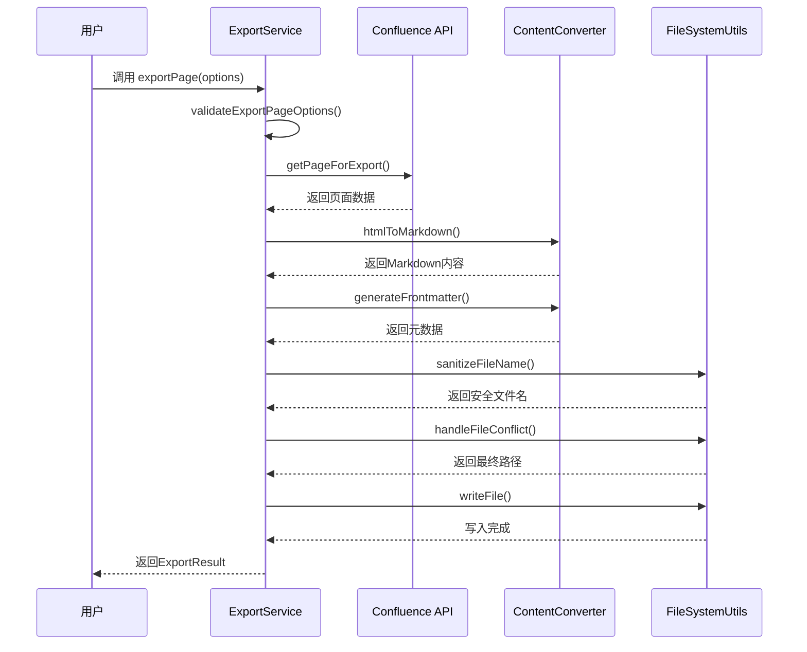
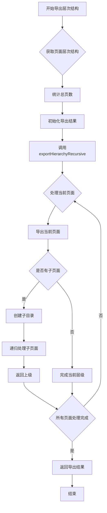
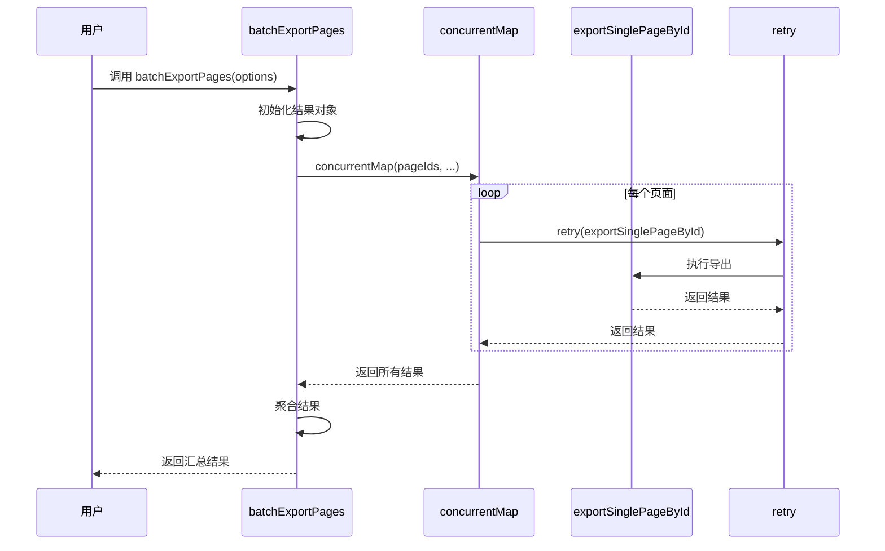
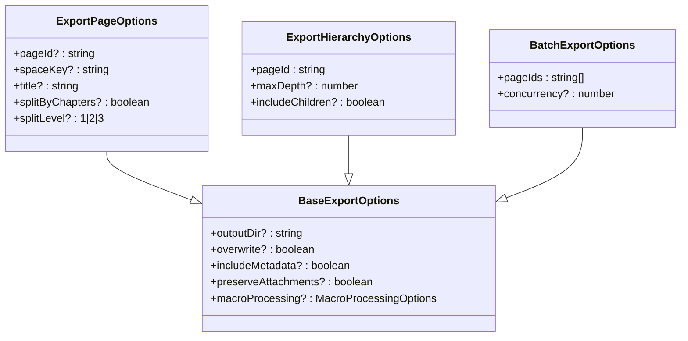
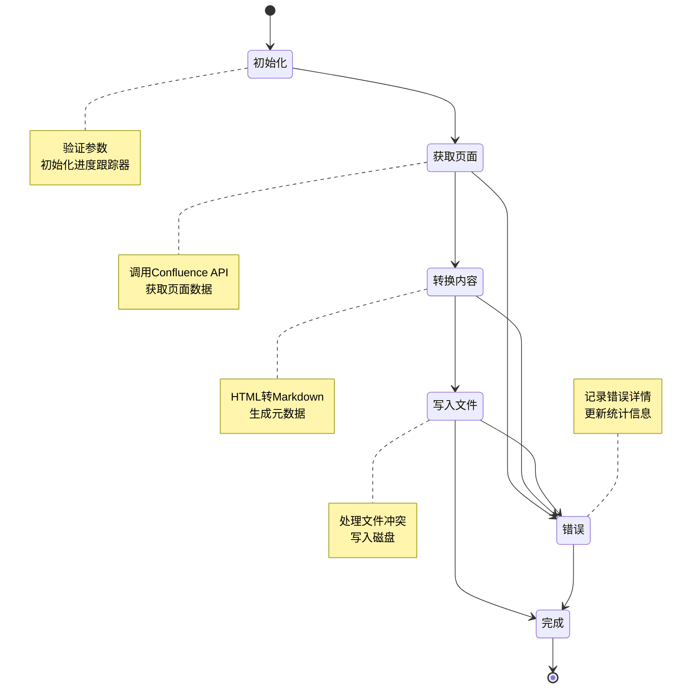
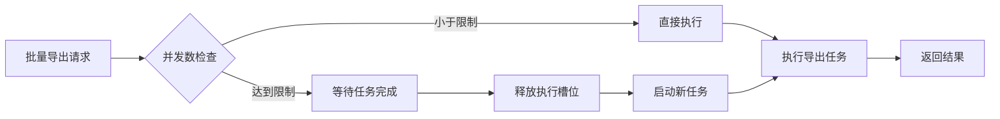
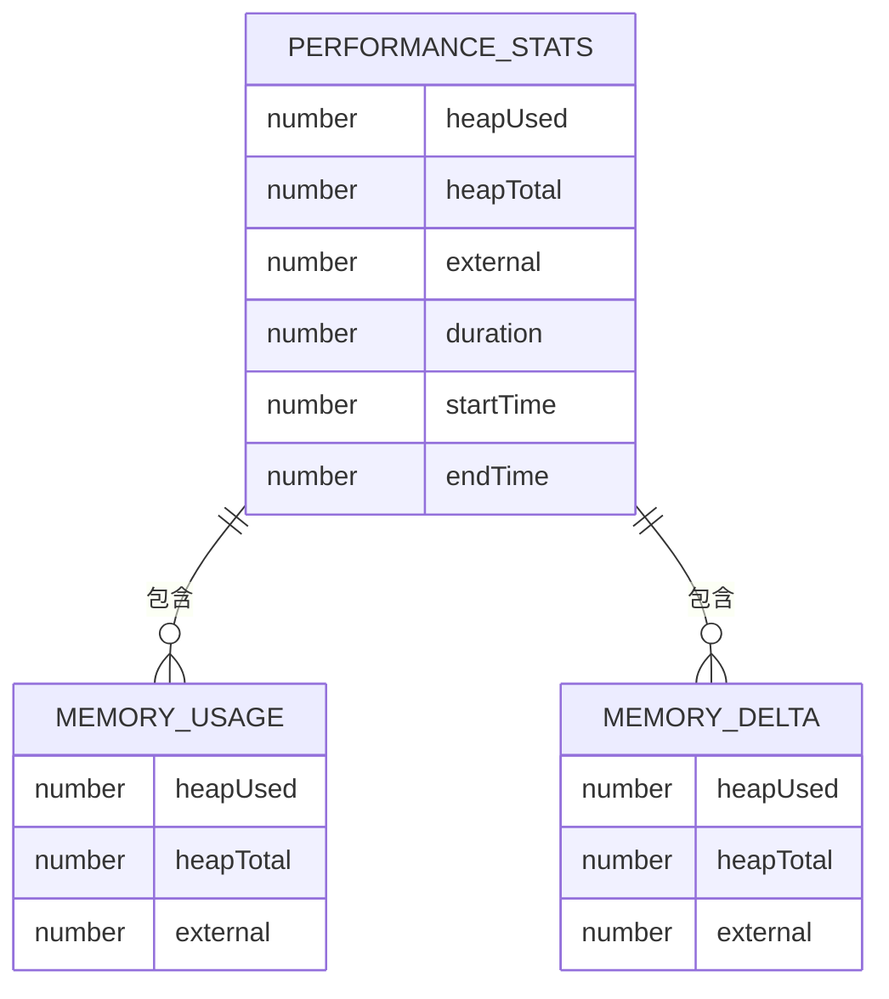

# 导出功能详解

<cite>
**本文档引用文件**  
- [export.service.ts](file://src/services/features/export.service.ts)
- [content-converter.ts](file://src/utils/content-converter.ts)
- [file-system.ts](file://src/utils/file-system.ts)
- [export.types.ts](file://src/types/export.types.ts)
- [performance-optimizer.ts](file://src/utils/performance-optimizer.ts)
- [progress-tracker.ts](file://src/utils/progress-tracker.ts)
- [数据防篡改签名方案.md](file://export/数据防篡改签名方案.md)
</cite>

## 目录
1. [导出功能概述](#导出功能概述)
2. [核心导出工具工作流程](#核心导出工具工作流程)
3. [导出选项详解](#导出选项详解)
4. [内容完整性保护机制](#内容完整性保护机制)
5. [性能优化策略](#性能优化策略)
6. [导出文件目录结构示例](#导出文件目录结构示例)

## 导出功能概述

本系统提供三种页面导出工具：`exportPage`、`exportPageHierarchy` 和 `batchExportPages`，用于将 Confluence 页面内容导出为 Markdown 格式文件。这些工具通过统一的导出服务实现，支持从单页面导出到批量处理的多种场景。

导出流程遵循标准化的工作流：首先从 Confluence API 获取页面内容（HTML 格式），然后通过 `content-converter.ts` 将 HTML 转换为高质量的 Markdown，最后使用 `file-system.ts` 工具将文件写入本地文件系统。整个过程支持进度跟踪、错误处理和性能监控。

**Section sources**
- [export.service.ts](file://src/services/features/export.service.ts#L31-L646)

## 核心导出工具工作流程

### exportPage 工作流程

`exportPage` 用于导出单个 Confluence 页面。其工作流程如下：

1. **参数验证**：检查是否提供了 `pageId` 或 `spaceKey + title` 组合
2. **获取页面信息**：调用 Confluence API 获取页面的存储内容（HTML）
3. **内容转换**：使用 `ContentConverter.htmlToMarkdown()` 将 HTML 转换为 Markdown
4. **元数据处理**：根据选项决定是否生成 YAML frontmatter
5. **文件写入**：通过 `FileSystemUtils` 写入文件系统，处理文件名冲突

当启用 `splitByChapters` 选项时，系统会根据标题级别自动将大文档拆分为多个章节文件，并生成导航索引。



**Diagram sources**
- [export.service.ts](file://src/services/features/export.service.ts#L31-L113)
- [content-converter.ts](file://src/utils/content-converter.ts#L1-L200)
- [file-system.ts](file://src/utils/file-system.ts#L1-L200)

**Section sources**
- [export.service.ts](file://src/services/features/export.service.ts#L31-L113)

### exportPageHierarchy 工作流程

`exportPageHierarchy` 用于递归导出页面及其所有子页面，保持原有的目录层次结构。

1. **获取页面层次结构**：通过 `getPageHierarchy()` 获取指定页面的所有后代节点
2. **统计总页数**：计算需要导出的页面总数
3. **递归导出**：调用 `exportHierarchyRecursive()` 逐层处理每个页面
4. **目录结构维护**：根据页面层级关系创建对应的子目录

该工具支持 `maxDepth` 参数来限制递归深度，避免导出过深的页面树。



**Diagram sources**
- [export.service.ts](file://src/services/features/export.service.ts#L380-L434)

**Section sources**
- [export.service.ts](file://src/services/features/export.service.ts#L380-L434)

### batchExportPages 工作流程

`batchExportPages` 用于批量导出多个页面，支持并发控制和错误重试。

1. **并发控制**：使用 `PerformanceOptimizer.concurrentMap()` 限制同时执行的导出任务数量
2. **重试机制**：每个页面导出任务都包含重试逻辑，最多重试2次
3. **资源监控**：创建 `ResourceMonitor` 跟踪内存使用情况
4. **结果聚合**：收集所有单个页面的导出结果，生成汇总报告

该工具通过 `concurrency` 参数控制并发数，默认为3，最大限制为5，防止系统资源耗尽。



**Diagram sources**
- [export.service.ts](file://src/services/features/export.service.ts#L549-L646)
- [performance-optimizer.ts](file://src/utils/performance-optimizer.ts#L1-L50)

**Section sources**
- [export.service.ts](file://src/services/features/export.service.ts#L549-L646)

## 导出选项详解

### 基础导出选项

导出功能支持多种配置选项，定义在 `BaseExportOptions` 接口中：

- **outputDir**: 输出目录，默认为 "confluence-export"
- **overwrite**: 是否覆盖现有文件
- **includeMetadata**: 是否包含元数据（YAML frontmatter）
- **preserveAttachments**: 是否保留附件信息



**Diagram sources**
- [export.types.ts](file://src/types/export.types.ts#L1-L50)

**Section sources**
- [export.types.ts](file://src/types/export.types.ts#L1-L50)

### 特殊导出选项

#### 章节拆分选项

`exportPage` 支持按章节拆分大文档：

- **splitByChapters**: 启用章节拆分功能
- **splitLevel**: 指定拆分级别（1、2 或 3，对应 H1、H2、H3 标题）

当启用此功能时，系统会：
1. 使用 `ContentConverter.splitByChapters()` 分析 HTML 内容
2. 根据指定的标题级别拆分内容
3. 为每个章节创建单独的 Markdown 文件
4. 生成包含导航链接的索引文件

#### 冲突处理策略

系统提供三种文件冲突处理策略：

- **OVERWRITE**: 覆盖现有文件
- **RENAME**: 重命名新文件（如 filename_1.md）
- **SKIP**: 跳过导出，不覆盖现有文件

这些策略通过 `ConflictStrategy` 枚举定义，并在 `FileSystemUtils.handleFileConflict()` 中实现。

**Section sources**
- [export.service.ts](file://src/services/features/export.service.ts#L200-L400)
- [file-system.ts](file://src/utils/file-system.ts#L1-L200)

## 内容完整性保护机制

结合"数据防篡改签名方案.md"文档，系统通过多层次机制保障导出内容的完整性：

### 元数据完整性

每个导出的 Markdown 文件都可包含 YAML frontmatter，记录原始页面的关键信息：

```yaml
---
originalPageId: "123456789"
originalTitle: "页面标题"
originalUrl: "/pages/viewpage.action?pageId=123456789"
spaceKey: "DEV"
spaceName: "开发文档"
author: "张三"
createdDate: "2025-01-01T10:00:00.000+08:00"
modifiedDate: "2025-01-02T14:30:00.000+08:00"
version: 5
exportDate: "2025-01-03T09:15:00.000Z"
---
```

这些元数据提供了内容溯源能力，确保导出文件与原始 Confluence 页面的关联性。

### 处理过程完整性

系统通过以下机制确保导出过程的完整性：

1. **进度跟踪**：`ProgressTracker` 实时记录导出进度和状态
2. **错误报告**：详细的错误信息记录在 `ExportResult.errors` 中
3. **操作审计**：日志系统记录完整的操作轨迹



**Diagram sources**
- [progress-tracker.ts](file://src/utils/progress-tracker.ts#L1-L200)
- [export.service.ts](file://src/services/features/export.service.ts#L31-L113)

**Section sources**
- [export.service.ts](file://src/services/features/export.service.ts#L31-L113)
- [progress-tracker.ts](file://src/utils/progress-tracker.ts#L1-L200)
- [export/数据防篡改签名方案.md](file://export/数据防篡改签名方案.md#L1-L142)

## 性能优化策略

### 并发控制

`batchExportPages` 工具通过 `PerformanceOptimizer.concurrentMap()` 实现智能并发控制：

- **限制并发数**：默认并发数为3，最大不超过5
- **动态调整**：根据系统资源情况调整并发级别
- **资源监控**：实时监控内存使用情况



### 重试机制

系统为关键操作提供重试机制，提高导出成功率：

- **自动重试**：失败任务最多重试2次
- **指数退避**：重试间隔逐渐增加（1秒、2秒、4秒）
- **错误分类**：区分网络错误、权限错误等不同类型

### 内存优化

通过以下方式优化内存使用：

- **流式处理**：大文件分块处理，避免内存溢出
- **资源清理**：及时释放不再使用的对象
- **性能监控**：定期记录内存使用情况



**Diagram sources**
- [performance-optimizer.ts](file://src/utils/performance-optimizer.ts#L1-L200)

**Section sources**
- [performance-optimizer.ts](file://src/utils/performance-optimizer.ts#L1-L200)

## 导出文件目录结构示例

以下是典型的导出文件目录结构示例：

```
confluence-export/
├── API_Documentation.md           # 单页面导出
├── User_Guide/                    # 层次结构导出
│   ├── User_Guide.md
│   ├── Getting_Started/
│   │   └── Installation.md
│   └── Advanced_Topics/
│       └── Configuration.md
└── Large_Document/                # 章节拆分导出
    ├── README.md                  # 章节索引
    ├── 01_introduction.md
    ├── 02_setup.md
    └── 03_usage.md
```

### 目录结构说明

- **根输出目录**：默认为 `confluence-export`，可通过 `outputDir` 参数自定义
- **单文件导出**：简单页面直接导出为单个 `.md` 文件
- **层次结构导出**：保持原始页面的父子关系，创建对应的子目录
- **章节拆分导出**：大文档按标题级别拆分为多个文件，包含索引导航

### 文件命名规则

系统使用 `FileSystemUtils.sanitizeFileName()` 确保文件名的安全性：

- 移除或替换 `/ \ < > : " | ? *` 等不安全字符
- 处理 Windows 保留名称（如 CON、PRN）
- 限制文件名长度（不超过200字符）
- 替换空格为下划线

**Section sources**
- [file-system.ts](file://src/utils/file-system.ts#L1-L200)