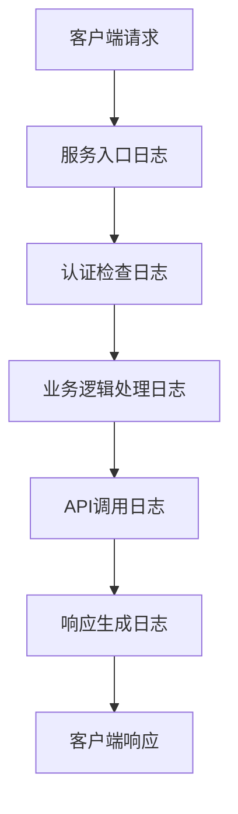
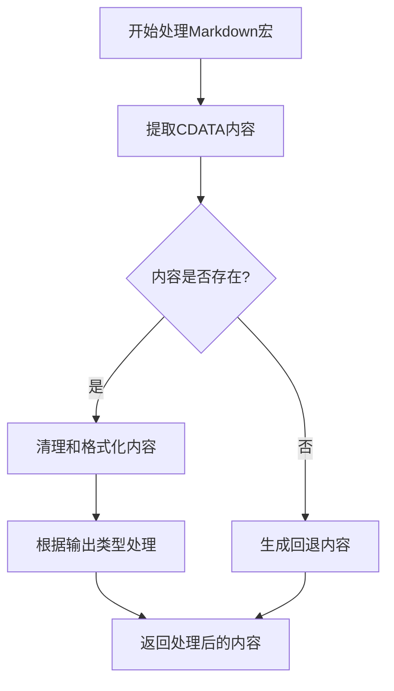

# 开发与测试指南

<cite>
**本文档引用的文件**  
- [README.md](file://README.md)
- [package.json](file://package.json)
- [tsconfig.json](file://tsconfig.json)
- [jest.config.js](file://jest.config.js)
- [logger.ts](file://src/utils/logger.ts)
- [logger.types.ts](file://src/types/logger.types.ts)
- [macro-registry.ts](file://src/services/macro-processors/macro-registry.ts)
- [markdown-macro-processor.ts](file://src/services/macro-processors/markdown-macro-processor.ts)
- [confluence.service.ts](file://src/services/confluence.service.ts)
- [page.service.ts](file://src/services/features/page.service.ts)
- [macro-registry.test.ts](file://test/unit/macro-registry.test.ts)
- [real-page-104762256.test.ts](file://test/integration/real-page-104762256.test.ts)
</cite>

## 目录
1. [本地开发环境搭建](#本地开发环境搭建)
2. [代码风格与TypeScript配置](#代码风格与typescript配置)
3. [调试技巧与日志系统](#调试技巧与日志系统)
4. [测试策略](#测试策略)
5. [编写新的测试用例](#编写新的测试用例)
6. [运行测试套件](#运行测试套件)
7. [代码提交与PR流程](#代码提交与pr流程)
8. [日志在调试中的关键作用](#日志在调试中的关键作用)

## 本地开发环境搭建

本项目为基于Node.js的TypeScript服务，用于与Confluence进行交互。以下是完整的本地开发环境搭建步骤。

### 环境要求
- Node.js >= 14.0.0
- TypeScript >= 4.0.0

### 安装依赖
```bash
npm install
```

### 构建项目
```bash
# 清理并重新构建
npm run build:clean
```

### 启动服务
```bash
# 启动服务
npm start
```

### 开发模式
```bash
# 监听文件变化并自动编译
npm run dev

# 监听文件变化并自动重启服务
npm run dev:start
```

### 调试模式
```bash
# 基本调试模式
npm run inspector

# 开发调试模式（带详细日志）
npm run inspector:dev
```

**Section sources**
- [README.md](file://README.md#L80-L150)
- [package.json](file://package.json#L6-L15)

## 代码风格与TypeScript配置

本项目使用TypeScript进行开发，代码风格和编译配置由`tsconfig.json`文件定义。

### TypeScript配置
`tsconfig.json`文件定义了项目的编译选项和源码结构：

```json
{
  "compilerOptions": {
    "target": "ES2020",
    "module": "ES2020",
    "moduleResolution": "node",
    "outDir": "./dist",
    "rootDir": "./src",
    "strict": true,
    "esModuleInterop": true,
    "skipLibCheck": true,
    "forceConsistentCasingInFileNames": true,
    "resolveJsonModule": true
  },
  "include": [
    "src/**/*"
  ],
  "exclude": [
    "node_modules",
    "dist",
    "test"
  ]
}
```

### 关键配置说明
- **target**: 编译目标为ES2020，支持现代JavaScript特性
- **module**: 使用ES2020模块系统
- **outDir**: 编译输出目录为`dist`
- **rootDir**: 源码根目录为`src`
- **strict**: 启用严格模式，提高代码质量
- **esModuleInterop**: 启用ES模块互操作性
- **include**: 包含`src`目录下的所有文件
- **exclude**: 排除`node_modules`、`dist`和`test`目录

该配置确保代码在现代Node.js环境中高效运行，同时保持类型安全和代码质量。

**Section sources**
- [tsconfig.json](file://tsconfig.json#L1-L22)
- [README.md](file://README.md#L151-L160)

## 调试技巧与日志系统

本项目使用结构化的日志系统进行调试，日志输出遵循JSON-RPC 2.0规范，便于MCP客户端捕获和解析。

### 日志级别
日志系统支持四种级别，按严重性递增：
- **DEBUG**: 详细调试信息
- **INFO**: 一般信息性消息
- **WARN**: 警告信息
- **ERROR**: 错误信息

### 日志服务实现
`logger.ts`文件实现了`ILoggerService`接口，提供统一的日志记录功能：

```typescript
export interface ILoggerService {
  debug(message: string, ...args: any[]): void;
  info(message: string, ...args: any[]): void;
  warn(message: string, ...args: any[]): void;
  error(message: string, ...args: any[]): void;
  setLogLevel(level: LogLevel): void;
  getLogLevel(): LogLevel;
}
```

### 日志级别控制
日志级别可以通过以下方式控制：
1. 环境变量`LOG_LEVEL`（如`LOG_LEVEL=DEBUG`）
2. 开发环境或设置了`DEBUG`环境变量时，自动启用`DEBUG`级别
3. 通过`setLogLevel()`方法动态调整

### 日志输出格式
所有日志以JSON格式输出到`stderr`，确保MCP客户端能够正确捕获：

```json
{
  "jsonrpc": "2.0",
  "method": "log",
  "params": {
    "level": "info",
    "message": "请求信息",
    "timestamp": "2024-04-16T12:00:44.000Z"
  }
}
```

### 日志单例模式
日志服务采用单例模式实现，确保全局只有一个实例，避免日志重复和资源浪费。

**Section sources**
- [logger.ts](file://src/utils/logger.ts#L1-L199)
- [logger.types.ts](file://src/types/logger.types.ts#L1-L30)
- [README.md](file://README.md#L700-L720)

## 测试策略

本项目采用分层测试策略，包括单元测试和集成测试，确保代码质量和功能正确性。

### 单元测试
单元测试位于`test/unit`目录，使用Jest框架测试服务逻辑和工具函数。

#### 测试示例：宏注册器
`macro-registry.test.ts`测试文件验证宏处理器注册器的功能：

```typescript
// 验证宏处理器注册功能
test('should register macro processor', () => {
  // 测试代码
});

// 验证宏处理器查找功能
test('should get registered processor', () => {
  // 测试代码
});
```

### 集成测试
集成测试位于`test/integration`目录，测试与真实Confluence API的交互。

#### 测试示例：真实页面交互
`real-page-104762256.test.ts`测试文件验证与真实Confluence页面的交互：

```typescript
// 测试与真实Confluence API的交互
test('should interact with real Confluence page', async () => {
  // 测试代码
});
```

### 测试环境配置
`jest.config.js`文件配置了测试环境：

```javascript
export default {
  preset: 'ts-jest',
  testEnvironment: 'node',
  extensionsToTreatAsEsm: ['.ts'],
  moduleNameMapper: {
    '^(\\.{1,2}/.*)\\.js$': '$1',
  },
  transform: {
    '^.+\\.tsx?$': [
      'ts-jest',
      {
        useESM: true,
      },
    ],
  },
  testTimeout: 30000,
  collectCoverageFrom: [
    'src/**/*.ts',
    '!src/**/*.test.ts',
    '!src/**/*.spec.ts',
  ],
};
```

### 测试策略优势
- **单元测试**: 快速验证核心逻辑，隔离外部依赖
- **集成测试**: 验证真实API交互，确保端到端功能正确
- **覆盖率统计**: 通过`collectCoverageFrom`配置收集代码覆盖率
- **超时控制**: 设置30秒超时，防止测试挂起

**Section sources**
- [jest.config.js](file://jest.config.js#L1-L22)
- [macro-registry.test.ts](file://test/unit/macro-registry.test.ts)
- [real-page-104762256.test.ts](file://test/integration/real-page-104762256.test.ts)

## 编写新的测试用例

编写新的测试用例时，应根据测试类型选择合适的目录和命名规范。

### 单元测试
单元测试应放在`test/unit`目录下，测试文件名以`.test.ts`结尾。

#### 测试文件结构
```typescript
import { SomeService } from '../../src/services/some.service.js';

describe('SomeService', () => {
  let service: SomeService;

  beforeEach(() => {
    service = new SomeService();
  });

  test('should do something', () => {
    // 测试代码
    expect(result).toBe(expected);
  });

  test('should handle error', () => {
    // 测试错误处理
    expect(() => service.someMethod(invalidInput)).toThrow();
  });
});
```

### 集成测试
集成测试应放在`test/integration`目录下，测试真实API交互。

#### 集成测试示例
```typescript
import { ConfluenceService } from '../../src/services/confluence.service.js';

describe('ConfluenceService Integration', () => {
  let service: ConfluenceService;

  beforeAll(() => {
    // 初始化服务
    service = new ConfluenceService({
      confluenceUrl: process.env.CONFLUENCE_URL!,
      accessToken: process.env.CONFLUENCE_ACCESS_TOKEN!
    });
  });

  test('should get page from real Confluence API', async () => {
    const page = await service.getPage('123456789');
    expect(page).toBeDefined();
    expect(page.id).toBe('123456789');
  }, 30000); // 增加超时时间
});
```

### 测试最佳实践
- **独立性**: 每个测试应独立运行，不依赖其他测试
- **可重复性**: 测试结果应一致，不受外部状态影响
- **清晰命名**: 测试名称应清晰描述测试目的
- **边界条件**: 测试正常和异常情况
- **Mock外部依赖**: 单元测试中使用mock隔离外部服务

**Section sources**
- [macro-registry.test.ts](file://test/unit/macro-registry.test.ts)
- [real-page-104762256.test.ts](file://test/integration/real-page-104762256.test.ts)

## 运行测试套件

项目提供了多种npm脚本来运行测试套件，满足不同场景的需求。

### 运行所有测试
```bash
npm test
```

### 运行特定类型的测试
```bash
# 运行单元测试
npm run test:unit

# 运行集成测试
npm run test:integration
```

### 监听模式
```bash
# 监听文件变化并运行相关测试
npm run test:watch
```

### 代码覆盖率
```bash
# 生成代码覆盖率报告
npm run test:coverage
```

### 测试脚本配置
这些脚本在`package.json`中定义：

```json
"scripts": {
  "test": "jest",
  "test:watch": "jest --watch",
  "test:coverage": "jest --coverage",
  "test:unit": "jest test/unit",
  "test:integration": "jest test/integration"
}
```

### 测试执行建议
- 开发时使用`npm run test:watch`实时反馈
- 提交代码前运行`npm test`确保所有测试通过
- 发布前运行`npm run test:coverage`检查代码覆盖率
- 集成测试可能需要更长的超时时间，已在`jest.config.js`中设置为30秒

**Section sources**
- [package.json](file://package.json#L16-L22)
- [jest.config.js](file://jest.config.js#L1-L22)

## 代码提交与PR流程

遵循一致的代码提交和PR流程，确保代码质量和团队协作效率。

### 分支策略
- **main**: 主分支，保护分支，仅通过PR合并
- **feature/**: 功能分支，命名如`feature/page-deletion`
- **bugfix/**: 修复分支，命名如`bugfix/login-issue`
- **hotfix/**: 紧急修复分支

### 提交信息规范
提交信息应遵循以下格式：
```
<type>: <subject>

<body>

<footer>
```

#### 类型说明
- **feat**: 新功能
- **fix**: 修复bug
- **docs**: 文档更新
- **style**: 代码格式调整
- **refactor**: 代码重构
- **test**: 测试相关
- **chore**: 构建过程或辅助工具变动

### PR流程
1. 从`main`分支创建功能分支
2. 实现功能并编写测试
3. 确保所有测试通过
4. 提交PR到`main`分支
5. 请求团队成员审查
6. 根据反馈修改代码
7. 合并PR

### PR审查要点
- 代码是否符合风格规范
- 是否有足够的测试覆盖
- 是否有潜在的性能问题
- 文档是否更新
- 是否遵循安全最佳实践

**Section sources**
- [README.md](file://README.md#L780-L790)

## 日志在调试中的关键作用

日志系统在调试过程中起着至关重要的作用，是定位问题和理解系统行为的主要工具。

### 日志追踪请求流程
通过日志可以完整追踪一个请求的处理流程：



**Diagram sources**
- [logger.ts](file://src/utils/logger.ts#L1-L199)

### 定位错误的步骤
1. **查看错误级别日志**: 优先关注`ERROR`级别的日志
2. **追踪请求ID**: 通过日志中的实例ID追踪特定请求
3. **查看上下文信息**: 检查日志中的参数和状态信息
4. **分析调用链**: 从入口到出口逐步排查

### 日志分析技巧
- **使用实例ID**: 每个日志消息包含实例ID，便于追踪同一实例的日志
- **关注时间戳**: 分析请求处理时间和性能瓶颈
- **过滤日志级别**: 根据需要过滤不同级别的日志
- **结合业务逻辑**: 将日志与代码逻辑对应分析

### 日志在宏处理器中的应用
以`MarkdownMacroProcessor`为例，日志帮助理解宏处理流程：



**Diagram sources**
- [markdown-macro-processor.ts](file://src/services/macro-processors/markdown-macro-processor.ts#L1-L613)
- [logger.ts](file://src/utils/logger.ts#L1-L199)

### 日志最佳实践
- **关键路径日志**: 在主要业务逻辑路径上添加日志
- **错误上下文**: 记录错误发生时的上下文信息
- **性能监控**: 记录耗时操作的开始和结束
- **避免敏感信息**: 不要在日志中记录密码等敏感信息
- **合理日志级别**: 根据信息重要性选择合适的日志级别

通过有效利用日志系统，开发者可以快速定位问题、理解系统行为，并提高调试效率。

**Section sources**
- [logger.ts](file://src/utils/logger.ts#L1-L199)
- [markdown-macro-processor.ts](file://src/services/macro-processors/markdown-macro-processor.ts#L1-L613)
- [macro-registry.ts](file://src/services/macro-processors/macro-registry.ts#L1-L294)