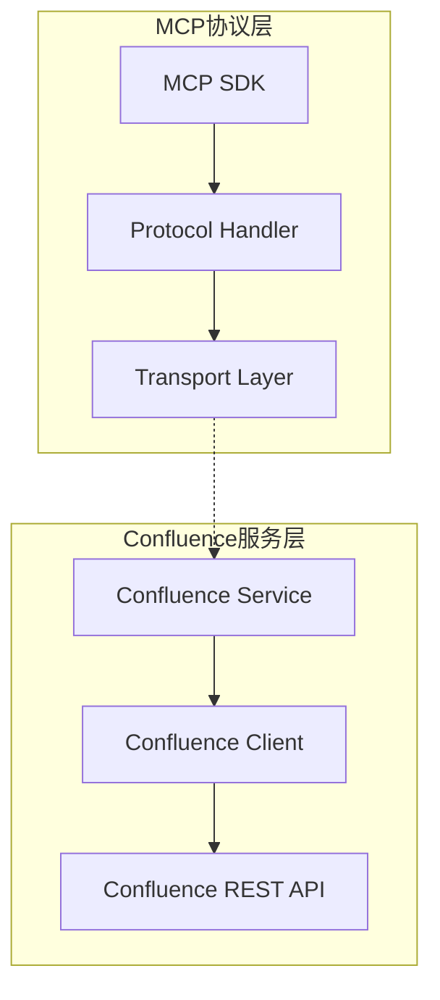
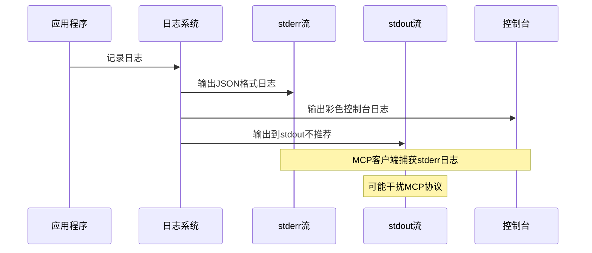
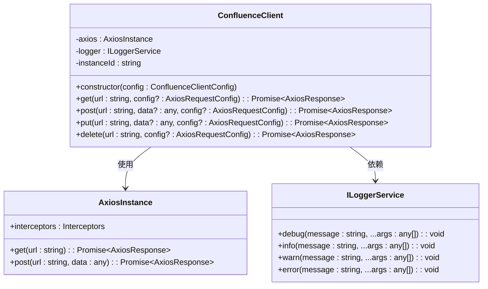
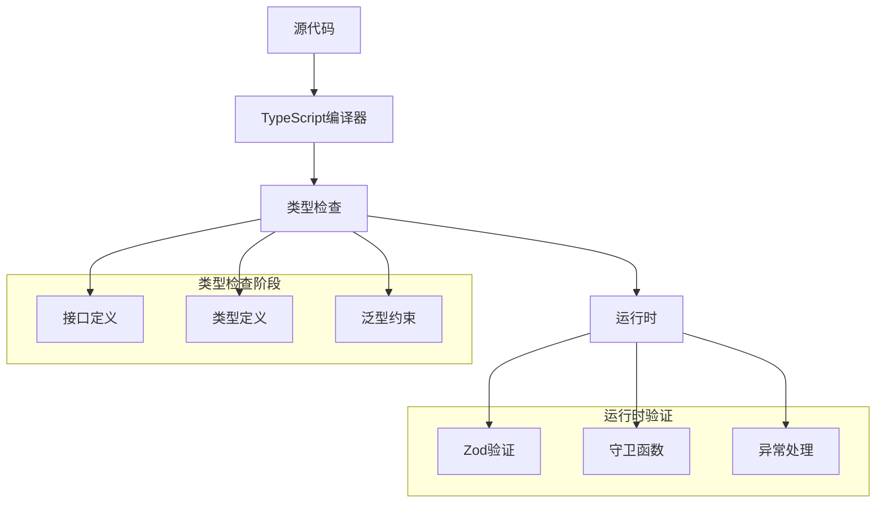
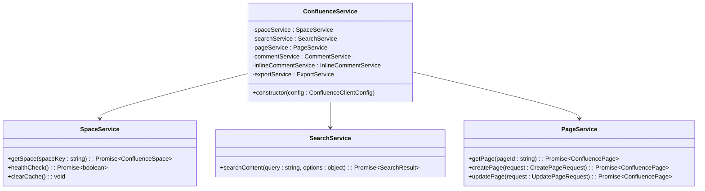
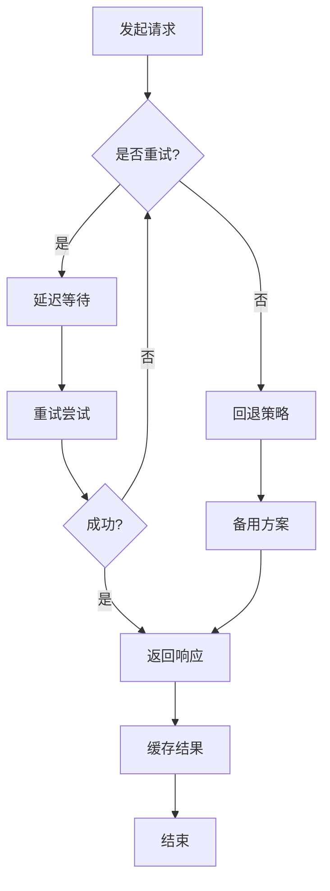

# 技术栈与依赖

<cite>
**本文档中引用的文件**
- [package.json](file://package.json)
- [tsconfig.json](file://tsconfig.json)
- [src/utils/logger.ts](file://src/utils/logger.ts)
- [src/services/confluence-client.ts](file://src/services/confluence-client.ts)
- [src/services/confluence.service.ts](file://src/services/confluence.service.ts)
- [src/types/confluence.types.ts](file://src/types/confluence.types.ts)
- [src/services/features/page.service.ts](file://src/services/features/page.service.ts)
- [src/utils/content-converter.ts](file://src/utils/content-converter.ts)
- [src/types/config.types.ts](file://src/types/config.types.ts)
- [test/unit/macro-processors/markdown-macro-processor.test.ts](file://test/unit/macro-processors/markdown-macro-processor.test.ts)
</cite>

## 引言

本项目是一个基于TypeScript的Confluence MCP（Model Context Protocol）服务器实现，采用了现代化的技术栈来构建一个高性能、类型安全的Confluence集成解决方案。该项目充分利用了多种核心依赖和技术组件，实现了对Confluence REST API的完整封装，并提供了丰富的功能特性。

## 核心技术栈分析

### TypeScript配置体系

项目采用严格的TypeScript配置来确保代码质量和类型安全：

```json
{
  "compilerOptions": {
    "target": "ES2020",
    "module": "ES2020",
    "moduleResolution": "node",
    "outDir": "./dist",
    "rootDir": "./src",
    "strict": true,
    "esModuleInterop": true,
    "skipLibCheck": true,
    "forceConsistentCasingInFileNames": true,
    "resolveJsonModule": true
  }
}
```

**技术优势：**
- **严格模式**：启用所有严格类型检查选项，确保类型安全
- **模块系统**：使用ES2020模块系统，支持现代JavaScript特性
- **互操作性**：通过`esModuleInterop`支持CommonJS模块的导入
- **性能优化**：跳过库文件检查，减少编译时间

### 核心依赖分析

#### 1. @modelcontextprotocol/sdk

**角色定位：**
- 实现MCP协议的核心SDK
- 提供与AI模型的标准化通信接口
- 支持异步消息处理和上下文管理

**架构作用：**


**图表来源**
- [src/services/confluence.service.ts](file://src/services/confluence.service.ts#L1-L50)
- [src/services/confluence-client.ts](file://src/services/confluence-client.ts#L1-L30)

#### 2. axios HTTP客户端

**技术特点：**
- **拦截器支持**：实现请求/响应拦截器进行日志记录和错误处理
- **连接池管理**：支持HTTPS代理和连接复用
- **超时控制**：灵活的超时配置和重试机制

**实现细节：**
```typescript
// 请求拦截器示例
this.axios.interceptors.request.use(
  (config) => {
    const startTime = Date.now();
    config.metadata = { startTime };
    
    this.logger.debug(`Request[${this.instanceId}]:`, {
      method: config.method,
      url: config.url,
      params: config.params,
      startTime: new Date(startTime).toISOString()
    });
    return config;
  },
  (error) => {
    this.logger.error(`Request[${this.instanceId}] Error:`, error);
    return Promise.reject(error);
  }
);
```

#### 3. 内容转换工具链

##### turndown - HTML到Markdown转换

**核心功能：**
- **结构化宏处理**：专门处理Confluence特有的AC:STRUCTURED-MACRO元素
- **自定义规则**：支持Confluence特定的宏和格式
- **性能优化**：针对大型文档的流式处理能力

**技术亮点：**
```typescript
// 自定义规则处理Confluence宏
turndown.addRule('confluenceStructuredMacro', {
  filter: (node: HTMLElement) => {
    const isStructuredMacro = node.nodeName === 'AC:STRUCTURED-MACRO' || 
                            (node.nodeName === 'DIV' && node.getAttribute && !!node.getAttribute('data-macro-name'));
    
    if (isStructuredMacro) {
      this.logger.debug('发现结构化宏', {
        nodeName: node.nodeName,
        macroName: node.getAttribute('ac:name') || node.getAttribute('data-macro-name') || 'unknown',
        innerHTML: node.innerHTML?.substring(0, 200)
      });
    }
    
    return isStructuredMacro;
  },
  replacement: (content, node) => {
    // 处理Markdown宏的特殊逻辑
    const macroName = element.getAttribute('ac:name') || element.getAttribute('data-macro-name') || 'unknown';
    
    if (macroName === 'markdown') {
      return this.processMarkdownMacro(element, content);
    }
    
    return content;
  }
});
```

##### marked - Markdown解析引擎

**集成优势：**
- **双向转换**：与turndown配合实现完整的HTML-Markdown转换
- **语法扩展**：支持GitHub风格的Markdown语法
- **性能优化**：高效的解析算法和内存管理

#### 4. zod - 运行时类型验证

**应用领域：**
- **配置验证**：确保环境配置的正确性
- **API响应验证**：验证Confluence API返回的数据结构
- **输入验证**：防止非法数据进入系统

**实现示例：**
```typescript
// 配置验证示例
const ConfigSchema = z.object({
  baseUrl: z.string().url(),
  username: z.string().optional(),
  password: z.string().optional(),
  accessToken: z.string().optional(),
  timeout: z.number().positive().optional()
});

export const validateConfig = (config: unknown): ConfluenceConfig => {
  return ConfigSchema.parse(config);
};
```

#### 5. dotenv - 环境配置管理

**配置管理策略：**
- **环境分离**：支持开发、测试、生产环境的配置隔离
- **敏感信息保护**：将认证凭据存储在环境变量中
- **配置优先级**：支持多层级配置覆盖机制

### 日志系统设计

项目实现了高度定制化的日志系统，具有以下特点：

#### 单例模式实现

```typescript
class LoggerImpl implements ILoggerService {
  private static instance: LoggerImpl;
  private static instanceCount: number = 0;
  
  public static getInstance(): LoggerImpl {
    if (!LoggerImpl.instance) {
      LoggerImpl.instance = new LoggerImpl();
    } else {
      // 输出重复调用信息
      process.stderr.write(`{"jsonrpc":"2.0","method":"log","params":{"level":"debug","message":"[SINGLETON] Logger.getInstance() called, returning existing instance [${LoggerImpl.instance.instanceId}]","timestamp":"${new Date().toISOString()}"}}\n`);
    }
    return LoggerImpl.instance;
  }
}
```

#### 多流输出设计



**图表来源**
- [src/utils/logger.ts](file://src/utils/logger.ts#L150-L198)

#### 日志级别管理

```typescript
const LOG_LEVEL_WEIGHTS: Record<LogLevel, number> = {
  [LogLevel.DEBUG]: 0,
  [LogLevel.INFO]: 1,
  [LogLevel.WARN]: 2,
  [LogLevel.ERROR]: 3
};

private shouldLog(level: LogLevel): boolean {
  return LOG_LEVEL_WEIGHTS[level] >= LOG_LEVEL_WEIGHTS[this.currentLogLevel];
}
```

### HTTP客户端封装

#### ConfluenceClient类设计



**图表来源**
- [src/services/confluence-client.ts](file://src/services/confluence-client.ts#L25-L146)

#### 连接池优化

```typescript
// 创建HTTPS Agent实例
const httpsAgent = new https.Agent({
  rejectUnauthorized: config.rejectUnauthorized ?? true,
  keepAlive: config.keepAlive ?? true,
  keepAliveMsecs: 1000,
  maxSockets: 100,
  maxFreeSockets: 10,
  timeout: config.timeout || 10000
});
```

## 架构优势分析

### 类型安全保证

通过TypeScript的严格类型检查，项目实现了端到端的类型安全保障：



### 异步处理能力

项目全面采用异步编程模式，提供了优秀的并发处理能力：

```typescript
// 并发页面获取示例
public async getPages(pageIds: string[]): Promise<ConfluencePage[]> {
  if (!pageIds.length) {
    throw new Error('At least one page ID is required');
  }
  return Promise.all(pageIds.map(id => this.getPage(id)));
}
```

### 可维护性设计

#### 服务组合模式



**图表来源**
- [src/services/confluence.service.ts](file://src/services/confluence.service.ts#L20-L50)

#### 缓存策略

```typescript
// 缓存装饰器模式
public async getPage(pageId: string): Promise<ConfluencePage> {
  return this.getCachedData(
    `page:${pageId}`,
    () => this.retryOperation(async () => {
      const response = await this.client.get(`/rest/api/content/${pageId}`, {
        params: { expand: 'body.storage,version,space' }
      });
      return response.data;
    })
  );
}
```

## 性能优化策略

### 内存管理

- **对象池**：复用HTTP客户端实例，避免重复创建
- **缓存机制**：智能缓存页面数据，减少API调用
- **流式处理**：针对大型文档的分块处理

### 网络优化

- **连接复用**：通过HTTPS Agent实现连接池
- **超时控制**：灵活的超时配置和重试机制
- **压缩传输**：自动启用gzip压缩

### 错误处理



## 结论

本项目通过精心选择的技术栈和架构设计，实现了以下核心价值：

1. **类型安全**：通过TypeScript和Zod确保代码质量和运行时安全
2. **高性能**：异步处理、连接池和智能缓存提供卓越性能
3. **可维护性**：模块化设计、清晰的职责分离和完善的测试覆盖
4. **可扩展性**：插件化架构支持功能扩展和定制化需求

这种技术选型不仅满足了当前的功能需求，还为未来的功能扩展和性能优化奠定了坚实的基础。通过MCP协议的标准化接口，项目能够无缝集成到各种AI工作流中，为用户提供强大的Confluence集成功能。