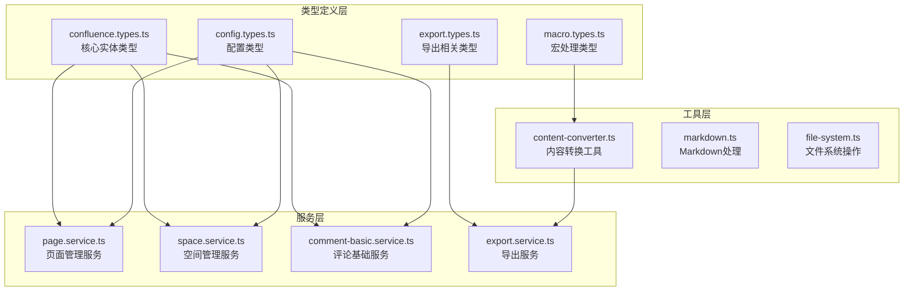
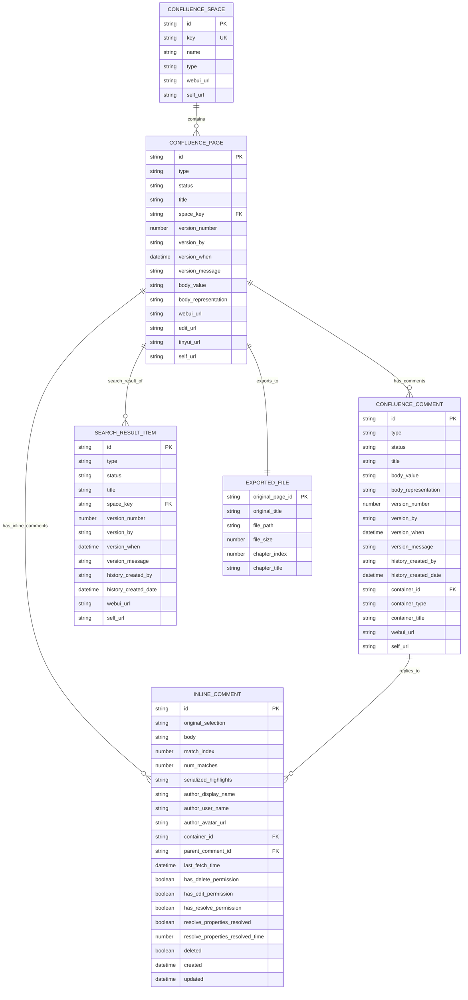
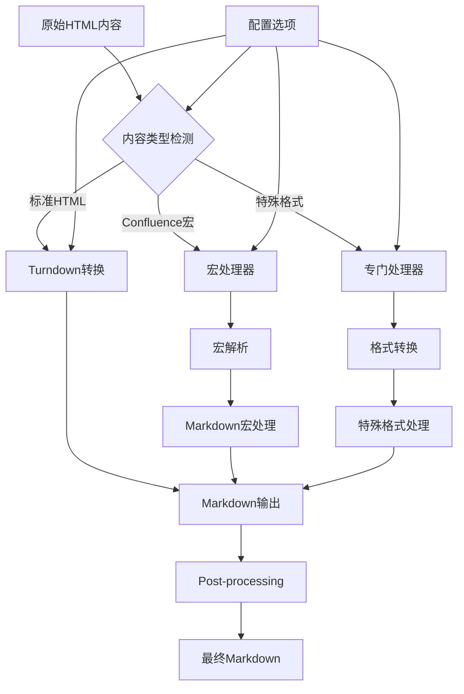

# 数据模型

<cite>
**本文档中引用的文件**
- [confluence.types.ts](file://src/types/confluence.types.ts)
- [export.types.ts](file://src/types/export.types.ts)
- [config.types.ts](file://src/types/config.types.ts)
- [page.service.ts](file://src/services/features/page.service.ts)
- [space.service.ts](file://src/services/features/space.service.ts)
- [comment-basic.service.ts](file://src/services/features/comment-basic.service.ts)
- [content-converter.ts](file://src/utils/content-converter.ts)
- [README.md](file://README.md)
</cite>

## 目录
1. [简介](#简介)
2. [项目结构概述](#项目结构概述)
3. [核心实体数据模型](#核心实体数据模型)
4. [搜索和导出结果模型](#搜索和导出结果模型)
5. [配置模型详解](#配置模型详解)
6. [实体关系图](#实体关系图)
7. [数据转换和处理](#数据转换和处理)
8. [JSON示例数据](#json示例数据)
9. [最佳实践和约束](#最佳实践和约束)
10. [总结](#总结)

## 简介

本文档详细定义了MCP Confluence服务中的所有核心数据模型，包括Confluence空间、页面、评论等实体的结构字段、数据类型和业务含义。这些数据模型构成了整个系统的基础架构，支撑着页面管理、评论处理、搜索功能和导出操作等核心功能。

系统采用TypeScript接口定义作为权威数据模型来源，确保类型安全和代码一致性。每个实体都经过精心设计，既满足Confluence API的规范要求，又适应实际业务场景的需求。

## 项目结构概述



**图表来源**
- [confluence.types.ts](file://src/types/confluence.types.ts#L1-L274)
- [export.types.ts](file://src/types/export.types.ts#L1-L188)
- [config.types.ts](file://src/types/config.types.ts#L1-L54)

## 核心实体数据模型

### ConfluenceSpace（空间实体）

ConfluenceSpace代表Confluence中的一个空间，是页面的容器。

```typescript
interface ConfluenceSpace {
  id: string;           // 空间唯一标识符
  key: string;          // 空间键值，用于URL路径
  name: string;         // 空间显示名称
  type: string;         // 空间类型（通常是"global"）
  _links: {            // 链接集合
    webui: string;      // Web界面URL
    self: string;       // API自我引用URL
  };
}
```

**字段说明：**
- `id`: 数字字符串，唯一标识空间
- `key`: 空间的短标识符，用于构建URL路径
- `name`: 用户友好的显示名称
- `type`: 空间类型，通常为"global"
- `_links.webui`: 浏览器访问地址
- `_links.self`: API调用地址

### ConfluencePage（页面实体）

ConfluencePage表示Confluence中的一个页面，包含内容、版本和元数据信息。

```typescript
interface ConfluencePage {
  id: string;                          // 页面唯一标识符
  type: string;                        // 页面类型（通常是"page"）
  status: string;                      // 页面状态（"current"或"trashed"）
  title: string;                       // 页面标题
  space: ConfluenceSpace;              // 所属空间
  version?: {                          // 版本信息（可选）
    number: number;                    // 版本号
    by: {                              // 版本创建者
      username: string;                // 用户名
      displayName: string;             // 显示名称
    };
    when: string;                      // 创建时间
    message?: string;                  // 版本消息
  };
  body?: {                             // 页面内容
    storage: {                         // 存储格式
      value: string;                   // HTML内容
      representation: string;          // 表示类型（"storage"）
    };
  };
  _links: {                            // 链接集合
    webui: string;                     // Web界面URL
    edit?: string;                     // 编辑页面URL（可选）
    tinyui?: string;                   // 小型编辑器URL（可选）
    self: string;                      // API自我引用URL
  };
}
```

**字段说明：**
- `id`: 页面的唯一标识符
- `type`: 固定为"page"
- `status`: 页面状态，"current"表示正常，"trashed"表示已删除
- `space`: 包含空间的基本信息
- `version`: 版本控制信息，记录最后修改者和时间
- `body.storage.value`: HTML格式的页面内容
- `_links`: 提供不同访问方式的URL

### ConfluenceComment（评论实体）

ConfluenceComment表示Confluence页面上的评论，支持普通评论和行内评论。

```typescript
interface ConfluenceComment {
  id: string;                          // 评论唯一标识符
  type: string;                        // 评论类型（通常是"comment"）
  status: string;                      // 评论状态（"current"或"trashed"）
  title: string;                       // 评论标题
  body: {                              // 评论内容
    storage: {                         // 存储格式
      value: string;                   // HTML内容
      representation: string;          // 表示类型（"storage"）
    };
  };
  version: {                           // 版本信息
    number: number;                    // 版本号
    by: {                              // 版本创建者
      username: string;                // 用户名
      displayName: string;             // 显示名称
      profilePicture?: {               // 用户头像（可选）
        path: string;                  // 头像路径
        width: number;                 // 宽度
        height: number;                // 高度
        isDefault: boolean;            // 是否为默认头像
      };
    };
    when: string;                      // 创建时间
    message?: string;                  // 版本消息
  };
  history: {                           // 历史信息
    latest: boolean;                   // 是否为最新版本
    createdBy: {                       // 创建者信息
      username: string;
      displayName: string;
      profilePicture?: {               // 创建者头像（可选）
        path: string;
        width: number;
        height: number;
        isDefault: boolean;
      };
    };
    createdDate: string;               // 创建日期
  };
  container: {                         // 容器信息（所属页面）
    id: string;                        // 页面ID
    type: string;                      // 容器类型
    title: string;                     // 页面标题
  };
  _links: {                            // 链接集合
    webui: string;                     // Web界面URL
    self: string;                      // API自我引用URL
  };
}
```

**字段说明：**
- `id`: 评论的唯一标识符
- `type`: 固定为"comment"
- `status`: 评论状态，"current"表示正常，"trashed"表示已删除
- `body.storage.value`: HTML格式的评论内容
- `version`: 版本控制信息，记录最后修改者和时间
- `history`: 历史信息，包含创建者和创建时间
- `container`: 指向评论所在的页面

**节点来源**
- [confluence.types.ts](file://src/types/confluence.types.ts#L1-L274)

## 搜索和导出结果模型

### SearchResult（搜索结果）

SearchResult封装了Confluence搜索操作的结果集。

```typescript
interface SearchResult {
  results: SearchResultItem[];         // 搜索结果列表
  start: number;                       // 起始索引
  limit: number;                       // 限制数量
  size: number;                        // 当前结果数量
  totalSize?: number;                  // 总结果数量（可选）
  cqlQuery?: string;                   // 查询的CQL语句（可选）
  searchDuration?: number;             // 搜索耗时（毫秒，可选）
  _links: {                            // 链接集合
    base: string;                      // 基础URL
    context: string;                   // 上下文URL
    self: string;                      // API自我引用URL
  };
}
```

### SearchResultItem（搜索结果项）

SearchResultItem是单个搜索结果的详细信息。

```typescript
interface SearchResultItem {
  id: string;                          // 结果项唯一标识符
  type: string;                        // 结果类型（"page"或"blogpost"）
  status: string;                      // 状态（"current"）
  title: string;                       // 标题
  space: ConfluenceSpace;              // 所属空间
  history?: {                          // 历史信息（可选）
    latest: boolean;                   // 是否为最新版本
    createdBy: {                       // 创建者信息
      username: string;
      displayName: string;
    };
    createdDate: string;               // 创建日期
  };
  version?: {                          // 版本信息（可选）
    number: number;                    // 版本号
    by: {                              // 版本创建者
      username: string;
      displayName: string;
    };
    when: string;                      // 创建时间
    message?: string;                  // 版本消息
  };
  _links: {                            // 链接集合
    webui: string;                     // Web界面URL
    self: string;                      // API自我引用URL
    [key: string]: string;             // 其他动态链接
  };
  _expandable?: {                      // 可展开字段（可选）
    [key: string]: string;             // 动态键值对
  };
}
```

### ExportResult（导出结果）

ExportResult描述了页面导出操作的完整结果。

```typescript
interface ExportResult {
  success: boolean;                    // 导出是否成功
  exportedFiles: ExportedFile[];       // 导出的文件列表
  errors: ExportError[];               // 导出过程中发生的错误
  summary: ExportSummary;              // 导出摘要信息
  macroProcessingStats?: MacroProcessingStats; // 宏处理统计（可选）
  macroProcessingErrors?: MacroProcessingError[]; // 宏处理错误（可选）
}
```

### ExportedFile（导出文件）

ExportedFile表示单个导出文件的详细信息。

```typescript
interface ExportedFile {
  originalPageId: string;              // 原始页面ID
  originalTitle: string;               // 原始页面标题
  filePath: string;                    // 导出文件路径
  fileSize: number;                    // 文件大小（字节）
  chapterIndex?: number;               // 章节索引（可选，用于拆分文档）
  chapterTitle?: string;               // 章节标题（可选，用于拆分文档）
}
```

**节点来源**
- [confluence.types.ts](file://src/types/confluence.types.ts#L40-L80)
- [export.types.ts](file://src/types/export.types.ts#L40-L80)

## 配置模型详解

### AppConfig（应用配置）

AppConfig扩展了ConfluenceConfig，包含了完整的应用配置信息。

```typescript
interface AppConfig extends ConfluenceConfig {
  server: ServerConfig;                // 服务器配置
  comment: CommentConfig;              // 评论配置
}
```

### ConfluenceConfig（Confluence配置）

ConfluenceConfig定义了与Confluence服务器连接的基本配置。

```typescript
interface ConfluenceConfig {
  baseUrl: string;                     // Confluence服务器基础URL
  username?: string;                   // 用户名（可选）
  password?: string;                   // 密码（可选）
  accessToken?: string;                // 访问令牌（可选）
  timeout?: number;                    // 请求超时时间（毫秒）
  rejectUnauthorized?: boolean;        // 是否拒绝未授权证书
}
```

### ServerConfig（服务器配置）

ServerConfig定义了MCP服务器的运行配置。

```typescript
interface ServerConfig {
  port: number;                        // 服务器端口号
  env: 'development' | 'production';   // 运行环境
  timeout: number;                     // 服务器超时时间
}
```

### CommentConfig（评论配置）

CommentConfig定义了评论功能的特定配置。

```typescript
interface CommentConfig {
  apiStrategy: CommentApiStrategy;     // 评论API实现策略
  enableFallback: boolean;             // 是否启用回退机制
  timeout: number;                     // 请求超时时间（毫秒）
}
```

### CommentApiStrategy（评论API策略枚举）

```typescript
enum CommentApiStrategy {
  TINYMCE = 'tinymce',                // 使用TinyMCE端点
  STANDARD = 'standard',              // 使用标准REST API
  AUTO = 'auto'                       // 自动选择策略
}
```

**节点来源**
- [config.types.ts](file://src/types/config.types.ts#L1-L54)

## 实体关系图



**图表来源**
- [confluence.types.ts](file://src/types/confluence.types.ts#L10-L274)
- [export.types.ts](file://src/types/export.types.ts#L40-L80)

## 数据转换和处理

### 内容转换流程

系统使用ContentConverter类处理HTML到Markdown的转换，支持复杂的Confluence内容格式。



**图表来源**
- [content-converter.ts](file://src/utils/content-converter.ts#L1-L199)

### Markdown宏处理

系统特别处理Confluence的Markdown宏，支持多种输出模式：

```typescript
// 内联模式：将换行符替换为空格
if (outputType === 'INLINE') {
    return cdataContent.replace(/\n/g, ' ').trim();
} else {
    // 块模式：保持原始格式
    return cdataContent;
}
```

**节点来源**
- [content-converter.ts](file://src/utils/content-converter.ts#L150-L200)

## JSON示例数据

### ConfluenceSpace 示例

```json
{
  "id": "12345",
  "key": "DEV",
  "name": "开发团队空间",
  "type": "global",
  "_links": {
    "webui": "/spaces/DEV",
    "self": "https://confluence.example.com/rest/api/space/DEV"
  }
}
```

### ConfluencePage 示例

```json
{
  "id": "987654321",
  "type": "page",
  "status": "current",
  "title": "API开发指南",
  "space": {
    "id": "12345",
    "key": "DEV",
    "name": "开发团队空间",
    "type": "global",
    "_links": {
      "webui": "/spaces/DEV",
      "self": "https://confluence.example.com/rest/api/space/DEV"
    }
  },
  "version": {
    "number": 5,
    "by": {
      "username": "admin",
      "displayName": "管理员"
    },
    "when": "2024-01-15T10:30:00.000Z",
    "message": "更新API端点信息"
  },
  "body": {
    "storage": {
      "value": "<p>这是API开发指南的内容...</p>",
      "representation": "storage"
    }
  },
  "_links": {
    "webui": "/pages/987654321/API开发指南",
    "edit": "/pages/edit.action?pageId=987654321",
    "self": "https://confluence.example.com/rest/api/content/987654321"
  }
}
```

### ConfluenceComment 示例

```json
{
  "id": "123456789",
  "type": "comment",
  "status": "current",
  "title": "代码审查意见",
  "body": {
    "storage": {
      "value": "<p>这段代码需要优化：</p><ul><li>性能问题：数据库查询未优化</li><li>安全问题：缺少输入验证</li></ul>",
      "representation": "storage"
    }
  },
  "version": {
    "number": 2,
    "by": {
      "username": "developer",
      "displayName": "开发者张三",
      "profilePicture": {
        "path": "/download/avatars/123.png",
        "width": 48,
        "height": 48,
        "isDefault": false
      }
    },
    "when": "2024-01-16T14:20:00.000Z",
    "message": "添加性能优化建议"
  },
  "history": {
    "latest": true,
    "createdBy": {
      "username": "developer",
      "displayName": "开发者张三",
      "profilePicture": {
        "path": "/download/avatars/123.png",
        "width": 48,
        "height": 48,
        "isDefault": false
      }
    },
    "createdDate": "2024-01-16T14:20:00.000Z"
  },
  "container": {
    "id": "987654321",
    "type": "page",
    "title": "API开发指南"
  },
  "_links": {
    "webui": "/pages/987654321/API开发指南?focusedCommentId=123456789#comment-123456789",
    "self": "https://confluence.example.com/rest/api/content/123456789"
  }
}
```

### ExportResult 示例

```json
{
  "success": true,
  "exportedFiles": [
    {
      "originalPageId": "987654321",
      "originalTitle": "API开发指南",
      "filePath": "confluence-export/API_Documentation.md",
      "fileSize": 15360,
      "chapterIndex": null,
      "chapterTitle": null
    },
    {
      "originalPageId": "987654321",
      "originalTitle": "API开发指南",
      "filePath": "confluence-export/User_Guide/Getting_Started.md",
      "fileSize": 8192,
      "chapterIndex": 1,
      "chapterTitle": "入门指南"
    }
  ],
  "errors": [],
  "summary": {
    "totalPages": 1,
    "successfulExports": 1,
    "failedExports": 0,
    "totalFiles": 2,
    "totalSize": 23552,
    "duration": 2500,
    "startTime": "2024-01-16T15:00:00.000Z",
    "endTime": "2024-01-16T15:00:02.500Z"
  }
}
```

## 最佳实践和约束

### 字段约束和验证

1. **必填字段验证**
   - `id`: 必须是非空字符串
   - `title`: 页面和评论标题不能为空
   - `spaceKey`: 空间键值必须符合Confluence规范

2. **数据类型约束**
   - `number`类型的字段必须为有效数字
   - `datetime`字段必须符合ISO 8601格式
   - `boolean`字段只能为true或false

3. **长度限制**
   - 标题长度通常不超过255字符
   - 内容字段根据Confluence限制有不同的长度限制
   - URL字段必须是有效的HTTP/HTTPS地址

### 性能考虑

1. **缓存策略**
   - 页面和空间信息使用LRU缓存
   - 缓存键基于实体ID和操作类型
   - 缓存过期时间根据数据变更频率设置

2. **批量操作**
   - 支持批量获取页面信息以减少API调用
   - 批量导出时使用并发控制避免服务器过载

3. **分页处理**
   - 搜索结果默认限制25条，支持分页
   - 评论列表支持分页加载
   - 大文档导出支持章节拆分

### 错误处理

1. **API错误处理**
   - 404错误：页面或资源不存在
   - 403错误：权限不足
   - 500错误：服务器内部错误
   - 超时错误：网络连接问题

2. **数据验证错误**
   - 无效的JSON格式
   - 缺少必需字段
   - 字段类型不匹配
   - 字段值超出范围

**节点来源**
- [page.service.ts](file://src/services/features/page.service.ts#L20-L50)
- [comment-basic.service.ts](file://src/services/features/comment-basic.service.ts#L20-L50)

## 总结

本文档详细定义了MCP Confluence服务中的所有核心数据模型，涵盖了从基础实体到复杂业务对象的完整数据架构。主要特点包括：

1. **完整的实体模型**：准确描述了Confluence空间、页面、评论等核心实体的结构和关系
2. **类型安全**：基于TypeScript接口定义，确保编译时类型检查
3. **业务导向**：每个字段都有明确的业务含义和使用场景
4. **扩展性设计**：支持可选字段和动态属性，适应不同的业务需求
5. **性能优化**：包含缓存、批量操作、分页等性能优化策略

这些数据模型为系统的稳定运行提供了坚实的基础，同时也为开发者提供了清晰的API使用指导。通过遵循这些模型的设计原则和最佳实践，可以确保系统的可维护性和扩展性。