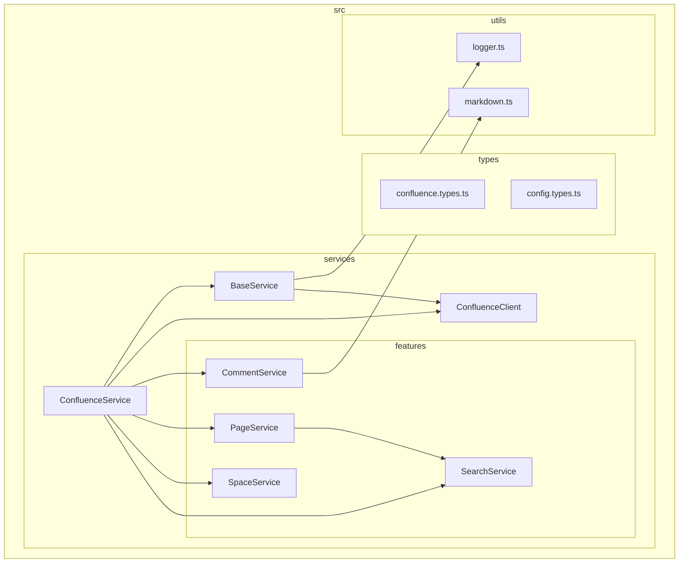
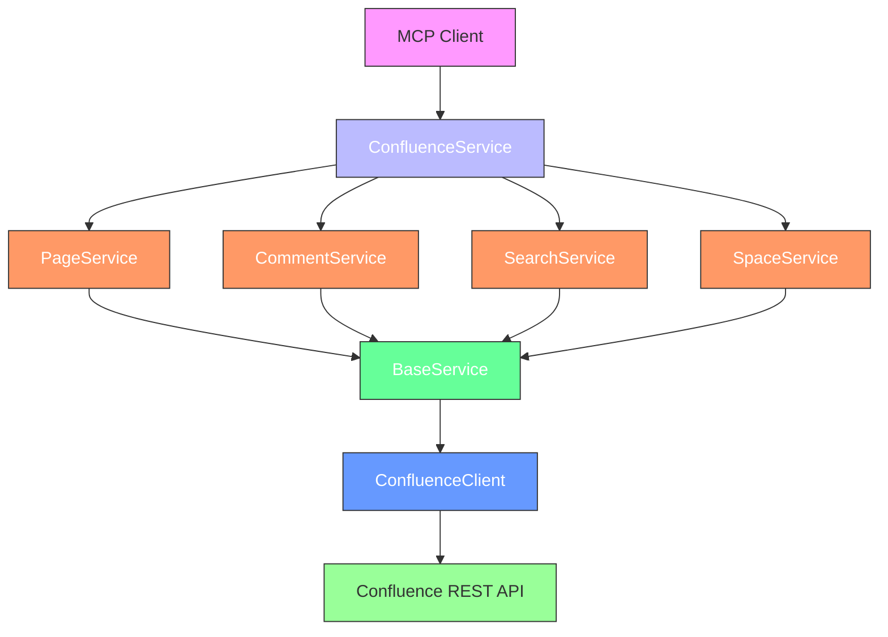
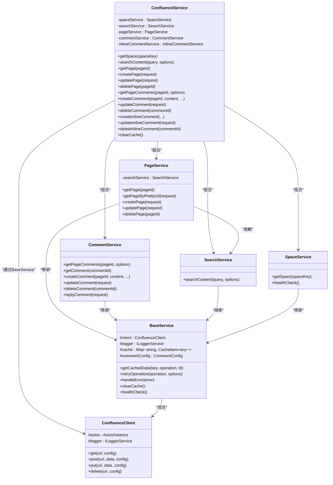
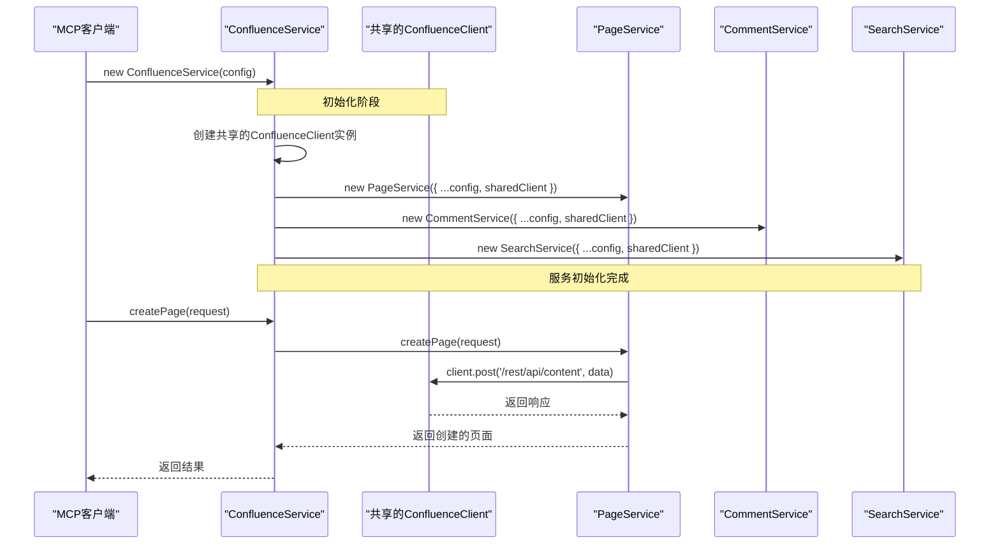
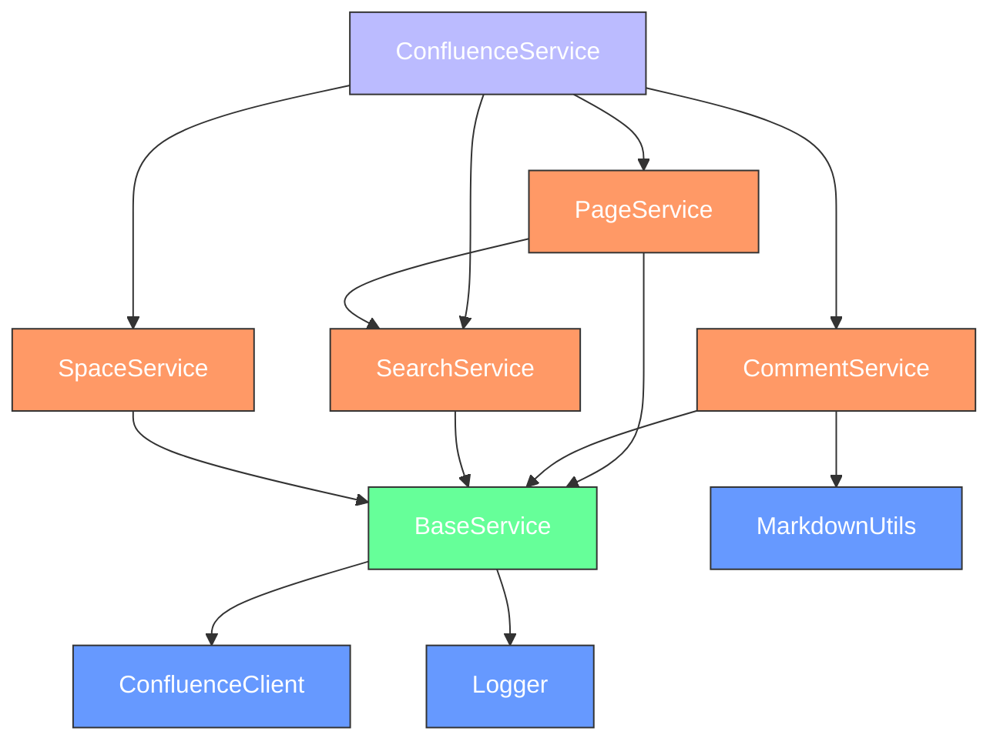

# 核心架构设计

<cite>
**本文档引用的文件**   
- [confluence.service.ts](file://src/services/confluence.service.ts)
- [base.service.ts](file://src/services/base.service.ts)
- [confluence-client.ts](file://src/services/confluence-client.ts)
- [page.service.ts](file://src/services/features/page.service.ts)
- [comment-basic.service.ts](file://src/services/features/comment-basic.service.ts)
- [search.service.ts](file://src/services/features/search.service.ts)
- [index.ts](file://src/services/index.ts)
- [feature-services.ts](file://src/services/features/feature-services.ts)
</cite>

## 目录
1. [引言](#引言)
2. [项目结构](#项目结构)
3. [核心组件](#核心组件)
4. [架构概述](#架构概述)
5. [详细组件分析](#详细组件分析)
6. [依赖分析](#依赖分析)
7. [性能考虑](#性能考虑)
8. [故障排除指南](#故障排除指南)
9. [结论](#结论)

## 引言
本文档旨在深入解析MCP Confluence服务的核心架构设计。该服务实现了Model Context Protocol (MCP)，为Confluence提供了一套完整的API交互能力。文档将重点分析`ConfluenceService`作为门面模式的实现，如何聚合`PageService`、`CommentService`、`SearchService`等子服务，以及`BaseService`提供的共享功能。同时，将阐述依赖注入在服务初始化中的应用，分析数据流从MCP请求到Confluence REST API响应的完整路径，并讨论关键的架构决策。

## 项目结构
该项目采用分层的模块化结构，清晰地分离了关注点。核心服务位于`src/services`目录下，其中`features`子目录包含了具体的业务功能服务。`base.service.ts`和`confluence-client.ts`提供了所有服务共享的基础功能。`types`目录定义了所有数据结构，`utils`目录包含了通用的工具函数。

**Diagram sources**
- [confluence.service.ts](file://src/services/confluence.service.ts#L1-L284)
- [base.service.ts](file://src/services/base.service.ts#L1-L184)
- [confluence-client.ts](file://src/services/confluence-client.ts#L1-L147)

**Section sources**
- [confluence.service.ts](file://src/services/confluence.service.ts#L1-L284)
- [project_structure](file://#L1-L20)

## 核心组件
本项目的核心组件围绕`ConfluenceService`展开，它作为门面（Facade）模式的实现，为外部调用者提供了一个统一、简化的接口。`ConfluenceService`内部聚合了多个专门化的子服务，如`PageService`、`CommentService`等，每个子服务负责处理特定领域的业务逻辑。这些服务都继承自`BaseService`，从而共享了HTTP客户端、缓存、错误处理和重试机制等核心功能。`ConfluenceClient`是与Confluence REST API进行通信的底层适配器，封装了HTTP请求的细节。

**Section sources**
- [confluence.service.ts](file://src/services/confluence.service.ts#L1-L284)
- [base.service.ts](file://src/services/base.service.ts#L1-L184)
- [confluence-client.ts](file://src/services/confluence-client.ts#L1-L147)

## 架构概述
该服务采用了一种清晰的分层架构，遵循了组合优于继承的设计原则。顶层是`ConfluenceService`，它扮演着门面的角色，将复杂的子系统接口简化为一个统一的API。下一层是多个功能服务（`PageService`、`CommentService`等），它们实现了具体的业务逻辑。最底层是`BaseService`和`ConfluenceClient`，提供了跨服务的通用能力。

**Diagram sources**
- [confluence.service.ts](file://src/services/confluence.service.ts#L1-L284)
- [base.service.ts](file://src/services/base.service.ts#L1-L184)
- [confluence-client.ts](file://src/services/confluence-client.ts#L1-L147)

## 详细组件分析
本节将深入分析各个关键组件的实现细节、交互方式和设计考量。

### ConfluenceService: 门面模式的实现
`ConfluenceService`是整个系统的入口点，它通过门面模式封装了内部复杂的子服务网络。其主要职责是接收来自MCP的请求，根据请求类型将其委托给相应的子服务，并将结果返回给客户端。这种设计极大地简化了客户端的使用，客户端无需了解`PageService`或`CommentService`的存在。

**Diagram sources**
- [confluence.service.ts](file://src/services/confluence.service.ts#L1-L284)
- [page.service.ts](file://src/services/features/page.service.ts#L1-L217)
- [comment-basic.service.ts](file://src/services/features/comment-basic.service.ts#L1-L579)
- [search.service.ts](file://src/services/features/search.service.ts#L1-L104)
- [base.service.ts](file://src/services/base.service.ts#L1-L184)
- [confluence-client.ts](file://src/services/confluence-client.ts#L1-L147)

### BaseService: 共享功能的基石
`BaseService`是一个抽象基类，为所有具体的服务提供了共享的功能。它通过依赖注入的方式接收配置，并在构造函数中初始化`ConfluenceClient`、`Logger`和`Cache`。这种设计避免了代码重复，确保了所有服务都使用一致的HTTP客户端、日志记录和缓存策略。

**Section sources**
- [base.service.ts](file://src/services/base.service.ts#L1-L184)
- [confluence-client.ts](file://src/services/confluence-client.ts#L1-L147)

### 服务初始化与依赖注入
服务的初始化过程在`ConfluenceService`的构造函数中完成，体现了依赖注入（DI）的思想。`ConfluenceService`首先创建一个共享的`ConfluenceClient`实例，然后将这个实例通过`serviceConfig`对象传递给所有子服务。这确保了整个应用中只有一个HTTP客户端，避免了不必要的连接开销和拦截器重复注册。

**Diagram sources**
- [confluence.service.ts](file://src/services/confluence.service.ts#L1-L284)
- [base.service.ts](file://src/services/base.service.ts#L1-L184)

### 数据流分析：从MCP请求到API响应
当一个MCP请求（如`managePages`）到达时，数据流会经过以下路径：首先由`ConfluenceService`接收，然后根据`action`参数将其委托给`PageService`。`PageService`会调用`BaseService`提供的`retryOperation`和`getCachedData`方法来执行带重试和缓存的HTTP请求。`BaseService`最终通过`ConfluenceClient`向Confluence的REST API发起实际的HTTP调用，并将响应逐层返回。

**Section sources**
- [confluence.service.ts](file://src/services/confluence.service.ts#L1-L284)
- [page.service.ts](file://src/services/features/page.service.ts#L1-L217)
- [base.service.ts](file://src/services/base.service.ts#L1-L184)

## 依赖分析
该项目的依赖关系清晰且合理。`ConfluenceService`是顶级聚合者，它直接依赖于所有功能服务。所有功能服务都继承自`BaseService`，从而间接依赖于`ConfluenceClient`和`Logger`。`PageService`还直接依赖于`SearchService`，用于实现`getPageByPrettyUrl`功能。这种依赖结构避免了循环依赖，并通过组合和继承实现了功能的复用。

**Diagram sources**
- [confluence.service.ts](file://src/services/confluence.service.ts#L1-L284)
- [page.service.ts](file://src/services/features/page.service.ts#L1-L217)
- [comment-basic.service.ts](file://src/services/features/comment-basic.service.ts#L1-L579)
- [base.service.ts](file://src/services/base.service.ts#L1-L184)

**Section sources**
- [confluence.service.ts](file://src/services/confluence.service.ts#L1-L284)
- [page.service.ts](file://src/services/features/page.service.ts#L1-L217)
- [base.service.ts](file://src/services/base.service.ts#L1-L184)

## 性能考虑
该架构在性能方面做出了多项优化。首先，通过在`ConfluenceService`中创建共享的`ConfluenceClient`实例，实现了HTTP连接的复用，减少了TCP握手和TLS协商的开销。其次，`BaseService`内置了5分钟的内存缓存，可以有效减少对Confluence API的重复请求。此外，`retryOperation`方法提供了自动重试机制，增强了服务在面对临时网络故障时的韧性。`ConfluenceClient`还配置了Keep-Alive和连接池，进一步提升了HTTP通信的效率。

## 故障排除指南
当服务出现问题时，应首先检查日志输出。该服务使用结构化的JSON日志，记录了每个请求的详细信息，包括请求方法、URL、响应状态码和耗时。如果遇到HTTP 5xx错误，`retryOperation`会自动进行重试。如果遇到CQL语法错误，`SearchService`会自动回退到基本的文本搜索。对于权限问题，`CommentService`在捕获到403错误时会抛出更友好的错误信息。如果问题持续存在，应检查`.env`文件中的认证信息是否正确，并确认Confluence服务器的URL是否可达。

**Section sources**
- [base.service.ts](file://src/services/base.service.ts#L1-L184)
- [search.service.ts](file://src/services/features/search.service.ts#L1-L104)
- [comment-basic.service.ts](file://src/services/features/comment-basic.service.ts#L1-L579)

## 结论
本MCP Confluence服务通过精心设计的架构，成功地将复杂的Confluence API交互封装成一个简洁、健壮且易于使用的接口。`ConfluenceService`作为门面模式的典范，有效地聚合了`PageService`、`CommentService`等多个子服务。`BaseService`通过继承为所有服务提供了统一的缓存、重试和错误处理能力。依赖注入的应用确保了`ConfluenceClient`的共享，优化了资源使用。整体架构遵循了高内聚、低耦合的原则，使得代码易于维护和扩展。未来可以考虑将`ConfigService`和`Logger`实现为单例，以进一步规范化全局状态的管理。