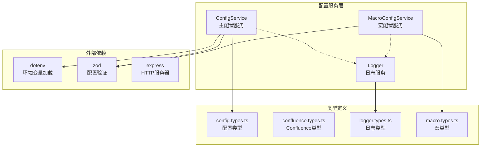
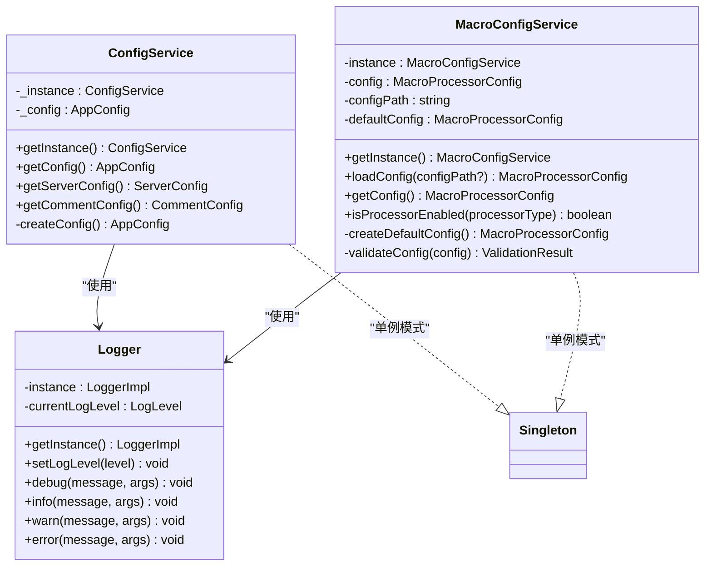
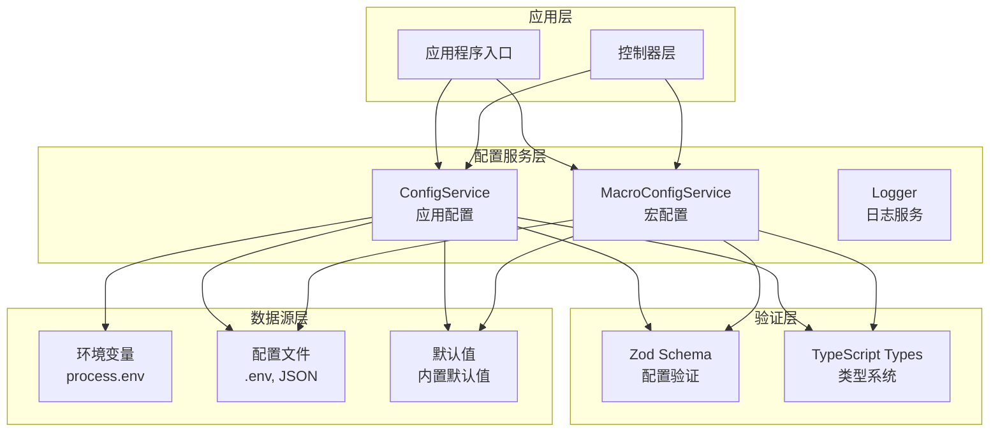
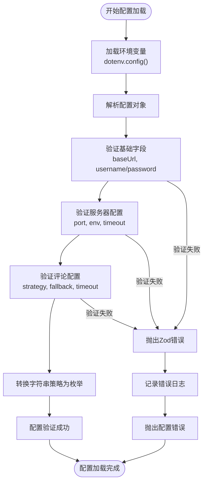
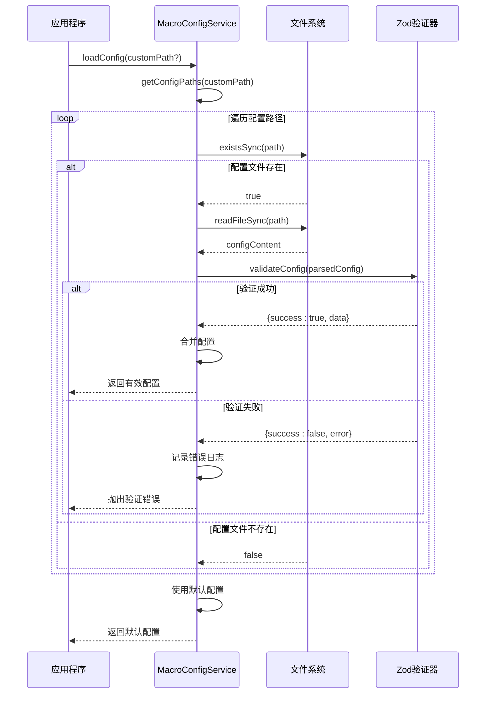
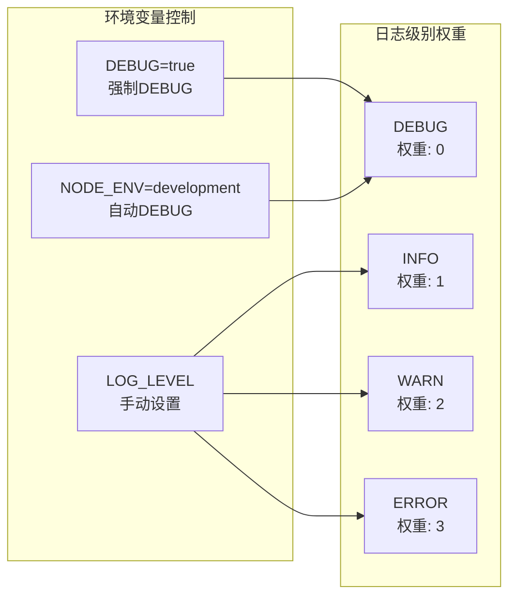
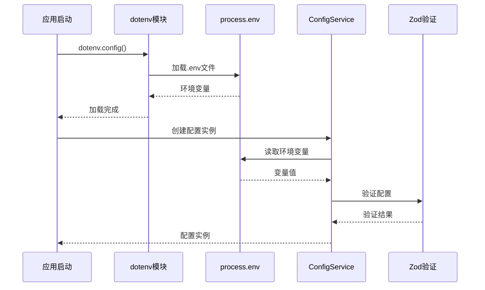

# 配置管理系统

<cite>
**本文档中引用的文件**
- [config.service.ts](file://src/services/config.service.ts)
- [config.types.ts](file://src/types/config.types.ts)
- [confluence.types.ts](file://src/types/confluence.types.ts)
- [logger.ts](file://src/utils/logger.ts)
- [logger.types.ts](file://src/types/logger.types.ts)
- [macro-config.service.ts](file://src/services/macro-config.service.ts)
- [macro.types.ts](file://src/types/macro.types.ts)
- [package.json](file://package.json)
</cite>

## 目录
1. [简介](#简介)
2. [项目结构概览](#项目结构概览)
3. [核心配置组件](#核心配置组件)
4. [架构概览](#架构概览)
5. [详细组件分析](#详细组件分析)
6. [环境变量配置](#环境变量配置)
7. [配置文件模板](#配置文件模板)
8. [部署环境最佳实践](#部署环境最佳实践)
9. [安全考虑](#安全考虑)
10. [故障排除指南](#故障排除指南)
11. [总结](#总结)

## 简介

本文档深入解析了 mcp-server-confluence-ts 项目中的配置管理系统。该系统采用现代化的配置管理模式，结合环境变量、配置文件和服务模式，提供了灵活且安全的配置管理解决方案。系统支持多种认证方式、超时设置、重试策略，并具备完善的日志记录和错误处理机制。

配置管理系统的核心特点包括：
- 基于 Zod 的强类型验证
- 环境变量与配置文件的双重支持
- 分层配置架构（应用级、服务器级、评论级）
- 安全的敏感信息处理
- 开发与生产环境的差异化配置

## 项目结构概览

配置管理系统在项目中的组织结构如下：



**图表来源**
- [config.service.ts](file://src/services/config.service.ts#L1-L128)
- [macro-config.service.ts](file://src/services/macro-config.service.ts#L1-L334)
- [logger.ts](file://src/utils/logger.ts#L1-L199)

## 核心配置组件

### 配置服务架构

配置管理系统采用单例模式设计，确保全局配置的一致性和唯一性：



**图表来源**
- [config.service.ts](file://src/services/config.service.ts#L35-L128)
- [macro-config.service.ts](file://src/services/macro-config.service.ts#L25-L334)
- [logger.ts](file://src/utils/logger.ts#L40-L199)

**章节来源**
- [config.service.ts](file://src/services/config.service.ts#L35-L128)
- [macro-config.service.ts](file://src/services/macro-config.service.ts#L25-L334)

## 架构概览

配置管理系统采用分层架构设计，确保各层级职责清晰：



**图表来源**
- [config.service.ts](file://src/services/config.service.ts#L1-L128)
- [macro-config.service.ts](file://src/services/macro-config.service.ts#L1-L334)

## 详细组件分析

### ConfigService - 主配置服务

ConfigService 是整个配置系统的核心，负责加载和管理应用级配置：

#### 配置结构定义

```typescript
// 应用配置接口
interface AppConfig extends ConfluenceConfig {
  server: ServerConfig;
  comment: CommentConfig;
}

// 服务器配置
interface ServerConfig {
  port: number;
  env: 'development' | 'production';
  timeout: number;
}

// 评论配置
interface CommentConfig {
  apiStrategy: CommentApiStrategy;
  enableFallback: boolean;
  timeout: number;
}
```

#### 配置验证机制

系统使用 Zod 进行严格的配置验证：



**图表来源**
- [config.service.ts](file://src/services/config.service.ts#L70-L127)

#### 认证配置处理

系统支持多种认证方式，优先级从高到低：

1. **访问令牌（推荐）**：CONFLUENCE_ACCESS_TOKEN
2. **用户名密码组合**：CONFLUENCE_USERNAME 和 CONFLUENCE_PASSWORD
3. **API Token**：通过 accessToken 参数

```typescript
// 认证验证逻辑
if (!config.accessToken && (!config.username || !config.password)) {
  throw new Error('Either CONFLUENCE_ACCESS_TOKEN or both CONFLUENCE_USERNAME and CONFLUENCE_PASSWORD must be provided');
}
```

**章节来源**
- [config.service.ts](file://src/services/config.service.ts#L70-L127)
- [config.types.ts](file://src/types/config.types.ts#L1-L54)

### MacroConfigService - 宏配置服务

MacroConfigService 专门负责宏处理器的配置管理：

#### 配置文件发现机制



**图表来源**
- [macro-config.service.ts](file://src/services/macro-config.service.ts#L80-L120)

#### 默认配置策略

系统提供丰富的默认配置，确保开箱即用：

```typescript
private createDefaultConfig(): MacroProcessorConfig {
  return {
    enabledProcessors: undefined, // undefined 表示启用所有处理器
    disabledProcessors: [],
    blacklistedMacros: [],
    fallbackStrategy: MacroFallbackStrategy.PRESERVE_HTML,
    maxRecursionDepth: 5,
    timeout: 30000, // 30秒
    enableConcurrency: true,
    preserveUnknownMacros: true,
    customProcessors: {},
    processorSettings: {
      markdown: {
        preserveFormatting: true,
        convertInlineToBlock: false
      },
      code: {
        preserveLineNumbers: true,
        addLanguageComment: true,
        enableSyntaxHighlighting: false
      }
    },
    debugMode: false,
    logLevel: 'info'
  };
}
```

**章节来源**
- [macro-config.service.ts](file://src/services/macro-config.service.ts#L45-L85)
- [macro-config.service.ts](file://src/services/macro-config.service.ts#L80-L120)

### Logger - 日志服务

Logger 服务提供统一的日志管理功能，支持动态日志级别控制：

#### 日志级别体系



**图表来源**
- [logger.ts](file://src/utils/logger.ts#L25-L45)

#### 日志输出机制

Logger 采用多通道输出策略：

```typescript
// 统一输出日志到stderr和console
private outputLog(level: "debug" | "info" | "warn" | "error", message: string, args: any[] = []): void {
  const logString = this.createLogMessage(level, message, args);
  
  // 输出到stderr，供MCP客户端捕获
  process.stderr.write(logString + '\n');
  
  // 同时输出到console，保持JSON格式便于调试
  switch (level) {
    case "debug":
      console.debug(logString);
      break;
    case "info":
      console.info(logString);
      break;
    case "warn":
      console.warn(logString);
      break;
    case "error":
      console.error(logString);
      break;
  }
}
```

**章节来源**
- [logger.ts](file://src/utils/logger.ts#L130-L160)
- [logger.ts](file://src/utils/logger.ts#L25-L45)

## 环境变量配置

### 核心环境变量

系统支持以下核心环境变量：

#### Confluence 连接配置

| 环境变量 | 类型 | 必需 | 默认值 | 描述 |
|---------|------|------|--------|------|
| `CONFLUENCE_URL` | string | 是 | - | Confluence 实例的基础 URL |
| `CONFLUENCE_USERNAME` | string | 否 | - | 用户名（与密码配合使用） |
| `CONFLUENCE_PASSWORD` | string | 否 | - | 密码（与用户名配合使用） |
| `CONFLUENCE_ACCESS_TOKEN` | string | 否 | - | API 访问令牌 |

#### 服务器配置

| 环境变量 | 类型 | 必需 | 默认值 | 描述 |
|---------|------|------|--------|------|
| `PORT` | number | 否 | 3000 | 服务器监听端口 |
| `NODE_ENV` | string | 否 | development | 运行环境 |
| `SERVER_TIMEOUT` | number | 否 | 10000 | 服务器超时时间（毫秒） |

#### 评论配置

| 环境变量 | 类型 | 必需 | 默认值 | 描述 |
|---------|------|------|--------|------|
| `COMMENT_API_STRATEGY` | string | 否 | standard | 评论API策略 |
| `COMMENT_ENABLE_FALLBACK` | boolean | 否 | true | 是否启用回退机制 |
| `COMMENT_TIMEOUT` | number | 否 | 15000 | 评论API超时时间（毫秒） |

#### 超时和安全配置

| 环境变量 | 类型 | 必需 | 默认值 | 描述 |
|---------|------|------|--------|------|
| `TIMEOUT` | number | 否 | - | 全局超时时间（毫秒） |
| `REJECT_UNAUTHORIZED` | boolean | 否 | true | 是否拒绝不安全的SSL连接 |

### 环境变量加载流程



**图表来源**
- [config.service.ts](file://src/services/config.service.ts#L6-L7)
- [config.service.ts](file://src/services/config.service.ts#L70-L90)

**章节来源**
- [config.service.ts](file://src/services/config.service.ts#L70-L90)

## 配置文件模板

### .env 文件模板

以下是完整的 .env 文件模板：

```bash
# ==============================
# Confluence 连接配置
# ==============================

# Confluence 实例URL
CONFLUENCE_URL=https://your-domain.atlassian.net/wiki

# 认证方式 1: 使用访问令牌 (推荐)
CONFLUENCE_ACCESS_TOKEN=your-access-token-here

# 认证方式 2: 使用用户名密码 (备用)
# CONFLUENCE_USERNAME=your-username
# CONFLUENCE_PASSWORD=your-password

# ==============================
# 服务器配置
# ==============================

# 监听端口
PORT=3000

# 运行环境 (development/production)
NODE_ENV=development

# 服务器超时时间 (毫秒)
SERVER_TIMEOUT=10000

# ==============================
# 评论配置
# ==============================

# 评论API策略: tinymce/standard/auto
COMMENT_API_STRATEGY=standard

# 是否启用回退机制
COMMENT_ENABLE_FALLBACK=true

# 评论API超时时间 (毫秒)
COMMENT_TIMEOUT=15000

# ==============================
# 超时和安全配置
# ==============================

# 全局超时时间 (毫秒)
TIMEOUT=30000

# 是否拒绝不安全的SSL连接
REJECT_UNAUTHORIZED=true

# ==============================
# 日志配置
# ==============================

# 日志级别: DEBUG/INFO/WARN/ERROR
LOG_LEVEL=INFO

# 开发模式启用DEBUG日志
DEBUG=false
```

### macro-config.json 模板

```json
{
  "enabledProcessors": ["markdown", "code", "table"],
  "disabledProcessors": ["unsupported-macro"],
  "blacklistedMacros": ["html", "iframe"],
  "fallbackStrategy": "preserve_html",
  "maxRecursionDepth": 5,
  "timeout": 30000,
  "enableConcurrency": true,
  "preserveUnknownMacros": true,
  "customProcessors": {
    "custom-macro": {
      "path": "./processors/custom-macro.js",
      "priority": 10,
      "enabled": true
    }
  },
  "processorSettings": {
    "markdown": {
      "preserveFormatting": true,
      "convertInlineToBlock": false
    },
    "code": {
      "preserveLineNumbers": true,
      "addLanguageComment": true,
      "enableSyntaxHighlighting": false
    }
  },
  "debugMode": false,
  "logLevel": "info"
}
```

## 部署环境最佳实践

### 开发环境配置

开发环境应注重调试能力和灵活性：

```bash
# 开发环境 .env
CONFLUENCE_URL=https://your-dev-domain.atlassian.net/wiki
CONFLUENCE_ACCESS_TOKEN=dev-access-token
NODE_ENV=development
PORT=3000
LOG_LEVEL=DEBUG
DEBUG=true
COMMENT_API_STRATEGY=auto
ENABLE_CONCURRENT_PROCESSING=true
```

### 生产环境配置

生产环境应注重安全性和稳定性：

```bash
# 生产环境 .env
CONFLUENCE_URL=https://your-production-domain.atlassian.net/wiki
CONFLUENCE_ACCESS_TOKEN=prod-access-token
NODE_ENV=production
PORT=8080
LOG_LEVEL=INFO
REJECT_UNAUTHORIZED=true
COMMENT_TIMEOUT=30000
MAX_RECURSION_DEPTH=3
```

### Docker 部署配置

```dockerfile
# Dockerfile 示例
FROM node:18-alpine

WORKDIR /app

COPY package*.json ./
RUN npm install

COPY . .

# 设置环境变量
ENV NODE_ENV=production
ENV PORT=8080
ENV LOG_LEVEL=INFO

EXPOSE 8080

CMD ["npm", "start"]
```

### Kubernetes 部署配置

```yaml
apiVersion: apps/v1
kind: Deployment
metadata:
  name: confluence-mcp-server
spec:
  replicas: 2
  selector:
    matchLabels:
      app: confluence-mcp-server
  template:
    metadata:
      labels:
        app: confluence-mcp-server
    spec:
      containers:
      - name: confluence-mcp-server
        image: confluence-mcp-server:latest
        ports:
        - containerPort: 8080
        env:
        - name: CONFLUENCE_URL
          valueFrom:
            secretKeyRef:
              name: confluence-secrets
              key: url
        - name: CONFLUENCE_ACCESS_TOKEN
          valueFrom:
            secretKeyRef:
              name: confluence-secrets
              key: access-token
        resources:
          requests:
            memory: "256Mi"
            cpu: "250m"
          limits:
            memory: "512Mi"
            cpu: "500m"
---
apiVersion: v1
kind: Service
metadata:
  name: confluence-mcp-server-service
spec:
  selector:
    app: confluence-mcp-server
  ports:
  - protocol: TCP
    port: 80
    targetPort: 8080
  type: LoadBalancer
```

## 安全考虑

### 敏感信息保护

#### 环境变量加密

```bash
# 使用环境变量加密工具
# 示例：使用 sops 加密敏感配置
echo "CONFLUENCE_ACCESS_TOKEN=encrypted-token" | sops --encrypt --encrypted-regex '^(CONFLUENCE_.*)$' > .env.encrypted

# 解密时使用
sops --decrypt .env.encrypted > .env
```

#### Kubernetes Secrets

```yaml
apiVersion: v1
kind: Secret
metadata:
  name: confluence-secrets
type: Opaque
data:
  url: aHR0cHM6Ly95b3VyLWRvbWFpbi5hdGxhc3NpYW4ubmV0L3dpbGxp
  access-token: eW91ci1hY2Nlc3MtdG9rZW4taGVyZQ==
```

#### Docker Secrets

```yaml
version: '3.8'
services:
  confluence-mcp-server:
    image: confluence-mcp-server:latest
    secrets:
      - confluence_url
      - confluence_token
    environment:
      - CONFLUENCE_URL_FILE=/run/secrets/confluence_url
      - CONFLUENCE_ACCESS_TOKEN_FILE=/run/secrets/confluence_token

secrets:
  confluence_url:
    external: true
  confluence_token:
    external: true
```

### 网络安全配置

#### SSL/TLS 配置

```javascript
// 在服务器配置中启用 HTTPS
const https = require('https');
const fs = require('fs');

const server = https.createServer({
  cert: fs.readFileSync('/path/to/certificate.crt'),
  key: fs.readFileSync('/path/to/private.key'),
  rejectUnauthorized: true // 强制验证证书
}, app);

server.listen(PORT, () => {
  console.log(`HTTPS Server running on port ${PORT}`);
});
```

#### 网络访问控制

```bash
# 使用防火墙规则限制访问
# 允许来自特定IP段的访问
iptables -A INPUT -p tcp --dport 8080 -s 192.168.1.0/24 -j ACCEPT
iptables -A INPUT -p tcp --dport 8080 -j DROP

# 使用云防火墙规则
# AWS Security Group 示例
{
  "IpPermissions": [
    {
      "IpProtocol": "tcp",
      "FromPort": 8080,
      "ToPort": 8080,
      "IpRanges": [{"CidrIp": "192.168.1.0/24"}]
    }
  ]
}
```

### 权限控制

#### 最小权限原则

```bash
# 创建专用用户运行服务
sudo useradd -r -s /bin/false confluence-user

# 设置适当的文件权限
sudo chown confluence-user:confluence-user /app
sudo chmod 700 /app

# 仅允许必要的网络访问
sudo setfacl -m u:confluence-user:rwx /app
```

#### API 访问控制

```typescript
// 实现API访问控制中间件
function apiAccessMiddleware(req, res, next) {
  const apiKey = req.headers['x-api-key'];
  
  if (!apiKey || !isValidApiKey(apiKey)) {
    return res.status(401).json({ error: 'Invalid API key' });
  }
  
  // 检查API配额和速率限制
  if (!checkRateLimit(apiKey)) {
    return res.status(429).json({ error: 'Rate limit exceeded' });
  }
  
  next();
}
```

## 故障排除指南

### 常见配置问题

#### 1. 认证失败

**症状**：无法连接到 Confluence 实例

**排查步骤**：
```bash
# 1. 检查环境变量设置
echo $CONFLUENCE_URL
echo $CONFLUENCE_ACCESS_TOKEN

# 2. 验证URL格式
curl -I "$CONFLUENCE_URL/rest/api/space"

# 3. 测试API访问
curl -H "Authorization: Bearer $CONFLUENCE_ACCESS_TOKEN" \
     "$CONFLUENCE_URL/rest/api/space"
```

**解决方案**：
- 确保使用正确的访问令牌
- 检查令牌权限范围
- 验证网络连通性

#### 2. 配置验证错误

**症状**：启动时出现配置验证失败

**排查步骤**：
```bash
# 启用调试模式查看详细错误
DEBUG=true npm start

# 检查具体的验证错误
# 错误通常会显示在日志中，例如：
# Invalid configuration: baseUrl must be a valid URL
```

**解决方案**：
- 检查 `.env` 文件语法
- 验证必填字段是否完整
- 确认数据类型匹配

#### 3. 超时问题

**症状**：请求超时或连接超时

**排查步骤**：
```bash
# 增加超时时间
export TIMEOUT=60000
export COMMENT_TIMEOUT=30000

# 检查网络延迟
ping your-confluence-domain.com

# 测试API响应时间
time curl "$CONFLUENCE_URL/rest/api/space"
```

**解决方案**：
- 根据网络状况调整超时设置
- 检查Confluence服务器负载
- 优化网络连接

### 配置诊断工具

#### 配置验证脚本

```bash
#!/bin/bash
# config-diagnostic.sh

echo "=== Confluence MCP Server 配置诊断 ==="

# 检查环境变量
echo "1. 检查环境变量..."
[ -z "$CONFLUENCE_URL" ] && echo "❌ CONFLUENCE_URL 未设置" || echo "✅ CONFLUENCE_URL 已设置"
[ -z "$CONFLUENCE_ACCESS_TOKEN" ] && echo "❌ CONFLUENCE_ACCESS_TOKEN 未设置" || echo "✅ CONFLUENCE_ACCESS_TOKEN 已设置"

# 测试网络连接
echo "2. 测试网络连接..."
if curl -s --head "$CONFLUENCE_URL" | head -n 1 | grep "HTTP/1.[01] [23]" > /dev/null; then
    echo "✅ Confluence 可访问"
else
    echo "❌ Confluence 不可访问"
fi

# 检查端口占用
echo "3. 检查端口占用..."
if lsof -i :3000 > /dev/null; then
    echo "❌ 端口 3000 已被占用"
else
    echo "✅ 端口 3000 可用"
fi

echo "=== 诊断完成 ==="
```

#### 配置健康检查

```typescript
// health-check.ts
export async function checkConfluenceHealth(): Promise<{
  status: 'healthy' | 'unhealthy';
  checks: Record<string, boolean>;
  errors?: string[];
}> {
  const checks = {
    urlReachable: false,
    apiAccessible: false,
    authenticationValid: false
  };
  
  try {
    // 检查URL可达性
    const response = await fetch(`${process.env.CONFLUENCE_URL}/rest/api/space`);
    checks.urlReachable = response.ok;
    
    // 检查API访问权限
    const authResponse = await fetch(`${process.env.CONFLUENCE_URL}/rest/api/space`, {
      headers: {
        'Authorization': `Bearer ${process.env.CONFLUENCE_ACCESS_TOKEN}`
      }
    });
    checks.apiAccessible = authResponse.ok;
    
    // 验证认证信息
    checks.authenticationValid = !!process.env.CONFLUENCE_ACCESS_TOKEN;
    
    const healthy = Object.values(checks).every(Boolean);
    return { status: healthy ? 'healthy' : 'unhealthy', checks };
    
  } catch (error) {
    return {
      status: 'unhealthy',
      checks,
      errors: [error.message]
    };
  }
}
```

**章节来源**
- [config.service.ts](file://src/services/config.service.ts#L95-L105)
- [logger.ts](file://src/utils/logger.ts#L130-L160)

## 总结

mcp-server-confluence-ts 的配置管理系统展现了现代应用配置管理的最佳实践。通过分层架构、强类型验证、环境变量支持和安全机制，系统提供了灵活、可靠且易于维护的配置解决方案。

### 主要优势

1. **类型安全**：基于 TypeScript 和 Zod 的强类型验证确保配置的正确性
2. **灵活性**：支持环境变量和配置文件的双重配置方式
3. **安全性**：内置敏感信息保护和权限控制机制
4. **可维护性**：清晰的配置结构和完善的错误处理
5. **扩展性**：模块化的配置服务支持功能扩展

### 最佳实践建议

1. **开发阶段**：使用详细的日志和调试模式
2. **生产环境**：启用安全配置和监控机制
3. **部署策略**：采用容器化和基础设施即代码
4. **安全防护**：实施最小权限原则和网络隔离
5. **运维监控**：建立完善的健康检查和告警机制

通过遵循这些配置管理原则和最佳实践，可以确保 mcp-server-confluence-ts 应用在各种环境中稳定、安全地运行。