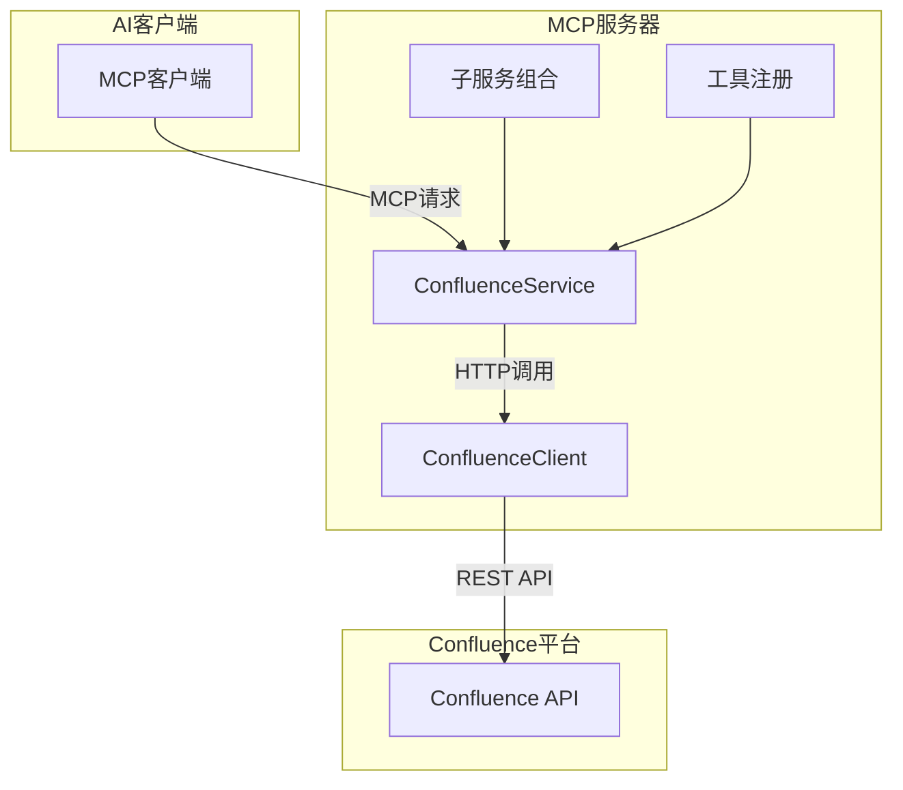
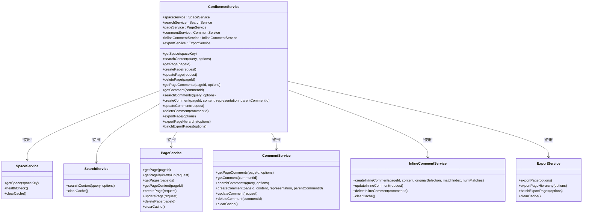

# 项目概述

<cite>
**本文档引用的文件**  
- [README.md](file://README.md)
- [package.json](file://package.json)
- [src/index.ts](file://src/index.ts)
- [src/services/confluence.service.ts](file://src/services/confluence.service.ts)
- [src/services/confluence-client.ts](file://src/services/confluence-client.ts)
- [src/services/features/page.service.ts](file://src/services/features/page.service.ts)
- [src/services/features/comment-basic.service.ts](file://src/services/features/comment-basic.service.ts)
- [src/services/features/export.service.ts](file://src/services/features/export.service.ts)
- [src/types/confluence.types.ts](file://src/types/confluence.types.ts)
- [src/utils/logger.ts](file://src/utils/logger.ts)
</cite>

## 目录
1. [简介](#简介)
2. [系统架构](#系统架构)
3. [核心功能](#核心功能)
4. [技术栈与设计原则](#技术栈与设计原则)
5. [服务组合机制与依赖注入](#服务组合机制与依赖注入)
6. [典型用户工作流](#典型用户工作流)
7. [部署形态与运行时环境](#部署形态与运行时环境)
8. [结论](#结论)

## 简介

mcp-server-confluence-ts 是一个基于 Model Context Protocol (MCP) 的 Confluence 集成后端服务，旨在桥接 AI 系统与企业知识库。该项目提供了一套完整的 API 接口，支持页面管理、评论交互、内容搜索和批量导出等关键功能，使 AI 模型能够无缝访问和操作 Confluence 中的企业知识资产。

通过 MCP 协议，该服务允许 AI 系统以标准化方式与 Confluence 进行交互，实现自动化知识同步、AI 驱动的内容检索和企业文档导出等高级应用场景。项目采用分层架构与组合模式，确保代码结构清晰、可维护性强，并通过 TypeScript 提供类型安全，提升开发效率和系统稳定性。

**Section sources**
- [README.md](file://README.md#L1-L800)

## 系统架构

**Diagram sources**
- [src/index.ts](file://src/index.ts#L0-L199)
- [src/services/confluence.service.ts](file://src/services/confluence.service.ts#L0-L199)

**Section sources**
- [src/index.ts](file://src/index.ts#L0-L199)
- [src/services/confluence.service.ts](file://src/services/confluence.service.ts#L0-L199)

## 核心功能

### 页面管理功能
- **`managePages`**: 统一页面管理工具，支持创建、更新、删除、获取页面基本信息和详细内容。
- **`getPageByPrettyUrl`**: 通过标题精确获取页面。
- **`getSpace`**: 获取空间信息。

### 评论管理功能
- **`manageComments`**: 统一评论管理工具，支持普通评论和行内评论的创建、更新、删除和回复。
- **`getPageComments`**: 获取页面所有评论（支持分页）。
- **`getComment`**: 获取单个评论详情。

### 搜索功能
- **`searchContent`**: 全文搜索内容（支持CQL语法）。
- **`searchComments`**: 搜索评论内容（支持空间限定）。

### 导出功能
- **`exportPage`**: 导出单个页面为 Markdown 文件。
- **`exportPageHierarchy`**: 递归导出页面及其所有子页面。
- **`batchExportPages`**: 批量导出多个指定页面。

**Section sources**
- [README.md](file://README.md#L1-L800)

## 技术栈与设计原则

### 技术栈
- **TypeScript**: 提供类型安全，增强代码可读性和可维护性。
- **Axios**: 用于 HTTP 请求，支持拦截器和请求/响应处理。
- **Turndown**: 将 HTML 内容转换为 Markdown 格式。
- **Express**: 构建 Web 服务器，处理 MCP 请求。
- **Zod**: 用于运行时类型验证，确保数据完整性。

### 设计原则
- **分层架构**: 项目采用清晰的分层架构，包括服务层、工具层和客户端层，确保职责分离。
- **组合模式**: `ConfluenceService` 聚合多个子服务（如 `PageService`、`CommentService`），提供统一的接口。
- **依赖注入**: 通过构造函数注入配置和共享客户端实例，提高模块间的解耦和测试性。
- **性能优化**: 支持 HTTP 连接复用、响应压缩、请求超时控制和错误重试机制。

**Section sources**
- [package.json](file://package.json#L0-L46)
- [src/services/confluence-client.ts](file://src/services/confluence-client.ts#L0-L146)

## 服务组合机制与依赖注入

### 服务组合机制
`ConfluenceService` 类通过组合多个子服务来提供统一的接口。每个子服务负责特定的功能模块，如 `PageService` 处理页面管理，`CommentService` 处理评论管理。这种设计使得代码更加模块化，易于维护和扩展。

**Diagram sources**
- [src/services/confluence.service.ts](file://src/services/confluence.service.ts#L0-L199)
- [src/services/features/page.service.ts](file://src/services/features/page.service.ts#L0-L199)
- [src/services/features/comment-basic.service.ts](file://src/services/features/comment-basic.service.ts#L0-L199)
- [src/services/features/export.service.ts](file://src/services/features/export.service.ts#L0-L199)

**Section sources**
- [src/services/confluence.service.ts](file://src/services/confluence.service.ts#L0-L199)

## 典型用户工作流

### 自动化知识同步
1. AI 系统通过 `searchContent` 工具搜索最新的技术文档。
2. 使用 `getPageContent` 获取文档的详细内容。
3. 将内容同步到内部知识库或进行进一步处理。

### AI驱动的内容检索
1. 用户提出问题，AI 系统通过 `searchContent` 在 Confluence 中搜索相关页面。
2. 使用 `getPageByPrettyUrl` 精确获取特定页面。
3. 提取页面内容并生成回答。

### 企业文档导出
1. 使用 `exportPageHierarchy` 导出整个项目文档。
2. 系统自动将 HTML 内容转换为 Markdown 格式。
3. 生成的文件保存到指定目录，便于离线查阅。

**Section sources**
- [README.md](file://README.md#L1-L800)

## 部署形态与运行时环境

### 部署形态
- **Docker容器化**: 项目支持 Docker 部署，便于在不同环境中快速部署和运行。
- **本地服务**: 可以通过 `npm start` 启动本地服务，适用于开发和测试环境。

### 运行时环境要求
- **Node.js >= 14.0.0**
- **TypeScript >= 4.0.0**
- **环境变量配置**: 在 `.env` 文件中配置 Confluence URL、认证信息和其他参数。

**Section sources**
- [README.md](file://README.md#L1-L800)
- [Dockerfile](file://Dockerfile#L1-L10)

## 结论

mcp-server-confluence-ts 项目通过 MCP 协议实现了 AI 系统与 Confluence 知识库的无缝集成。其分层架构和组合模式确保了代码的模块化和可维护性，而依赖注入机制提高了系统的灵活性和可测试性。项目支持丰富的功能，包括页面管理、评论交互、内容搜索和批量导出，满足了企业级知识管理的需求。通过 Docker 容器化部署，项目能够在多种环境中快速部署和运行，为 AI 驱动的企业知识管理提供了强大的支持。